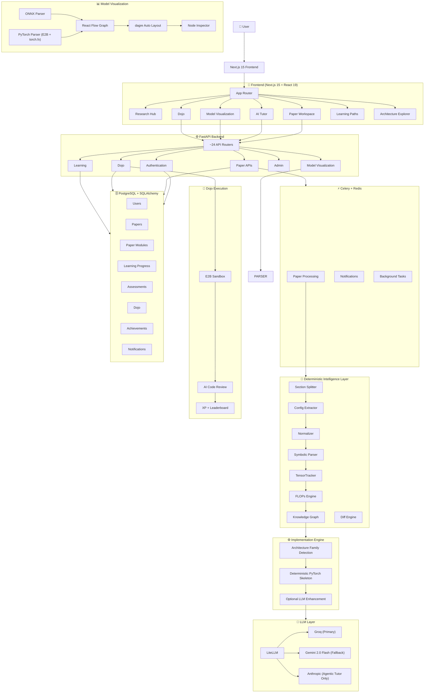
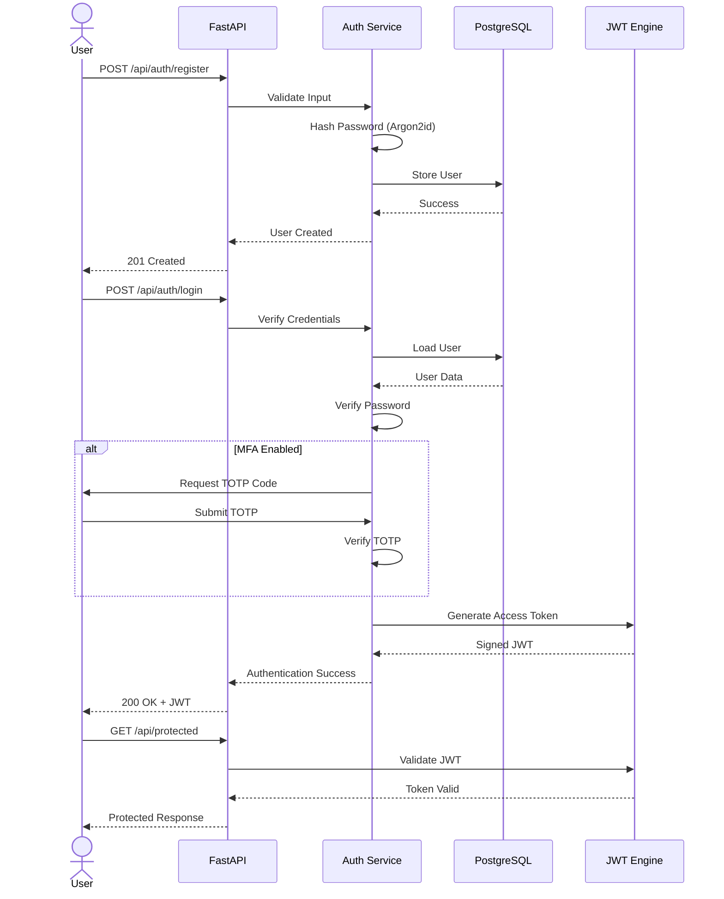

<div align="center">
  <h1>🧠 Paper2Code</h1>
  <p><strong>Transforming Research Papers into Interactive Deep Learning Learning Experiences</strong></p>

  <p>
    Paper2Code is a production-grade AI learning platform that transforms research papers into interactive learning experiences.
    It combines deterministic architecture extraction, symbolic reasoning, AI tutoring, executable PyTorch scaffolds, adaptive learning,
    coding challenges, and interactive model visualization to bridge the gap between reading research and building real systems.
  </p>

  [](https://nextjs.org/)
  [](https://react.dev/)
  [](https://www.typescriptlang.org/)
  [](https://fastapi.tiangolo.com/)
  [](https://www.sqlalchemy.org/)
  [](https://e2b.dev/)
  [](https://litellm.ai/)
  [](https://opensource.org/licenses/MIT)
</div>

---

# 🎯 What is Paper2Code?

Paper2Code is a **research-to-learning intelligence platform** designed to help engineers, students, and researchers understand deep learning papers by transforming them into structured, interactive learning experiences.

Instead of treating a paper as static text, Paper2Code extracts its architecture, validates it using deterministic reasoning engines, generates executable PyTorch scaffolds, and presents everything through interactive visualizations, AI tutoring, coding exercises, assessments, and adaptive learning paths.

Unlike traditional paper summarizers, Paper2Code separates **facts** from **explanations**.

> **LLMs explain. Deterministic engines provide facts. The two never swap roles.**

Tensor shapes, FLOPs, parameter counts, architecture graphs, configuration extraction, assessments, and implementation scaffolds are produced by deterministic engines inside the platform. Large Language Models are only used to explain those verified facts, reducing hallucinations while improving educational quality.

---

# 🚀 Complete Processing Pipeline

Paper2Code follows a **deterministic-first pipeline** for transforming research papers into executable learning experiences.

```
Research Paper (PDF)
        │
        ▼
┌──────────────────────────────┐
│ PDF Extraction               │
│ pdfplumber + PyMuPDF         │
└──────────────┬───────────────┘
               ▼
┌──────────────────────────────┐
│ Section Splitting            │
│ Detect logical paper blocks  │
└──────────────┬───────────────┘
               ▼
┌──────────────────────────────┐
│ LangGraph Ingestion Agent    │
│ Adaptive orchestration       │
└──────────────┬───────────────┘
               ▼
┌──────────────────────────────┐
│ Architecture Parsing         │
│ Config extraction            │
│ Layer normalization          │
└──────────────┬───────────────┘
               ▼
┌──────────────────────────────┐
│ Deterministic Intelligence   │
│ TensorTracker                │
│ FLOPs Engine                 │
│ Knowledge Graph              │
│ Symbolic Parser              │
└──────────────┬───────────────┘
               ▼
┌──────────────────────────────┐
│ Skeleton Generator           │
│ Family-aware PyTorch         │
│ Template generation          │
└──────────────┬───────────────┘
               ▼
      Optional LLM Enhancement
 (Groq → Gemini → Anthropic*)
               ▼
┌──────────────────────────────┐
│ Interactive Learning         │
│ Research Hub                 │
│ AI Tutor                     │
│ Model Visualization          │
│ Dojo                         │
│ Assessments                  │
│ Learning Paths               │
└──────────────────────────────┘
```

### Processing Philosophy

Unlike conventional AI code generators, Paper2Code is **skeleton-first**.

The platform first identifies the architecture family and produces a deterministic PyTorch scaffold using family-specific templates. Unknown architectures fall back to a structured TODO scaffold instead of hallucinating implementations.

LLM-based implementation generation is available as an **optional**, budget-aware enhancement rather than the default execution path.

### Deterministic Intelligence Layer

The core reasoning engine lives inside the `core/` package and contains multiple deterministic systems:

| Engine | Responsibility |
|---------|----------------|
| **TensorTracker** | Symbolic tensor propagation and validation |
| **FLOPs Engine** | Closed-form compute estimation |
| **Knowledge Graph** | Deep learning ontology and grounded facts |
| **Config Extractor** | Hyperparameter extraction |
| **Normalizer** | Layer normalization and synonym resolution |
| **Diff Engine** | Architecture comparison |
| **Section Splitter** | Structured PDF segmentation |
| **Symbolic Parser** | Mathematical notation parsing |

These deterministic engines produce the facts that power every downstream feature.

LLMs never invent tensor shapes, parameter counts, architecture topology, or numerical values—they only explain verified information generated by these engines.

---

# 🔄 System Workflow Diagram

The diagram below illustrates the end-to-end flow through Paper2Code—from paper ingestion to deterministic reasoning, AI tutoring, model visualization, code execution, and adaptive learning.



### Key Design Principles

- **Deterministic engines generate facts.**
- **LLMs explain verified information instead of generating architecture data.**
- **Skeleton-first code generation ensures reproducible implementations.**
- **Interactive model visualization is powered by React Flow with automatic dagre layout.**
- **Code execution runs inside secure E2B sandboxes instead of local execution.**
- **Asynchronous processing uses Celery with Redis, keeping the UI responsive during paper ingestion.**

---

## 🔐 Authentication Flow



# ✨ Feature Matrix

| Feature | Description | Status |
|---------|-------------|:------:|
| **Research Hub** | Browse a curated collection of research papers with structured metadata and learning resources | ✅ |
| **Paper Workspace** | Unified workspace containing Summary, Knowledge Graph, Blueprint, Executable, Challenges, AI Tutor, and Implement tabs | ✅ |
| **PDF Upload & Processing** | Upload research papers and automatically extract architecture information | ✅ |
| **LangGraph Ingestion Pipeline** | Adaptive paper ingestion workflow with deterministic validation | ✅ |
| **Architecture Parsing** | Extract layers, topology, hyperparameters, and implementation details from research papers | ✅ |
| **Knowledge Graph Generation** | Convert extracted architectures into structured graph representations | ✅ |
| **TensorTracker** | Deterministic symbolic tensor propagation and shape validation | ✅ |
| **FLOPs Engine** | Closed-form FLOPs and compute estimation for supported layers | ✅ |
| **Configuration Extraction** | Automatic extraction of architectural configurations and hyperparameters | ✅ |
| **Architecture Comparison** | Compare architectures structurally using deterministic graph analysis | ✅ |
| **Skeleton-first Code Generation** | Generate deterministic PyTorch implementation scaffolds based on detected architecture families | ✅ |
| **Optional LLM Code Enhancement** | Improve generated scaffolds using LLMs when enabled | ✅ |
| **Grounded AI Tutor** | Context-aware tutor grounded in verified architecture data | ✅ |
| **Agentic Tutor** | Tool-enabled tutoring workflow for deeper exploration and reasoning | ✅ |
| **Learning Path Generator** | Personalized curriculum generation based on learner progress | ✅ |
| **Research RAG** | Cross-paper search and retrieval using grounded knowledge | ✅ |
| **Adaptive Learning Engine** | Learner profiling, recommendations, and mastery tracking | ✅ |
| **Interactive Assessments** | Deterministically graded architecture and deep learning challenges | ✅ |
| **Dojo Coding Platform** | Interactive coding environment with Monaco Editor and secure code execution | ✅ |
| **AI Code Review** | Automated post-submission feedback for Dojo solutions | ✅ |
| **Achievement System** | XP, achievements, milestones, and learner progression | ✅ |
| **Leaderboard** | Competitive rankings and progress tracking | ✅ |
| **Learning Analytics** | Adaptive recommendations and learner insights | ✅ |
| **Notifications** | In-app notifications and learning updates | ✅ |
| **Authentication** | JWT authentication, OAuth, MFA (TOTP), session management, audit logs | ✅ |
| **Admin Dashboard** | User, content, moderation, and platform administration | ✅ |
| **Model Visualization** | Upload ONNX or PyTorch models and explore interactive computation graphs | ✅ |
| **Architecture Explorer** | Browse curated deep learning architectures with interactive visualizations | ✅ |
| **Architecture Comparison** | Side-by-side architecture comparison with deterministic analysis | ✅ |
| **System Design Explorer** | Interactive system design learning modules | ✅ |
| **Architecture Labs** | Experiment with implementations and learning exercises | ✅ |
| **Shared Animation System** | Reusable animation components powering architecture and paper visualizations | ✅ |

---

## 🌐 Frontend Experience

Built with **Next.js 15 (App Router)**, the frontend provides a unified learning experience through dedicated application routes.

| Route | Purpose |
|--------|---------|
| `/` | Landing page |
| `/papers` | Research Hub |
| `/papers/[id]` | Paper Workspace |
| `/dojo` | Coding challenge hub |
| `/dojo/[slug]` | Monaco-powered coding environment |
| `/learn` | Learning roadmap |
| `/learn/[domain]/[topic]` | Topic learning pages |
| `/architectures` | Architecture Explorer |
| `/architectures/[slug]` | Architecture details |
| `/architectures/compare` | Architecture comparison |
| `/system-design` | System Design hub |
| `/system-design/[slug]` | Individual system design pages |
| `/labs` | Interactive learning labs |
| `/model-viz` | Interactive model visualization |
| `/extract-code` | Paper → PyTorch extraction |
| `/pricing` | Pricing page |
| `/auth/*` | Authentication flows |

### Static Content

The platform currently includes approximately:

| Content | Count |
|---------|------:|
| Research Papers | ~200 |
| Architecture Pages | ~80 |
| Curriculum Topics | 82 |
| Dojo Problems | ~30 |

---

## 🎨 Frontend Technology

| Category | Technology |
|----------|------------|
| Framework | Next.js 15 (App Router) |
| UI | React 19 |
| Language | TypeScript |
| Styling | Tailwind CSS v3 |
| Animations | Framer Motion · GSAP · anime.js |
| Editor | Monaco Editor |
| Graph Visualization | React Flow + dagre |
| Documentation | MDX + KaTeX |
| Deployment | Vercel |

The frontend also includes a shared animation system (`src/components/anim/`) used across research papers, architecture pages, and system design visualizations to provide consistent interactive experiences.

---

# 🏗️ System Architecture

Paper2Code follows a modern full-stack architecture where the frontend, backend, deterministic intelligence layer, asynchronous workers, and AI services are independently deployable.

```text
┌─────────────────────────────────────────────────────────────────────────────┐
│                           Frontend (Vercel)                                │
│                                                                             │
│  Next.js 15 (App Router) • React 19 • TypeScript • Tailwind CSS            │
│                                                                             │
│  Research Hub • Paper Workspace • AI Tutor • Dojo • Learning               │
│  Architecture Explorer • Model Visualization • Labs                        │
│                                                                             │
│  React Flow • Monaco • Framer Motion • GSAP • anime.js • MDX • KaTeX       │
└───────────────────────────────┬─────────────────────────────────────────────┘
                                │
                          REST / Web APIs
                                │
┌───────────────────────────────▼─────────────────────────────────────────────┐
│                         FastAPI Backend (Render)                            │
│                                                                             │
│  FastAPI • SQLAlchemy 2.0 • Alembic • ~24 Routers                           │
│                                                                             │
│  Authentication • Papers • Learning • Dojo • Tutor                         │
│  Admin • Analytics • Assessments • Notifications                           │
└──────────────┬──────────────────────┬───────────────────────┬──────────────┘
               │                      │                       │
               │                      │                       │
               ▼                      ▼                       ▼

┌─────────────────────┐   ┌──────────────────────┐   ┌──────────────────────┐
│ Deterministic Core  │   │  AI Layer            │   │  Async Processing    │
│                     │   │                      │   │                      │
│ TensorTracker       │   │ LiteLLM             │   │ Celery               │
│ FLOPs Engine        │   │ Groq (Primary)      │   │ Redis                │
│ Knowledge Graph     │   │ Gemini (Fallback)   │   │ Background Jobs      │
│ Config Extractor    │   │ Anthropic Optional  │   │ Paper Processing     │
│ Symbolic Parser     │   │                     │   │ Notifications        │
│ Diff Engine         │   │                     │   │ Analytics            │
└────────────┬────────┘   └──────────────────────┘   └──────────────────────┘
             │
             ▼

┌─────────────────────────────────────────────────────────────────────────────┐
│                     Code Execution & Model Parsing                          │
│                                                                             │
│          E2B Code Interpreter • PyTorch • torch.fx • ONNX                  │
└───────────────────────────────┬─────────────────────────────────────────────┘
                                │
                                ▼

┌─────────────────────────────────────────────────────────────────────────────┐
│                              Data Layer                                     │
│                                                                             │
│ PostgreSQL • SQLAlchemy ORM • Alembic Migrations                            │
│                                                                             │
│ Users • Papers • Modules • Assessments • Learning                          │
│ Dojo • Achievements • Sessions • Notifications                             │
└─────────────────────────────────────────────────────────────────────────────┘
```

---

## ⚙️ Deployment Architecture

| Component | Platform |
|-----------|----------|
| Frontend | **Vercel** |
| Backend API | **Render** |
| Database | PostgreSQL |
| Cache / Queue | Redis |
| Background Workers | Celery |
| Code Execution | E2B Code Interpreter |
| Object Storage | R2 / S3 Compatible |
| Local Development | Docker Compose |

---

## 🧠 Core Intelligence Layer

The `core/` package contains the deterministic reasoning engines that power the platform.

Unlike conventional AI-powered applications, these engines are responsible for generating **all factual information**, including architecture topology, tensor propagation, parameter estimation, compute analysis, and structural comparisons.

```
core/
│
├── rag/
│   ├── tensor_tracker.py
│   ├── flops_engine.py
│   ├── knowledge_graph.py
│   ├── config_extractor.py
│   ├── normalizer.py
│   ├── symbolic_parser.py
│   ├── diff_engine.py
│   └── section_splitter.py
│
├── agents/
│   ├── ingestion_agent.py
│   ├── tutor_agent.py
│   ├── agentic_tutor.py
│   ├── learning_path_agent.py
│   ├── research_rag_agent.py
│   ├── code_review_agent.py
│   ├── parsing_agent_impl.py
│   ├── explanation_agent_impl.py
│   └── visualization_agent_impl.py
│
├── analytics/
│
├── assessment/
│
├── implementation/
│
├── dojo/
│
└── lab/
```

---

## 🔐 Authentication & Security

Paper2Code includes a production-ready authentication system.

### Supported Features

- JWT Authentication
- Refresh Token Rotation
- Google OAuth
- GitHub OAuth
- Multi-Factor Authentication (TOTP)
- Session Management
- Security Audit Logs
- Email Verification
- Password Reset
- Device Tracking

### Password Security

Instead of relying solely on bcrypt, Paper2Code uses:

- **Argon2id** as the primary password hashing algorithm
- Legacy **bcrypt verification** for backward compatibility
- Automatic password rehashing after successful login when legacy hashes are detected

This allows older accounts to migrate seamlessly to stronger password hashing without requiring users to reset their passwords.

---

# 📂 Project Structure

Paper2Code is organized into independent frontend, backend, and deterministic intelligence layers, making the platform modular and easy to extend.

```text
paper2code/
│
├── frontend/                 Next.js 15 application
├── backend/                  FastAPI backend
├── core/                     Deterministic intelligence engines
├── tests/                    Backend & integration tests
├── alembic/                  Database migrations
├── docker-compose.yml
├── Dockerfile
├── requirements.txt
├── alembic.ini
├── main.py
├── app.py                    Legacy Streamlit application
└── README.md
```

> **Note:** `app.py` is a legacy Streamlit prototype and is no longer part of the primary application stack.

---

# 🎨 Frontend (Next.js 15)

The frontend is built using **Next.js 15 App Router**, React 19, and TypeScript.

```text
frontend/
│
├── src/
│   ├── app/
│   │
│   ├── components/
│   │   ├── anim/
│   │   ├── ui/
│   │   ├── papers/
│   │   ├── dojo/
│   │   ├── tutor/
│   │   └── architecture/
│   │
│   ├── lib/
│   ├── hooks/
│   ├── styles/
│   ├── content/
│   └── utils/
│
├── public/
└── package.json
```

### Major Application Routes

| Route | Description |
|--------|-------------|
| `/` | Landing Page |
| `/papers` | Research Hub |
| `/papers/[id]` | Interactive Paper Workspace |
| `/dojo` | Coding Challenge Platform |
| `/dojo/[slug]` | Monaco Coding Environment |
| `/learn` | Learning Dashboard |
| `/learn/[domain]/[topic]` | Topic Learning Pages |
| `/architectures` | Architecture Explorer |
| `/architectures/[slug]` | Architecture Details |
| `/architectures/compare` | Architecture Comparison |
| `/system-design` | System Design Explorer |
| `/system-design/[slug]` | Individual System Design |
| `/labs` | Interactive Labs |
| `/model-viz` | Model Visualization |
| `/extract-code` | Paper → Code |
| `/pricing` | Pricing |
| `/auth/*` | Authentication |

---

# ⚙️ Backend (FastAPI)

The backend provides authentication, paper processing, adaptive learning, AI tutoring, analytics, and asynchronous task execution.

```text
backend/
│
├── server.py
├── database.py
├── celery_app.py
├── routers/
├── services/
├── repositories/
├── modules/
├── middleware/
├── tasks/
├── schemas/
└── models.py
```

### Backend Capabilities

- Paper Processing APIs
- Authentication APIs
- Learning APIs
- Dojo APIs
- AI Tutor APIs
- Model Visualization APIs
- Analytics APIs
- Admin APIs
- Notification APIs
- Background Task APIs

The backend is built around **FastAPI**, **SQLAlchemy 2.0**, **Alembic**, **Celery**, and **Redis**, exposing approximately **24 API routers**.

---

# 🧠 Deterministic Intelligence Layer

The `core/` package contains the engines responsible for extracting, validating, and reasoning about research papers.

```text
core/
│
├── rag/
│
├── agents/
│
├── assessment/
│
├── analytics/
│
├── implementation/
│
├── dojo/
│
└── lab/
```

## `core/rag`

Responsible for deterministic reasoning.

- TensorTracker
- FLOPs Engine
- Knowledge Graph
- Config Extractor
- Layer Normalizer
- Symbolic Parser
- Section Splitter
- Diff Engine

---

## `core/agents`

Coordinates AI-assisted workflows.

Includes:

- Ingestion Agent
- Parsing Agent
- Visualization Agent
- Explanation Agent
- Tutor Agent
- Agentic Tutor
- Research RAG Agent
- Learning Path Agent
- Code Review Agent

These agents orchestrate workflows, while deterministic engines provide factual grounding.

---

## `core/assessment`

Provides deterministic grading engines for:

- Architecture Challenges
- Tensor Shape Challenges
- FLOPs Challenges
- Comparison Challenges

---

## `core/analytics`

Responsible for learner intelligence.

Includes:

- Adaptive Learning Engine
- Recommendation Engine

---

## `core/lab`

Interactive experimentation environment for architecture exploration and analysis.

---

## `core/implementation`

Converts parsed architectures into executable implementations.

Paper2Code follows a **Skeleton-first** strategy:

1. Detect architecture family
2. Generate deterministic PyTorch scaffold
3. Optionally enhance using an LLM

This approach prioritizes reproducibility over generative code synthesis.

---

## `core/dojo`

Contains the backend powering coding exercises, validation, execution, and educational workflows.

---

# 🤖 AI Layer

Paper2Code combines **deterministic reasoning** with modern Large Language Models to deliver grounded explanations, implementation guidance, and interactive tutoring.

Rather than relying entirely on LLMs, the platform first extracts verified architectural information using deterministic engines before invoking language models.

## LLM Stack

| Component | Technology |
|-----------|------------|
| LLM Gateway | LiteLLM |
| Primary Model | Groq (Llama 3.3 70B Versatile) |
| Fallback Model | Gemini 2.0 Flash |
| Specialized Tutor | Anthropic Claude (Optional) |

### Why LiteLLM?

LiteLLM provides a unified interface for multiple providers, allowing Paper2Code to:

- Switch providers automatically
- Retry failed requests
- Reduce latency
- Control inference costs
- Enable future model expansion without changing application logic

---

## AI Agents

The platform contains several specialized agents responsible for different educational workflows.

| Agent | Purpose |
|--------|---------|
| Ingestion Agent | Coordinates paper processing |
| Parsing Agent | Extracts structured architecture information |
| Explanation Agent | Generates grounded explanations |
| Tutor Agent | Answers paper-specific questions |
| Agentic Tutor | Tool-enabled reasoning and multi-step tutoring |
| Research RAG Agent | Cross-paper retrieval and synthesis |
| Learning Path Agent | Personalized curriculum generation |
| Code Review Agent | Reviews Dojo submissions |
| Visualization Agent | Generates interactive architecture views |

Each agent is grounded by deterministic outputs rather than relying solely on model-generated knowledge.

---

# 📄 Research RAG

Paper2Code includes a Retrieval-Augmented Generation (RAG) pipeline tailored specifically for research papers.

Instead of retrieving arbitrary text chunks, the system combines:

- Parsed architecture metadata
- Knowledge graph relationships
- Section-aware retrieval
- Deterministic tensor analysis
- Configuration extraction

This enables the tutor to answer questions using verified architectural information instead of generic LLM knowledge.

---

# 💻 Secure Code Execution

Interactive coding exercises are powered by **E2B Code Interpreter**, providing isolated execution environments for learner submissions.

## Workflow

```text
Student Code
      │
      ▼
Monaco Editor
      │
      ▼
Backend Validation
      │
      ▼
E2B Sandbox
      │
      ▼
Execution Results
      │
      ▼
AI Code Review
      │
      ▼
XP • Achievements • Progress
```

### Benefits

- Secure isolated execution
- No local sandbox management
- Reliable dependency handling
- Scalable execution environments
- Better developer experience

---

# 🥋 Dojo Coding Platform

The Dojo provides an interactive environment for applying deep learning concepts through guided programming challenges.

## Features

- Interactive coding problems
- Monaco Editor
- Secure execution using E2B
- AI-assisted code review
- Progressive difficulty
- Automatic grading
- Learning hints
- XP rewards
- Achievement tracking
- Leaderboards

The platform currently includes **approximately 30 coding challenges**, with additional problems planned as the curriculum expands.

---

# 📊 Interactive Model Visualization

Paper2Code includes a dedicated model visualization tool for exploring neural network architectures.

Users can upload either:

- ONNX models
- PyTorch models

The platform automatically parses the computational graph and renders an interactive visualization.

## Visualization Pipeline

```text
Model Upload
      │
      ▼
Server-side Parsing
      │
      ├────────► ONNX Parser
      │
      └────────► torch.fx Parser
                     │
                     ▼
        Graph Representation
                     │
                     ▼
        React Flow Renderer
                     │
                     ▼
         dagre Auto Layout
                     │
                     ▼
         Interactive Node Inspector
```

### Supported Features

- Interactive computation graphs
- Automatic layout generation
- Node metadata inspection
- Layer connections
- Tensor flow visualization
- Expandable graph navigation

---

# 🎯 Learning Experience

Paper2Code is designed as a complete educational platform rather than a standalone paper parser.

Learners progress through a continuous workflow:

```text
Research Paper
      │
      ▼
Architecture Understanding
      │
      ▼
Knowledge Graph
      │
      ▼
Guided Learning
      │
      ▼
Interactive Assessments
      │
      ▼
Coding Challenges
      │
      ▼
AI Feedback
      │
      ▼
Achievements
      │
      ▼
Mastery Tracking
```

Every stage builds upon deterministic architectural understanding, ensuring learners receive explanations that remain faithful to the original research paper.


---

# ⚡ Getting Started

Paper2Code consists of two independent applications:

- **Frontend** — Next.js 15 + React 19
- **Backend** — FastAPI + SQLAlchemy + Celery

The services communicate through REST APIs and can be developed independently.

---

# 📋 Prerequisites

Before running the project, ensure the following are installed:

| Software | Recommended Version |
|-----------|---------------------|
| Python | 3.11+ |
| Node.js | 20+ |
| npm / pnpm | Latest |
| PostgreSQL | 15+ |
| Redis | Latest |
| Docker (Optional) | Latest |

---

# 📥 Clone the Repository

```bash
git clone https://github.com/officialpk956-wq/paper2code.git

cd paper2code
```

---

# 🎨 Frontend Setup

```bash
cd frontend

npm install
```

Create a `.env.local` file:

```env
NEXT_PUBLIC_API_URL=http://localhost:8000
```

Start the development server:

```bash
npm run dev
```

The frontend will be available at:

```
http://localhost:3000
```

---

# ⚙️ Backend Setup

Create a virtual environment:

```bash
python -m venv .venv
```

Activate it.

**Windows**

```bash
.venv\Scripts\activate
```

**Linux / macOS**

```bash
source .venv/bin/activate
```

Install dependencies:

```bash
pip install -r requirements.txt
```

Run database migrations:

```bash
alembic upgrade head
```

Start the FastAPI server:

```bash
python main.py
```

or

```bash
uvicorn backend.server:app --reload
```

Backend URL:

```
http://localhost:8000
```

---

# ⚡ Background Workers

Paper processing, notifications, analytics, and other long-running jobs execute asynchronously using **Celery**.

Start Redis first.

Then launch a worker:

```bash
celery -A backend.celery_app worker --loglevel=info
```

---

# 🐳 Docker Development

Paper2Code supports containerized local development using Docker Compose.

Start all services:

```bash
docker compose up --build
```

Typical services include:

- Frontend
- Backend API
- PostgreSQL
- Redis
- Celery Worker

To stop everything:

```bash
docker compose down
```

---

# 🔧 Environment Variables

## Backend

Create a `.env` file.

### Required

```env
DATABASE_URL=

SECRET_KEY=

GROQ_API_KEY=

E2B_API_KEY=
```

### Optional

```env
GEMINI_API_KEY=

ANTHROPIC_API_KEY=

REDIS_URL=

R2_ENDPOINT=

R2_ACCESS_KEY=

R2_SECRET_KEY=
```

---

## Frontend

Create `frontend/.env.local`

```env
NEXT_PUBLIC_API_URL=http://localhost:8000
```

---

# 🗄️ Database

Paper2Code uses **PostgreSQL** with **SQLAlchemy 2.0** and **Alembic** migrations.

Typical migration workflow:

```bash
alembic revision --autogenerate -m "description"

alembic upgrade head
```

---

# 🚀 Deployment

The platform is designed for independent frontend and backend deployments.

| Service | Platform |
|----------|----------|
| Frontend | Vercel |
| Backend | Render |
| Database | PostgreSQL |
| Background Jobs | Celery |
| Queue | Redis |
| Object Storage | R2 / S3 Compatible |

This separation allows the frontend and backend to scale independently while keeping asynchronous workloads isolated from user-facing requests.

---

# 🧪 Running Tests

Run the complete test suite:

```bash
pytest
```

Run a specific module:

```bash
pytest tests/<module_name>
```

For frontend quality checks:

```bash
npm run lint

npm run build
```

The repository includes an extensive automated test suite covering API endpoints, authentication, deterministic engines, and integration workflows.

---

# 🤝 Contributing

Contributions are always welcome!

Paper2Code is an open platform focused on making deep learning research more accessible through deterministic reasoning, interactive learning, and executable implementations.

Whether you're interested in improving the educational experience, expanding architecture support, fixing bugs, or enhancing documentation, we'd love your contribution.

## Ways to Contribute

- 🐛 Report bugs
- 💡 Suggest new features
- 📄 Improve documentation
- 🧠 Add support for new architecture families
- 📊 Improve visualization components
- ⚡ Optimize deterministic engines
- 🥋 Create new Dojo challenges
- 📝 Improve tutorials and learning content
- 🧪 Add or improve automated tests

---

## Development Workflow

1. Fork the repository.
2. Create a feature branch.

```bash
git checkout -b feature/amazing-feature
```

3. Commit your changes.

```bash
git commit -m "Add amazing feature"
```

4. Push your branch.

```bash
git push origin feature/amazing-feature
```

5. Open a Pull Request.

---

## Contribution Guidelines

Please ensure that:

- Code follows existing project conventions.
- New functionality includes appropriate tests where applicable.
- Documentation is updated alongside feature additions.
- Pull requests remain focused on a single feature or improvement.
- Large architectural changes are discussed through an issue before implementation.

---

# 🛣️ Roadmap

Paper2Code continues to evolve toward becoming a comprehensive learning platform for deep learning research.

## Near-term Goals

- Expanded architecture coverage
- Additional Dojo coding challenges
- Enhanced AI Tutor capabilities
- Improved research retrieval pipeline
- Better learning analytics
- Additional system design modules
- Richer architecture visualizations

---

## Future Vision

- Multi-paper comparative learning
- Interactive paper annotations
- Collaborative study workspaces
- Research collections and playlists
- Visual architecture builder
- Fine-grained curriculum recommendations
- Community-created Dojo challenges
- Instructor dashboards
- Mobile-friendly learning experience
- Enterprise deployment options

---

# 📜 License

This project is licensed under the **MIT License**.

You are free to:

- Use
- Modify
- Distribute
- Build upon

the project in accordance with the terms of the license.

See the `LICENSE` file for complete details.

---

# 📚 Citation

If Paper2Code contributes to your research, teaching, or educational work, please consider citing the project.

```bibtex
@software{paper2code,
  title   = {Paper2Code},
  author  = {Priyanshu Kumar},
  year    = {2026},
  url     = {https://github.com/officialpk956-wq/paper2code}
}
```

---

# 🙏 Acknowledgements

Paper2Code builds upon decades of research from the deep learning community.

Special thanks to:

- Researchers who openly publish their work
- The PyTorch community
- The FastAPI ecosystem
- The Next.js and React communities
- Contributors to SQLAlchemy and Alembic
- The LangGraph ecosystem
- LiteLLM contributors
- Groq for high-performance inference
- Google Gemini for multimodal capabilities
- The ONNX ecosystem
- React Flow maintainers
- Open-source contributors whose tools make this platform possible

---

# 🌟 Project Philosophy

Paper2Code was created with a simple belief:

> **Research papers should be understood—not just read.**

Instead of treating papers as static PDFs, the platform transforms them into interactive learning experiences through deterministic reasoning, grounded AI assistance, executable implementations, visual exploration, and hands-on practice.

By combining symbolic analysis with modern AI systems, Paper2Code aims to bridge the gap between reading cutting-edge research and truly understanding how it works.

---

<div align="center">

### ⭐ If you find Paper2Code useful, consider giving the repository a star!

**Helping researchers learn, understand, and implement deep learning—one paper at a time.**

Made with ❤️ for the AI research community.

</div>
