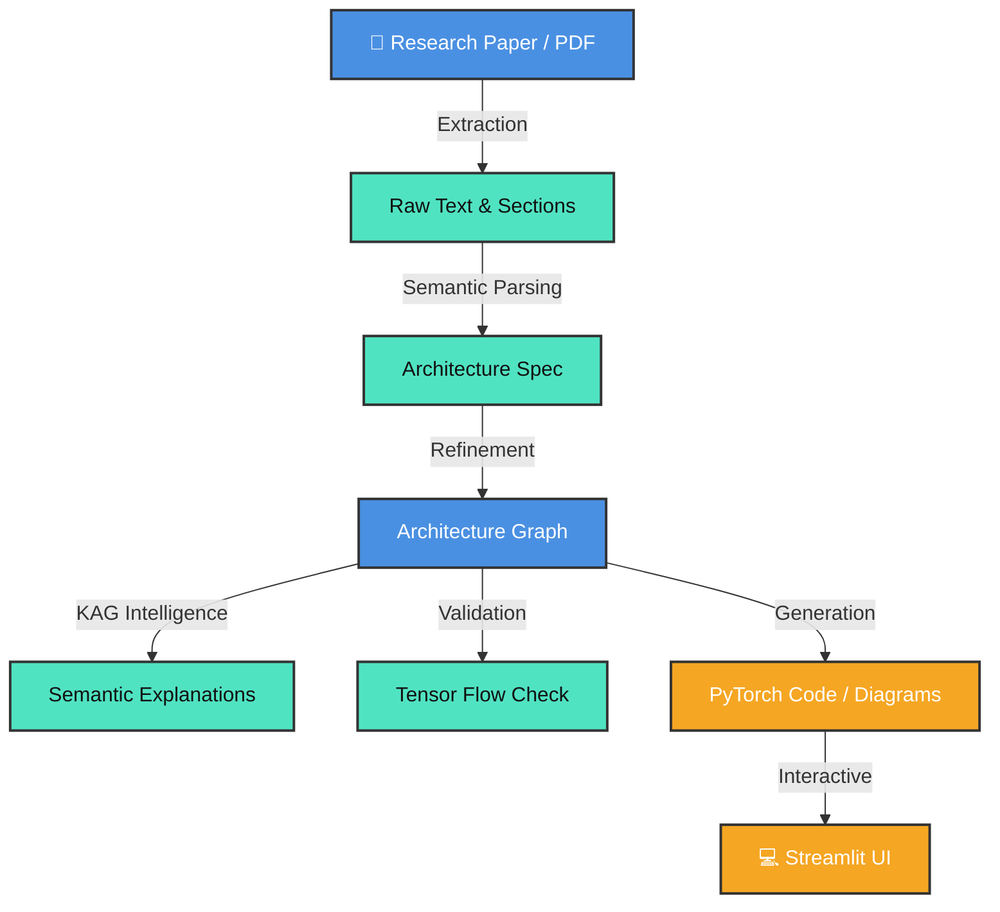

<div align="center">
  
  
  # 📄 paper2code
  **Research-to-Implementation Intelligence**
  
  [](https://www.python.org/downloads/)
  [](https://opensource.org/licenses/MIT)
  []()
  [](https://streamlit.io/)
  
  *Transform Deep Learning Research Papers into Structured Architectures, Executable Code, and Interactive Visualizations.*
</div>

---

## 🌟 The Vision: Ending the Reproducibility Crisis

**The Problem:** Deep learning research is moving faster than ever, but implementation is lagging significantly behind. Papers often describe models using vague terminology, inconsistent diagrams, and implicit assumptions. A single architectural block can be interpreted in dozens of ways, leading to a massive "reproducibility gap." Researchers and engineers spend countless hours translating a PDF into PyTorch code, often guessing hyperparameter configurations or tensor shapes.

**Our Vision:** We envision a world where **every deep learning research paper is instantly reproducible, verifiable, and understandable**. We are building a future where a researcher can upload a PDF and, within seconds, receive a mathematically validated computational graph, educational explanations of why each layer was chosen, and ready-to-train executable code.

**Our Mission:** To automate the translation of human-readable research papers into machine-executable graphs. We achieve this not through blind LLM generation, but through a **Deterministic Knowledge-Augmented Generation (KAG)** system. We ground raw text extractions in a hardcoded Deep Learning Ontology, validate the mathematics of tensor flows using a symbolic forward-pass engine, and present the findings in a visually stunning, interactive UI.

---

## 🗺️ Where We Are Heading (The Roadmap)

While the foundation of `paper2code` is fully operational for ResNet, U-Net, ViT, and Transformer models, our journey is just beginning. Here is a detailed look at our immediate and long-term trajectory:

### 1. Multi-Modal Architecture Extraction
*   **Current State:** We rely entirely on text extracted via `pdfplumber` and `PyMuPDF`.
*   **The Future:** Papers convey massive amounts of information through diagrams. We are building a multi-modal parser that uses Vision-Language Models (VLMs) and Optical Character Recognition (OCR) to "read" architecture diagrams directly from the images. This visual layout understanding will cross-verify our text-based extraction, ensuring absolute precision and zero data loss.

### 2. The "Architecture-LLM" Fine-Tuning
*   **Current State:** We use general-purpose LLMs to parse hyperparameters and section text.
*   **The Future:** We plan to train a highly specialized, local "Architecture-LLM." By fine-tuning an open-source model strictly on deep learning architectures, tensor shape mathematics, and our proprietary ontology mapping, we will achieve surgical extraction precision while eliminating the need for expensive, cloud-based API calls.

### 3. Expansion to State Space Models & LLM Backbones
*   **Current State:** Solid support for standard CNNs and Attention mechanisms.
*   **The Future:** The field is evolving towards complex State Space Models (SSMs) like Mamba, and massive LLM backbones (Llama, Mistral). We are expanding our ontology and builder modules to natively support these architectures, upgrading our `TensorTracker` to seamlessly handle KV-caching semantics, recurrent unrolling, and sparse attention mechanisms.

### 4. The Automatic "Self-Healing" Fix-Agent
*   **Current State:** The `TensorTracker` mathematically validates tensor shapes and throws errors if a paper's description contains topological impossibilities (e.g., mismatched dimensions).
*   **The Future:** We are developing an autonomous Fix-Agent. When an impossibility is detected, this agent will search the literature for standard practices, suggest code-level or schema-level corrections, and effectively "heal" the broken architecture described in the paper, creating a fully self-correcting pipeline.

---

## 🚀 Key Achievements (State-of-the-Art)

| Feature | Detailed Description | Status |
| :--- | :--- | :---: |
| 🧠 **Deterministic KAG** | We bypassed the hallucination issues of traditional RAG by mapping architectural components directly to a hardcoded DL Ontology. The system produces educational context that is 100% factually grounded. | ✅ |
| 🛡️ **ViT Hardening** | Complete and robust support for Vision Transformers. The system extracts and maps Patch Embeddings, CLS Tokens, and Positional Embeddings with perfect precision. | ✅ |
| 🧮 **Tensor Tracking** | A custom symbolic forward-pass engine (`TensorTracker`) that mathematically validates `(B, N, D)` shapes across complex multi-head attention blocks before generating code. | ✅ |
| 🕸️ **Universal Graph** | A unified `ArchitectureGraph` data structure that serves as the single source of truth for all supported model families, allowing for deterministic comparisons between vastly different networks. | ✅ |
| 💎 **Glassmorphism UI** | A premium, highly interactive Streamlit dashboard. It features real-time graph exploration, visual bottleneck highlighting, and dynamic side-by-side model comparison overlays. | ✅ |

---

## 🏗️ System Architecture & Data Flow

### The Technology Stack
<p>
  
  
  
  
</p>

### The paper2code Pipeline Flow



---

## 📂 Exhaustive Project Directory & File Manifest

To understand the immense scale and orchestration of `paper2code`, here is a highly detailed breakdown of the entire repository. Every file has a specific, meticulously designed purpose.

### 📁 Root Directory (Core Entry Points & Documentation)
- **`app.py`**: The crown jewel of the user interface. A Streamlit application built with a Glassmorphism design that provides an interactive dashboard for exploring graphs, reading explanations, and comparing architectures.
- **`server.py`**: The FastAPI backend server. It exposes the extraction, parsing, and rendering pipelines via RESTful API endpoints.
- **`main.py`**: The primary data ingestion script. It orchestrates the extraction of raw text from PDF files using `pdfplumber` (with a fallback to `PyMuPDF`).
- **`AGENT_INTERFACE_REFERENCE.md` & `AGENT_SYSTEM_DESIGN.md`**: Comprehensive architectural design documents defining how the multi-agent system communicates, negotiates, and resolves conflicts.
- **`PHASE_3_9_B_1_COMPLETE.md` & `DELIVERABLES_INDEX.md`**: Internal tracking metrics and documentation marking the successful delivery of the Agent framework interface layer.
- **`benchmark_*.py`**: A suite of latency and accuracy benchmarking scripts (`benchmark_bert_pipeline.py`, `benchmark_vit_pipeline.py`, etc.) ensuring our parsers meet strict performance SLAs.
- **`demo_*.py`**: Standalone demonstration scripts (`demo_comparator.py`, `demo_explainer.py`) to quickly showcase the explanation and comparison capabilities without spinning up the full UI.
- **`test_*.py` & `validate_*.py`**: An incredibly robust suite of dozens of validation scripts testing everything from visual feature regressions (`test_visual_comparison.py`) to complex tensor math (`validate_tensor_tracker.py`).
- **`requirements.txt` / `.env`**: Standard Python dependencies and environment configuration files.

### 🧠 `src/rag/` (The Intelligence & Logic Layer)
This directory houses the Deterministic KAG system. It is the "brain" of the operation.
- **`knowledge_graph.py`**: Contains the hardcoded **Deep Learning Ontology**. This maps abstract architecture terms to strict semantic roles (e.g., standardizing `mhsa` to `token_mixer`).
- **`semantic_explainer.py`**: The "Teacher" module. It ingests nodes and uses the ontology to generate hallucination-free, educational text explaining *why* a layer was chosen by the authors.
- **`tensor_tracker.py`**: The "Validator" module. It uses symbolic mathematics to run a dry forward-pass on the extracted graph, guaranteeing that shapes align across complex layers like Transformers before any code is generated.
- **`config_extractor.py`**: The hyperparameter sleuth. It interfaces with LLMs to pull exact numerical values (patch sizes, embedding dimensions, number of heads) from the dense text of the paper.
- **`diff_engine.py` & `flops_engine.py`**: Complex analytical engines. `diff_engine.py` calculates structural semantic differences between two different architectures, while `flops_engine.py` estimates the theoretical computational complexity of the models.
- **`symbolic_parser.py`**: Parses and evaluates symbolic tensor shapes (e.g., handling variable sequence lengths `N` alongside fixed batch sizes `B`).
- **`retriever.py` & `normalizer.py`**: Utilities to retrieve context from the ontology and normalize user/text inputs for the RAG pipeline.

### 🤖 `src/agents/` (The Autonomous Orchestrators)
This directory contains the implementations for our autonomous agent system, which handles specialized tasks.
- **`parsing_agent_impl.py`**: Responsible for taking raw, chunked text and converting it precisely into an `ArchitectureGraph` object.
- **`visualization_agent_impl.py`**: Dedicated strictly to the aesthetics of the data. It handles graph styling, node colors, label placement, and hover-card rendering.
- **`explanation_agent_impl.py`**: Consumes the output of the `semantic_explainer` and formats it into digestible, human-readable summaries for the UI.
- **`config_parser.py`**: An agent that specializes in parsing the highly complex, nested configuration outputs generated by the LLM during the extraction phase.
- **`types.py`**: Enforces strict typing. Contains the Abstract Base Classes (ABCs) and TypedDicts that ensure all agents adhere to a rigid communication contract.

### 📐 `src/` (Core Data Structures & Code Generation)
The engineering backbone that bridges the graph to executable PyTorch code.
- **`architecture_graph.py`**: The holy grail of the data model. Defines `GraphNode`, `GraphEdge`, and the unified `ArchitectureGraph` class.
- **`codegen.py`**: The PyTorch generator. Iterates over the `ArchitectureGraph` and constructs a fully executable `nn.Module` class string.
- **`metrics_estimator.py` & `radar_chart.py`**: Visualization utilities that calculate parameter counts and generate radar charts to visually compare the complexity vs. performance trade-offs of models.
- **`model_builder.py`, `transformer_builder.py`, `unet_builder.py`, `vit_builder.py`**: Highly specialized constructor classes. These files take the code-ready JSON schemas and build the actual PyTorch neural networks for specific families.
- **`generate_code_ready_schema*.py`**: Scripts that take the raw parsed extraction and refine it into a rigid, implementation-ready JSON schema.
- **`diagram_*.py` & `visualizer_*.py`**: Scripts responsible for translating the `ArchitectureGraph` into visual Graphviz files and Streamlit-compatible visual components.
- **`schema_refiner*.py` & `schema_rules*.py`**: The rule engines. They apply architecture-specific logical rules to clean, normalize, and validate the raw text extractions.
- **`section_splitter.py`**: Ingests thousands of words of raw PDF text and intelligently splits it into logical sections (Methodology, Experiments, Related Work).
- **`verify_model.py`**: An analytical tool that double-checks the generated PyTorch models for execution validity.
- **`blocks_*.py`**: Reusable architectural blueprints containing standard definitions for residual blocks, attention mechanisms, and unet convolutions.
- **`paper_to_code_generator.py`**: The grand orchestrator. It imports all these pieces and runs the high-level script connecting PDF ingestion directly to PyTorch code generation.

### ⚖️ `src/comparators/` & 🗣️ `src/explainers/` (Analysis)
- **`src/comparators/architecture_comparator.py`**: A deterministic logic engine built to ingest two different `ArchitectureGraphs` and output the exact structural, tensor, and topological differences.
- **`src/explainers/graph_explainer.py` & `comparison_explainer.py`**: Translates the mathematical diffs from the comparator into fluid, educational natural language text.

### 📦 `outputs/` (Generated Artifacts)
Where the pipeline writes its output. This directory is dynamically populated.
- **`texts/`**: The raw `.txt` files extracted from the PDFs.
- **`sections/`**: The text split into logical JSON blocks.
- **`modelspecs/`**: The initial, raw, unrefined architectural specifications.
- **`code_ready/` & `code_ready_unet/`**: The final, validated, ready-to-build JSON schemas.
- **`diagrams/`**: The beautifully rendered `.png` architecture diagrams.
- **`generated_scripts/`**: The final Python `.py` artifacts containing the PyTorch code.

### 🗂️ Supporting Directories
- **`data/pdfs/`**: The source of truth. Contains the original research papers (e.g., Attention Is All You Need, ResNet, U-Net).
- **`models/`**: Storage for any locally saved PyTorch weights or embeddings used during testing.
- **`static/` & `templates/`**: Traditional web assets (HTML, CSS, JS) used for backend/FastAPI frontends separate from Streamlit.
- **`paper2code/`**: A fully encapsulated sub-package that provides data handling utilities (`data.py`), model wrapping (`models.py`), and training loop definitions (`train.py`) for users who want to actually train the generated code.

---

## 🛠️ Installation & Setup

**1. Clone the Repository**
```bash
git clone https://github.com/officialpk956-wq/paper2code.git
cd paper2code
```

**2. Environment Setup**
```bash
python -m venv .venv
# On Windows
.venv\Scripts\activate
# On macOS/Linux
source .venv/bin/activate 

pip install -r requirements.txt
```

**3. Launch the Intelligence Suite**
```bash
# Terminal 1: Launch Backend API
python server.py

# Terminal 2: Launch Glassmorphism UI
streamlit run app.py
```

---

## 🤝 Contributing & Contact

We welcome contributions to push the boundaries of deep learning reproducibility! Please see `CONTRIBUTING.md` for guidelines.

- **Maintainer**: [@officialpk956-wq](https://github.com/officialpk956-wq)
- **Status**: Active Development (Phase 3.9.B.1 Complete)
- **License**: [MIT](LICENSE)

<br/>
<div align="center">
  <i>Built with ❤️ for the AI Research Community.</i>
</div>
