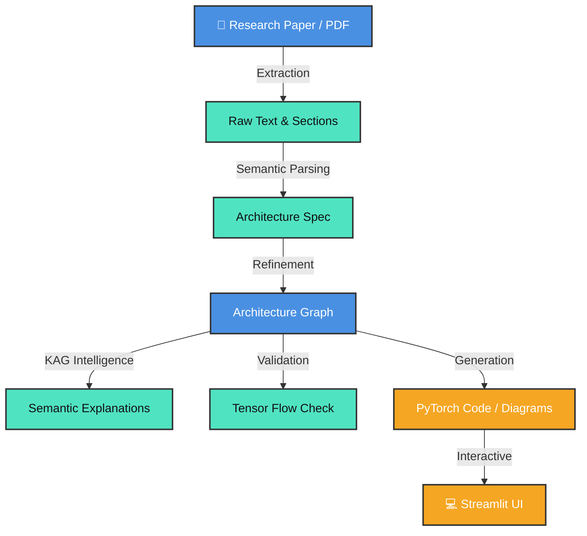

<div align="center">
  
  
  # 📄 paper2code
  **Research-to-Implementation Intelligence**
  
  [](https://www.python.org/downloads/)
  [](https://opensource.org/licenses/MIT)
  []()
  [](https://streamlit.io/)
  
  *Transform Deep Learning Research Papers into Structured Architectures, Executable Code, and Interactive Visualizations.*
</div>

---

## 🌟 Vision & Mission

> **The Reproducibility Gap ends here.** Deep learning papers often describe models in ways that are hard to reproduce. Important details are scattered across text, diagrams, and implicit assumptions.

- **Vision**: To create a world where every deep learning research paper is instantly reproducible, verifiable, and understandable by anyone, regardless of architecture complexity.
- **Mission**: Automate the conversion of human-readable architecture descriptions into machine-executable graphs and code, while providing deep architectural insights through mathematical validation and deterministic semantic explanations.

---

## 🚀 Key Achievements (State-of-the-Art)

| Feature | Description | Status |
| :--- | :--- | :---: |
| 🧠 **Deterministic KAG** | Knowledge-Augmented Generation using a hardcoded DL Ontology. Hallucination-free context. | ✅ |
| 🛡️ **ViT Hardening** | Robust support for Patch Embeddings, CLS Tokens, and Positional Embeddings. 100% precision. | ✅ |
| 🧮 **Tensor Tracking** | Symbolic forward-pass engine (`TensorTracker`) validating `(B, N, D)` shapes and topology. | ✅ |
| 🕸️ **Universal Graph** | Unified `ArchitectureGraph` single source of truth for ResNet, U-Net, ViT, and Transformers. | ✅ |
| 💎 **Glassmorphism UI** | Premium Streamlit dashboard. Real-time graphs, bottleneck highlighting, and model comparison. | ✅ |

---

## 🏗️ System Architecture & Pipeline

### Technology Stack
<p>
  
  
  
  
</p>

### The paper2code Pipeline Flow



---

## 🔬 Deep Dive: The KAG System

Traditional RAG often "hallucinates" architecture details. **paper2code** uses a **Deterministic Knowledge Graph** approach:

1. 🏷️ **Semantic Roles**: Every node is assigned a role (`patch_embedding`, `token_mixer`, etc.).
2. 🗺️ **Ontology Mapping**: The system maps these roles to our local `KnowledgeGraph`.
3. 🎓 **Educational Templates**: Explanations are built using validated pedagogical templates, ensuring accuracy.

---

## 📂 Detailed Project Structure (Comprehensive)

<details>
<summary><b>Click to expand the Exhaustive File Manifest</b> 🗂️</summary>

### 📁 Root Directory
- **`app.py`**: Main Streamlit application with the Glassmorphism UI.
- **`server.py`**: FastAPI backend server for API endpoints.
- **`main.py`**: Primary entry point for text extraction from PDFs.
- **`AGENT_*.md` / `PHASE_*.md` / `DELIVERABLES_*.md`**: Extensive documentation and tracking metrics for Phase 3.9.B.1.
- **`benchmark_*.py` / `demo_*.py`**: Demonstration and latency/accuracy benchmarking scripts for various architectures.
- **`test_*.py` / `validate_*.py`**: Comprehensive test suites covering tensor tracking, UI visuals, graph creation, and legacy compatibility.

### 🧠 `src/rag/` (The Intelligence Layer)
- **`knowledge_graph.py`**: The Deep Learning Ontology mapping structure.
- **`semantic_explainer.py`**: The "Teacher" for node explanations.
- **`tensor_tracker.py`**: The "Validator" for symbolic tensor shapes.
- **`config_extractor.py`**: Extracts architectural hyperparams from paper text.
- **`diff_engine.py`** / **`flops_engine.py`**: Complexity calculation and architecture differential engines.

### 🤖 `src/agents/` (The Orchestrators)
- **`parsing_agent_impl.py`**: Text to `ArchitectureGraph` agent.
- **`visualization_agent_impl.py`**: Graph rendering and styling agent.
- **`explanation_agent_impl.py`**: Human-readable summary generator agent.
- **`config_parser.py`**: Parses advanced LLM output configs.

### 📐 `src/` (Core Source Code)
- **`architecture_graph.py`**: Core graph data structures (`GraphNode`, `ArchitectureGraph`).
- **`codegen.py`**: Graph to PyTorch `nn.Module` conversion.
- **`metrics_estimator.py`** / **`radar_chart.py`**: Visualizations for complexity vs. performance trade-offs.
- **`*_builder.py`**: PyTorch-specific model builders (ResNet, ViT, U-Net, Transformers).
- **`generate_*.py`**: Code-ready JSON schema generation.
- **`diagram_*.py`** & **`visualizer_*.py`**: Visualization utilities for Streamlit and Graphviz formats.

### ⚖️ Comparators & Explainers
- **`src/comparators/architecture_comparator.py`**: Deterministic comparison engine.
- **`src/explainers/graph_explainer.py`**: Translating graph diffs into textual explanations.

### 📦 `outputs/`
- Contains dynamically generated artifacts: `texts/`, `diagrams/`, `code_ready/` JSON schemas, and `modelspecs/`.

</details>

---

## 🛠️ Quick Start & Setup

**1. Clone the Repository**
```bash
git clone https://github.com/officialpk956-wq/paper2code.git
cd paper2code
```

**2. Environment Setup**
```bash
python -m venv .venv
# On Windows
.venv\Scripts\activate
# On macOS/Linux
source .venv/bin/activate 

pip install -r requirements.txt
```

**3. Launch the Intelligence Suite**
```bash
# Terminal 1: Launch Backend API
python server.py

# Terminal 2: Launch Glassmorphism UI
streamlit run app.py
```

---

## 🗺️ Direction & Roadmap (Future Plans)

We are rapidly evolving. Here is where the project is heading next:

- [ ] 🖼️ **Multi-Modal Extraction**: Direct parsing of architecture diagrams directly from images (OCR + visual layout).
- [ ] 🧠 **LLM Fine-tuning**: Training a specialized "Architecture-LLM" for surgical extraction precision.
- [ ] 🐉 **Llama/Mamba Support**: Expanding the ontology to include State Space Models and modern LLM backbones.
- [ ] 🚑 **Automatic Fix-Agent**: A self-healing agent that suggests paper corrections if the `TensorTracker` catches math impossibilities.

---

## 🤝 Contributing & Contact

We welcome contributions to push the boundaries of deep learning reproducibility! Please see `CONTRIBUTING.md` for guidelines.

- **Maintainer**: [@officialpk956-wq](https://github.com/officialpk956-wq)
- **Status**: Active Development (Phase 3.9.B.1 Complete)
- **License**: [MIT](LICENSE)

<br/>
<div align="center">
  <i>Built with ❤️ for the AI Research Community.</i>
</div>
