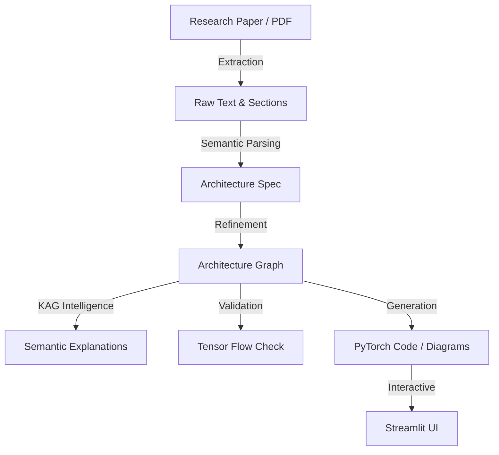

# 📄 paper2code: Research-to-Implementation Intelligence

> Transform Deep Learning Research Papers into Structured Architectures, Executable Code, and Interactive Visualizations.

 <!-- Placeholder for actual banner -->

**paper2code** is a state-of-the-art research-to-implementation toolkit designed to bridge the "reproducibility gap" in deep learning. It transforms informal architecture descriptions from research papers into structured, verifiable, and pedagogically rich code artifacts.

---

## 🌟 Vision & Mission

### **Vision**
To create a world where every deep learning research paper is instantly reproducible, verifiable, and understandable by anyone, regardless of the complexity of the architecture.

### **Mission**
To automate the conversion of human-readable architecture descriptions into machine-executable graphs and code, while providing deep architectural insights through mathematical validation and deterministic semantic explanations.

---

## 🚀 Key Achievements (State-of-the-Art)

- [x] **Deterministic KAG Explanation System**: Implemented a Knowledge-Augmented Generation (KAG) system that uses a hardcoded DL Ontology to provide hallucination-free educational context.
- [x] **Vision Transformer (ViT) Hardening**: Robust support for Patch Embeddings, CLS Tokens, and Positional Embeddings with 100% extraction accuracy.
- [x] **Mathematical Tensor Tracking**: A symbolic forward-pass engine (`TensorTracker`) that validates tensor shapes `(B, N, D)` and detects topological mismatches before code generation.
- [x] **Universal Architecture Graph**: A unified `ArchitectureGraph` representation that serves as the single source of truth for ResNet, U-Net, ViT, and standard Transformers.
- [x] **Interactive Glassmorphism UI**: A premium Streamlit-based dashboard featuring real-time graph exploration, bottleneck highlighting, and side-by-side model comparison.

---

## 🏗️ System Architecture & Data Flow

### **Technology Stack**

| Layer | Technology |
|---|---|
| **Language** | Python 3.10+ |
| **Frontend** | Streamlit (Glassmorphism UI) |
| **Backend** | FastAPI |
| **DL Framework** | PyTorch |
| **Graph Engine** | Custom Semantic Architecture Graph |
| **Validation** | Symbolic Tensor Tracking |

### **The paper2code Pipeline**



---

## 📂 Detailed Project Structure

Below is an exhaustive breakdown of the repository and the specific responsibilities of each module.

### 🧠 `src/rag/` (The Intelligence Layer)
This is where the "reasoning" happens.
*   **`knowledge_graph.py`**: Contains the **Deep Learning Ontology**. It maps architecture types to semantic roles (e.g., `mhsa` -> `token_mixer`).
*   **`semantic_explainer.py`**: The "Teacher." It generates educational text explaining *why* a layer is used (e.g., "The CLS token represents the global state...").
*   **`tensor_tracker.py`**: The "Validator." It performs symbolic math to ensure that input/output shapes align across complex Transformer blocks.
*   **`config_extractor.py`**: Uses LLMs to pull architectural hyperparameters (patch size, embedding dim, heads) from raw paper text.
*   **`retriever.py`**: Handles context retrieval for specific architectural terms to ground the parsing process.

### 🤖 `src/agents/` (The Orchestrators)
*   **`parsing_agent_impl.py`**: Implements the logic to convert text to `ArchitectureGraph`.
*   **`visualization_agent_impl.py`**: Handles the styling and rendering of the graph (colors, labels, and hover-cards).
*   **`explanation_agent.py` (Interface)**: Defines the contract for generating human-readable summaries.

### 📐 `src/core/` & Supporting Files
*   **`architecture_graph.py`**: Defines the `GraphNode` and `ArchitectureGraph` classes.
*   **`codegen.py`**: Converts the final graph into executable PyTorch `nn.Module` code.
*   **`metrics_estimator.py`**: Computes FLOPs and parameter counts for each node.
*   **`radar_chart.py`**: Generates visual performance/complexity trade-off charts.

---

## 🔬 Deep Dive: The KAG System

Traditional RAG often "hallucinates" architecture details. **paper2code** uses a **Deterministic Knowledge Graph** approach:

1.  **Semantic Roles**: Every node is assigned a role (`patch_embedding`, `token_mixer`, etc.).
2.  **Ontology Mapping**: The system looks up these roles in our local `KnowledgeGraph`.
3.  **Educational Templates**: Explanations are constructed using validated templates, ensuring accuracy and pedagogical value.

---

## 🛠️ Installation & Setup

1.  **Clone the Repository**:
    ```bash
    git clone https://github.com/officialpk956-wq/paper2code.git
    cd paper2code
    ```
2.  **Install Dependencies**:
    ```bash
    pip install -r requirements.txt
    ```
3.  **Launch the Backend**:
    ```bash
    python server.py
    ```
4.  **Launch the UI**:
    ```bash
    streamlit run app.py
    ```

---

## 📅 Roadmap (Future Plans)

- [ ] **Multi-Modal Extraction**: Direct parsing of architecture diagrams from images.
- [ ] **LLM Fine-tuning**: A specialized "Architecture-LLM" for even higher extraction precision.
- [ ] **Llama/Mamba Support**: Expanding the ontology to include State Space Models and LLM backbones.
- [ ] **Automatic Fix-Agent**: An agent that suggests corrections to the user's paper description if the `TensorTracker` detects a mathematical impossibility.

---

## 🤝 Contributing & Contact

We welcome contributions! Please see `CONTRIBUTING.md` for guidelines.

**Maintainer**: officialpk956-wq  
**Status**: Active Development (Phase 3.9.B.1 Complete)  
**License**: MIT

---
*Last Updated: May 2026*
