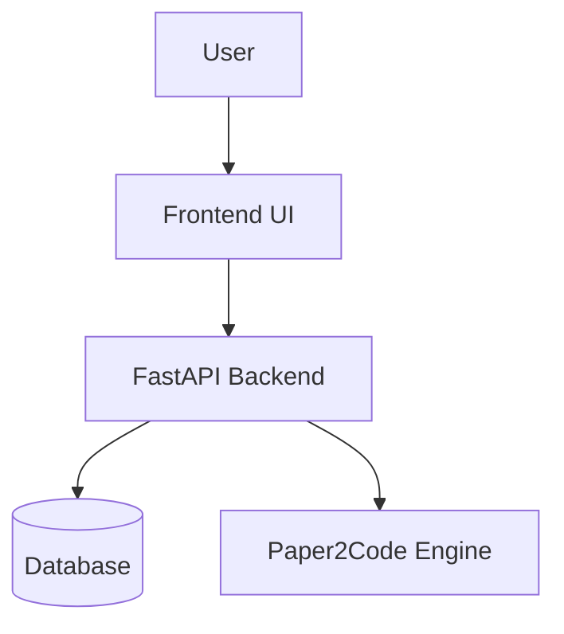
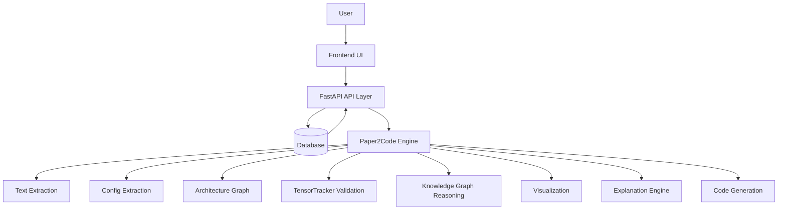
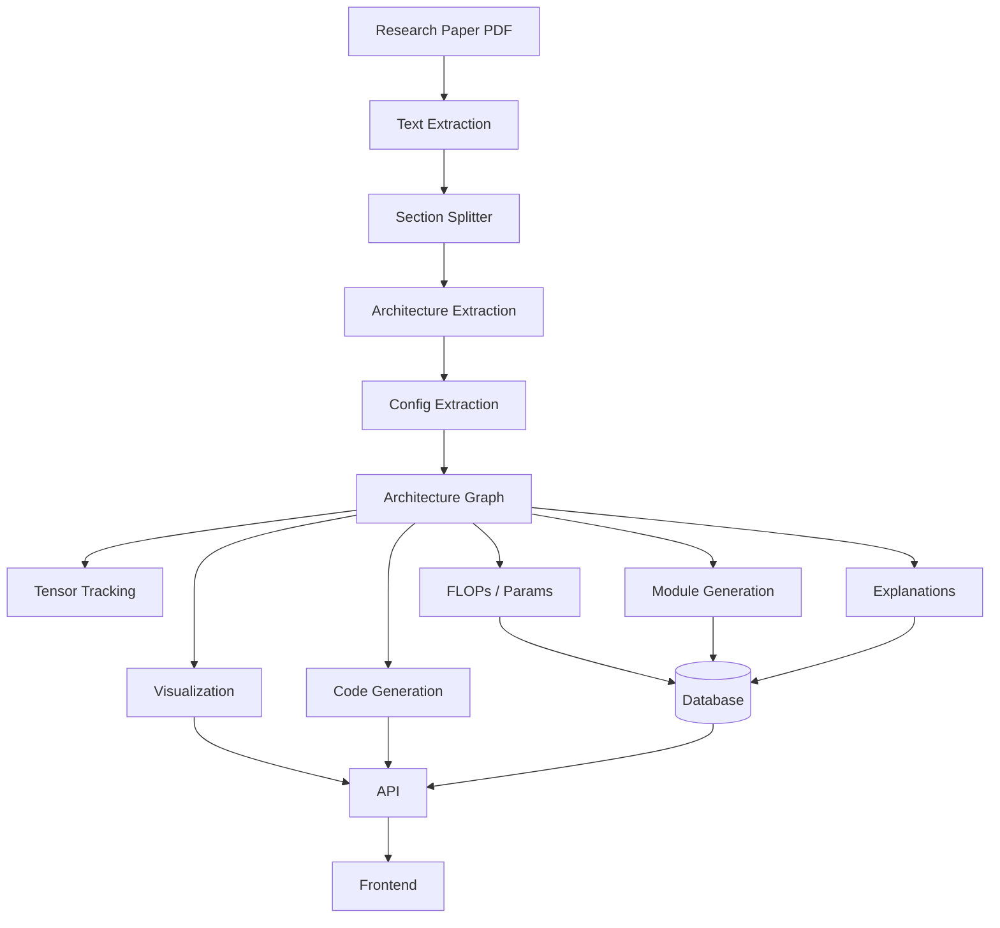
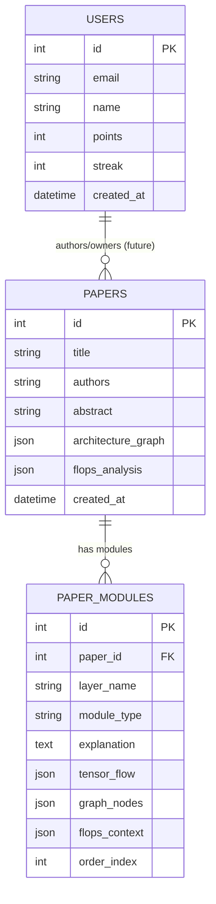

# Paper2Code Engineering Handbook

Version: 1.0  
Last Updated: 2026-05-31  
Audience: Project owners, architects, lead engineers, senior backend engineers, senior AI engineers, and future maintainers.

This handbook is a complete engineering guide to building Paper2Code from scratch. It is not a file-by-file explanation. It teaches the product intent, architectural logic, data flow, and engineering decisions you must understand to reconstruct the system independently.

## Table of Contents

1. Project Overview  
2. Project Evolution  
3. System Design Masterclass  
4. Monorepo Architecture  
5. Paper2Code Core Engine  
6. Research Paper to Learning Pipeline  
7. Database Engineering  
8. FastAPI Masterclass  
9. Frontend Masterclass  
10. AI/ML Knowledge Required  
11. Technologies Used  
12. Software Engineering Principles  
13. Testing Masterclass  
14. Debugging Guide  
15. How to Rebuild Paper2Code from Scratch  
16. Interview Preparation  
17. Future Roadmap  
18. Final Engineering Exam

---

# SECTION 1 — PROJECT OVERVIEW

## 1.1 What is Paper2Code?

Paper2Code is a deterministic research-to-implementation intelligence platform that converts AI research papers into validated architecture graphs, educational explanations, and runnable code. Its core value is not only generating code, but validating and explaining the architecture so that researchers and engineers can trust and understand the implementation.

## 1.2 The Problem It Solves

Deep learning papers describe architectures for humans, not for machines. The result is ambiguity:

- Missing details (padding, activation order, normalization placement)
- Inconsistent naming and notation across papers
- Multiple plausible interpretations for a single paper
- Large time cost to implement and validate a paper

Paper2Code addresses the reproducibility gap by grounding extraction in a deterministic knowledge system and validating tensor shapes before code generation.

## 1.3 Why It Was Created

The project exists because reproducibility is the bottleneck in modern ML:

- Researchers spend weeks replicating a single model
- Implementations diverge without clear correctness criteria
- Students learn the theory but cannot map it to implementation

Paper2Code was built to automate the translation layer between paper and code while ensuring correctness and educational clarity.

## 1.4 What Makes It Unique

Paper2Code is intentionally deterministic. It does not rely on free-form LLM generation alone. It uses:

- A hardcoded Deep Learning Ontology (Knowledge Graph)
- A TensorTracker symbolic validator
- A unified ArchitectureGraph representation
- A pipeline of strict agents and pure functions

This makes outputs auditable, reproducible, and explainable.

## 1.5 Core Ideas Behind the Project

1. **Deterministic extraction beats hallucination**  
   Use structured rules and ontologies to parse architecture details.

2. **Validate before generating**  
   Symbolically validate tensor shapes before writing code.

3. **Use a unified graph representation**  
   Everything (visuals, explanations, code) is derived from the same graph.

4. **Teach as you generate**  
   The system must explain the architecture, not just output code.

## 1.6 Target Users

| Persona | Need | How Paper2Code Helps |
|---|---|---|
| Researcher | Reproducible implementations | Validated graph + code |
| Student | Learning architecture design | Explanations + module viewer |
| Engineer | Fast prototyping | Generated runnable code |
| Interviewer | Evaluation material | Architecture questions + system insights |
| Product Owner | Platform roadmap | Clear modular subsystems |

## 1.7 Value

**Educational value:**  
Explains real architectures from real papers with module-level breakdown and tensor flow tracing.

**Technical value:**  
Enforces correctness via symbolic validation and deterministic constraints.

**Business value:**  
Reduces research time-to-implementation, enables a scalable learning platform, and creates a moat of deterministic knowledge rather than purely generative output.

## 1.8 Complete Vision

Paper2Code aims to become the authoritative platform for understanding and reproducing AI research. The long-term vision is a complete learning and research interface:

- Upload any paper
- Extract architecture deterministically
- Validate and explain design choices
- Compare against known architectures
- Generate code that is auditable, traceable, and correct

---

# SECTION 2 — PROJECT EVOLUTION

## 2.1 Chronological Evolution

### Phase 1: Research-to-Code Translation
The initial goal was simple: convert paper text to runnable code. Early prototypes relied on raw extraction and basic parsing. The output was functional but fragile because papers are inconsistent.

### Phase 2: Deterministic Extraction
The system evolved toward determinism. A Deep Learning Ontology was introduced to constrain parsing and resolve ambiguity. This reduced hallucinations and improved repeatability.

### Phase 3: Learning Platform Pivot
The project pivoted from pure code generation to an educational platform:

- Code generation alone does not teach
- Engineers need explanations and visualizations
- Students need to understand architectural intent

### Phase 4: Golden Paper Set
A curated set of canonical papers was introduced to guarantee quality:

- High-impact architectures
- Diverse families (CNNs, Transformers, U-Net)
- Stable references for evaluation and validation

### Phase 5: Module Viewer and Architecture Reasoning
The platform added module-level explanation and reasoning:

- “Why does this block exist?”
- “What is its compute impact?”
- “How does it affect tensor shape?”

### Phase 6: Tensor Tracking and FLOPs Estimation
Validation and performance insight became first-class:

- TensorTracker catches shape errors early
- FLOPs and parameter estimation quantify cost

## 2.2 Why These Decisions Were Made

| Decision | Rationale |
|---|---|
| Deterministic parsing | Trust and reproducibility |
| Knowledge Graph | Grounding architecture constraints |
| TensorTracker | Prevent invalid graphs before code generation |
| Golden Paper Set | Curated learning and validation dataset |
| Module viewer | Explainability at the right granularity |
| FLOPs analysis | Teach performance and compute tradeoffs |

---

# SECTION 3 — SYSTEM DESIGN MASTERCLASS

## 3.1 Top-Level System Diagram



## 3.2 Expanded System Diagram



## 3.3 Layer Responsibilities

| Layer | Responsibilities | Inputs | Outputs | Dependencies | Failure Modes | Tradeoffs |
|---|---|---|---|---|---|---|
| Frontend | User interaction, display graphs, module navigation | API responses | Visual UI state | FastAPI | Blank UI, failed requests | Faster iteration vs feature depth |
| FastAPI | Orchestration, validation, API contract | HTTP requests | JSON responses | Core engine, DB | 500 on pipeline errors | Simplicity vs heavy validation |
| Database | Persist papers, modules, metrics | Structured data | Query results | SQLAlchemy | Connection errors | SQLite simplicity vs scaling limits |
| Paper2Code Engine | Core reasoning, parsing, graph, metrics | Text or config | Graph, explanations, code | Knowledge Graph, TensorTracker | Invalid graphs, parse errors | Determinism vs flexibility |

## 3.4 Data Flow Summary

1. User sends a paper text or PDF
2. Backend extracts text and generates a config
3. Pipeline creates an ArchitectureGraph
4. TensorTracker validates shapes
5. Knowledge Graph verifies topology and assigns semantic roles
6. Visualization and explanation agents produce output
7. API returns structured JSON for UI

---

# SECTION 4 — MONOREPO ARCHITECTURE

## 4.1 Why a Monorepo

The project is structured as a monorepo so that:

- The core engine is shared by API and UI
- Tests can run across layers
- Changes to ontology or graph logic propagate consistently
- Packaging and deployment stay aligned

## 4.2 Advantages

- Single source of truth for architecture logic
- Easier refactoring across layers
- Shared models and schemas
- Simplified CI and testing

## 4.3 Disadvantages

- Larger repository footprint
- Requires discipline in modular boundaries
- Slower installs if dependencies are not scoped

## 4.4 Alternative Architectures

| Approach | Pros | Cons |
|---|---|---|
| Polyrepo | Independent deployments | Duplication of shared logic |
| Microservices | Scalability | Higher operational complexity |
| Monolith | Easy integration | Harder scaling and ownership boundaries |

## 4.5 Top-Level Folder Rationale

| Folder | Purpose | Why It Exists | If Missing |
|---|---|---|---|
| backend/ | FastAPI API, DB integration | Serves API, orchestrates engine | No backend API, UI breaks |
| core/ | Core engine and reasoning logic | Graphs, validation, codegen | No intelligence layer |
| frontend/ | Next.js UI components | User interface and visualization | No interactive experience |
| static/ | Static assets for FastAPI | Landing page and assets | Empty root UI |
| workers/ | Background or async tasks | Long-running jobs | No offloaded processing |
| migrations/ | Alembic migrations | Schema evolution | Manual DB changes |
| tests/ | Validation and regression tests | Quality assurance | Unreliable changes |
| data/ | Papers and datasets | Inputs for experiments | No paper set |
| outputs/ | Generated artifacts | Debug and validation outputs | Lost observability |
| scripts/ | Maintenance tooling | Data prep and utilities | Harder operations |
| notebooks/ | Exploratory analysis | Rapid research and demos | Loss of experimentation |

---

# SECTION 5 — PAPER2CODE CORE ENGINE

This section explains the core subsystems as systems, not files. Each subsystem has a clear purpose, inputs, outputs, algorithms, tradeoffs, and debugging guidance.

## 5.1 Architecture Graph Generation

**Problem solved:** unify heterogeneous architecture descriptions into a single structured representation.  
**Input:** ConfigDict or extracted architecture description.  
**Output:** ArchitectureGraph (nodes + edges + metadata).

**Algorithm (conceptual):**
1. Normalize layer types and parameters
2. Build node list in topological order
3. Create edges based on inferred or explicit connections
4. Attach semantic metadata for later reasoning

**Example:**
```
Input: "3x3 conv, 64 filters, stride 2 -> maxpool -> residual block"
Output: GraphNode(conv2d) -> GraphNode(maxpool2d) -> GraphNode(residualblock)
```

**Complexity:** O(N + E) where N is nodes and E is edges.  
**Tradeoffs:** Accuracy depends on normalization rules. Determinism reduces flexibility.  
**Common bugs:** missing edges, incorrect ordering, incorrect parameter mapping.  
**Debugging:** inspect normalized config, verify node count, visualize the graph.

## 5.2 Module Generation

**Problem solved:** break the architecture into pedagogical blocks (modules).  
**Input:** ArchitectureGraph.  
**Output:** Module list with explanations and tensor flow.

**Algorithm:**
1. Group nodes by semantic role or stage
2. Create module boundaries at block-level patterns (e.g., ResNet stages)
3. Attach tensor trace summaries

**Tradeoffs:** module boundaries are heuristic and may differ from author intent.  
**Debugging:** verify module counts against known architecture patterns.

## 5.3 Tensor Tracking

**Problem solved:** ensure tensor shapes are valid across the graph.  
**Input:** ArchitectureGraph with layer params.  
**Output:** tensor_trace metadata or validation errors.

**Algorithm:**
1. Initialize input tensor shape
2. Propagate shapes layer-by-layer
3. Validate constraints (concat alignment, residual add compatibility, attention head divisibility)

**Example:**
```
Input: (B, 64, 56, 56) + (B, 256, 56, 56)
Result: Invalid, mismatch on channels
```

**Complexity:** O(N) with constant-time shape ops per node.  
**Common bugs:** incorrect inferred shapes, missing params (stride, padding).  
**Debugging:** inspect tensor_trace, verify input dimensions.

## 5.4 FLOPs Estimation

**Problem solved:** quantify computational cost for each layer and architecture.  
**Input:** ArchitectureGraph with shape metadata.  
**Output:** FLOPs summary and per-layer breakdown.

**Algorithm:** apply layer-specific formulas (conv, linear, attention).  
**Tradeoffs:** estimates depend on assumed input size and batch.  
**Debugging:** compare estimated FLOPs against known benchmarks.

## 5.5 Parameter Estimation

**Problem solved:** estimate parameter counts for each layer.  
**Input:** ArchitectureGraph with dimensions.  
**Output:** parameter totals.

**Algorithm:** compute weights and biases per layer type.  
**Debugging:** verify counts for known architectures (ResNet-50, ViT-B).

## 5.6 Semantic Explanation Generation

**Problem solved:** teach design intent rather than simply showing layers.  
**Input:** ArchitectureGraph + semantic roles.  
**Output:** readable explanations for each node and overall design.

**Algorithm:**
1. Map node type to explanation template
2. Use semantic role annotations for rationale
3. Combine into architecture narrative

**Common bugs:** shallow explanations if semantic roles missing.  
**Debugging:** confirm roles from Knowledge Graph are attached.

## 5.7 Architecture Comparison

**Problem solved:** compare two architectures (e.g., ResNet-50 vs ResNet-101).  
**Input:** two ArchitectureGraphs.  
**Output:** diff summary, visual annotations, explanation.

**Algorithm:** structural diff on nodes and edges, compute deltas in FLOPs and depth.  
**Tradeoffs:** structural comparison may miss semantic intent differences.  
**Debugging:** inspect highlighted nodes and comparison summary.

## 5.8 Reasoning Engine (Knowledge Graph)

**Problem solved:** enforce architectural validity and annotate semantic roles.  
**Input:** ArchitectureGraph.  
**Output:** motifs, anomalies, semantic annotations.

**Algorithm:** rule-based constraints on node types, allowed sequences, and motif detection.  
**Tradeoffs:** deterministic constraints can be conservative and reject novel designs.  
**Debugging:** inspect motif/anomaly logs and validate against rules.

---

# SECTION 6 — RESEARCH PAPER TO LEARNING PIPELINE

This section shows the complete paper-to-learning transformation using a ResNet-style example.

## 6.1 End-to-End Flow



## 6.2 Step-by-Step Transformation (ResNet Example)

| Step | Input | Output | Code Responsible | Why It Exists |
|---|---|---|---|---|
| Text extraction | PDF bytes | Raw text | PaperToCodeGenerator.from_pdf | Convert PDF to text |
| Section split | Raw text | Structured sections | section_splitter.process_text | Focus on method section |
| Architecture extraction | Sections | Spec draft | architecture_extractor.extract_architecture | Identify architecture family |
| Config extraction | Spec text | ConfigDict | rag.config_extractor.ConfigExtractor | Normalize into structured config |
| Graph generation | ConfigDict | ArchitectureGraph | ParsingAgent | Unified internal representation |
| Tensor tracking | Graph | Tensor trace or warnings | rag.tensor_tracker.TensorTracker | Validate shapes |
| FLOPs & params | Graph | Metrics | metrics_estimator / flops_estimator | Compute cost |
| Module generation | Graph | Module list | module_generator | Learning granularity |
| Explanation | Graph | Narrative | explainers.graph_explainer | Teach design |
| Visualization | Graph | DOT / SVG | visualizer_* | UI diagrams |
| Code generation | Graph + spec | PyTorch code | paper_to_code_generator._generate_code | Runnable implementation |
| Persistence | Metrics, modules | DB records | backend models | UI browsing |

## 6.3 Example Transformation Detail

**Paper text snippet:**  
"We use a 7x7 convolution with 64 filters and stride 2, followed by max pooling, then four stages of residual blocks with increasing channels."

**ConfigDict output (simplified):**
```json
{
  "name": "ResNet",
  "model_family": "resnet",
  "layers": [
    {"type": "conv2d", "params": {"kernel_size": 7, "channels": 64, "stride": 2}},
    {"type": "maxpool2d", "params": {}},
    {"type": "residualblock", "params": {"channels": 64}},
    {"type": "residualblock", "params": {"channels": 128}},
    {"type": "residualblock", "params": {"channels": 256}},
    {"type": "residualblock", "params": {"channels": 512}}
  ]
}
```

**ArchitectureGraph result (conceptual):**
```
conv2d -> maxpool2d -> res_block_1 -> res_block_2 -> res_block_3 -> res_block_4
```

**Why this matters:**  
This structure becomes the single source of truth for explanations, metrics, diagrams, and code. It is the backbone of the platform.

---

# SECTION 7 — DATABASE ENGINEERING

Paper2Code uses SQLAlchemy as the ORM and SQLite as the default storage engine. The database is intentionally simple to support fast local development and deterministic experiments, but the design is ready to scale to PostgreSQL when needed.

## 7.1 Core Entities

The current persistence layer models three primary entities:

1. **User**: identity, points, activity  
2. **Paper**: metadata and aggregated analytics  
3. **PaperModule**: module-level explanation and metrics

### Conceptual ER Diagram



## 7.2 SQLAlchemy Fundamentals

SQLAlchemy provides a declarative mapping between Python classes and database tables. In Paper2Code, models are declared in `backend/models.py` using SQLAlchemy 2.x style:

```python
class Paper(Base):
    __tablename__ = "papers"
    id = Column(Integer, primary_key=True)
    title = Column(String(512), unique=True, nullable=False)
    architecture_graph = Column(JSON)
    flops_analysis = Column(JSON)
```

### Why ORM?

- Keeps business logic in Python
- Avoids handwritten SQL for common workflows
- Enforces consistent schema
- Supports multiple databases without rewrites

## 7.3 Dependency Injection and Session Lifecycle

FastAPI injects a database session per request. The `get_db()` dependency in `backend/database.py` yields a session and ensures it is closed after the request.

```python
def get_db():
    db = SessionLocal()
    try:
        yield db
    finally:
        db.close()
```

**Why this matters:**  
It prevents leaking connections and keeps transactions isolated per request.

## 7.4 Alembic Migrations

Alembic is the standard for schema migrations with SQLAlchemy. The intent is:

1. Model updates happen in code
2. Alembic generates migration scripts
3. Database is migrated safely without data loss

**When to use Alembic:**  
Any schema change in production or shared environments.

## 7.5 Repositories and Services

The database layer is intentionally minimal but future-proof:

- **Repositories** should encapsulate queries (PaperRepository, ModuleRepository)
- **Services** should encapsulate business logic (PaperService, LearningService)

This separation prevents API handlers from becoming “God functions” and keeps testing isolated.

## 7.6 Session Management and Connection Pools

SQLite runs in-process and does not need a real pool. PostgreSQL uses pool_pre_ping and pool_recycle for stability.

Key concepts:

- **pool_pre_ping** prevents stale connections  
Level-up: necessary for long-lived services.

- **pool_recycle** prevents server-side idle disconnects.

## 7.7 Why SQLite Was Selected

SQLite is ideal for:

- Local development
- Single-user learning platform
- Deterministic experiments
- Zero configuration

## 7.8 When PostgreSQL Becomes Necessary

Switch to PostgreSQL when:

- Concurrent users exceed 20-50
- You need row-level locking
- Data grows beyond a few GB
- You require analytics queries or replication

## 7.9 Scaling the Database

Scaling strategy:

1. Replace SQLite with Postgres  
2. Add read replicas for analytics  
3. Partition large tables (modules, traces)  
4. Cache hot queries (paper summaries, module lists)

---

# SECTION 8 — FASTAPI MASTERCLASS

FastAPI is the API backbone of Paper2Code. It handles request validation, dependency injection, and orchestration of the core engine.

## 8.1 Why FastAPI

| Reason | Benefit |
|---|---|
| Type hints and Pydantic | Strong request/response validation |
| Async support | Efficient IO for PDFs and external calls |
| Dependency injection | Clean DB session management |
| Automatic docs | OpenAPI and Swagger UI out of the box |

## 8.2 Core Design Patterns

- **Single Responsibility Endpoints**: Each endpoint performs one job.
- **Dependency Injection**: Database sessions are injected cleanly.
- **Error Handling**: Errors return HTTP exceptions with details.
- **Pipeline Orchestration**: No business logic in API layer; it delegates to the core engine.

## 8.3 Implemented Endpoints

### 1) `GET /`
**Purpose:** Serve static landing page.  
**Response:** HTML from `static/index.html`.

### 2) `GET /api/health/db`
**Purpose:** Verify database connectivity.  
**Response:** `{ ok, dialect, url, error }`

Example:
```json
{
  "ok": true,
  "dialect": "sqlite",
  "url": "sqlite:///./tensortonic_dev.db",
  "error": ""
}
```

### 3) `POST /api/parse_pdf`
**Purpose:** Upload a PDF and extract architecture.  
**Input:** multipart/form-data (PDF file)  
**Output:** Graph, explanation, code, metrics, layer breakdown.

Example cURL:
```bash
curl -X POST http://localhost:8000/api/parse_pdf \
  -F "file=@resnet.pdf"
```

### 4) `POST /api/parse_text`
**Purpose:** Parse architecture directly from raw text.  
**Input:**
```json
{ "text": "We use a 7x7 conv with 64 filters..." }
```
**Output:** same structure as parse_pdf.

### 5) `POST /api/compare_text`
**Purpose:** Compare two architectures from text.  
**Input:**
```json
{ "text_a": "ResNet-50 ...", "text_b": "ResNet-101 ..." }
```
**Output:** visualization for A and B plus comparison explanation.

### 6) `POST /api/analyze_graph`
**Purpose:** Analyze an architecture graph sent directly from UI.  
**Input:** list of normalized layer dicts.  
**Output:** same as parse_text.

### 7) `GET /api/papers`
**Purpose:** List available papers from DB.  
**Output:** paper summaries (title, module count, FLOPs).

### 8) `GET /api/papers/{paper_id}`
**Purpose:** Detailed paper view.  
**Output:** metadata, module summary, graph, FLOPs.

### 9) `GET /api/papers/{paper_id}/modules`
**Purpose:** Module list for a paper.  
**Output:** module IDs, ordering, and names.

### 10) `GET /api/modules/{module_id}`
**Purpose:** Full detail for a single module.  
**Output:** explanation, tensor summary, graph nodes, navigation.

## 8.4 Response Shape (Core Contract)

The API returns consistent structures to allow the UI to render modules, diagrams, and code without additional transforms:

```json
{
  "name": "ResNet",
  "svg": "graphviz_dot",
  "explanation": "long narrative",
  "code": "PyTorch code",
  "layer_breakdown": [
    { "id": "n1", "type": "conv2d", "explanation": "..." }
  ],
  "metrics": {
    "flops_score": 1.2e9,
    "params": 25557032,
    "depth": 50,
    "memory_mb": 180.4
  }
}
```

## 8.5 Error Handling Strategy

Failures are returned with HTTP 500 + message. This is intentionally simple for early-stage development but should evolve to:

- Structured error codes (PARSE_FAILED, GRAPH_INVALID)
- Partial responses with warnings
- Error logging and tracing

---

# SECTION 9 — FRONTEND MASTERCLASS

Paper2Code’s frontend is built in Next.js and communicates with FastAPI through JSON APIs. The current repo includes reusable components (code editor and math visualization) and a UI plan to support a learning platform.

## 9.1 Current UI Architecture

The UI is structured around three primary user journeys:

1. **Library Page**: list of papers with metrics  
2. **Paper Overview**: summary, architecture graph, high-level explanation  
3. **Module Viewer**: step-by-step module breakdown with tensor trace

## 9.2 Rendering Flow

```mermaid
flowchart TD
  UI[User clicks paper] --> API[GET /api/papers]
  API --> UI
  UI --> P[GET /api/papers/{id}]
  P --> UI
  UI --> M[GET /api/papers/{id}/modules]
  M --> UI
  UI --> D[GET /api/modules/{module_id}]
  D --> UI
```

## 9.3 Core Components

### Code Editor
The frontend includes a Monaco-based code editor:

- Syntax-highlighted PyTorch code
- Used for displaying generated code
- Supports future editing and export

### Math Visualization
Plotly-based interactive visualizations:

- Used for training/learning demos
- Example: gradient descent chart
- Template for future FLOPs or tensor visualizations

## 9.4 State Management

The project uses standard React state and hooks:

- `useState` for local component state
- `useEffect` for data fetching
- No global store yet (can be added if complexity grows)

## 9.5 API Communication

The UI calls the backend using standard fetch calls:

1. Fetch paper list
2. Fetch detailed paper data
3. Fetch module details
4. Render visual graph and explanations

## 9.6 Intended UI Components (Blueprint)

| Component | Purpose | Inputs | Outputs |
|---|---|---|---|
| PaperList | Show available papers | /api/papers | UI cards |
| PaperOverview | Show architecture summary | /api/papers/{id} | Graph + metrics |
| ModuleViewer | Step-by-step learning | /api/modules/{id} | Explanation, tensor flow |
| CodePanel | Show generated code | /api/parse_* | Monaco editor |
| MetricsPanel | FLOPs, params | /api/parse_* | Charts/labels |

---

# SECTION 10 — AI/ML KNOWLEDGE REQUIRED

To fully understand Paper2Code, you must be fluent in core deep learning concepts because the system models them explicitly.

## 10.1 CNNs (Convolutional Neural Networks)

Key ideas:

- Convolution kernels extract spatial features
- Stride controls downsampling
- Padding controls spatial preservation

**Shape formula (Conv2D):**
```
H_out = floor((H_in + 2P - K) / S) + 1
W_out = floor((W_in + 2P - K) / S) + 1
```

## 10.2 ResNet

ResNet introduced residual connections to address vanishing gradients. It is a foundational architecture in the golden paper set.

Core idea:
```
Output = F(x) + x
```

This requires matching shapes between F(x) and x, which is why TensorTracker is essential.

## 10.3 Transformers

Transformers rely on attention and are sensitive to dimension alignment:

```
Attention(Q, K, V) = softmax(QK^T / sqrt(d)) V
```

TensorTracker validates:

- `embed_dim % num_heads == 0`
- consistent sequence length across residuals

## 10.4 U-Net

U-Net is an encoder-decoder architecture with skip connections:

- Encoder downsamples, decoder upsamples
- Skip connections concatenate feature maps

TensorTracker must validate that concatenated shapes match.

## 10.5 Patch Embeddings

Vision Transformers slice images into patches:

```
num_patches = (H / P) * (W / P)
```

This implies H and W must be divisible by patch size.

## 10.6 FLOPs and Parameter Counts

**Conv2D FLOPs (approx):**
```
FLOPs = H * W * C_in * C_out * K * K
```

**Params:**
```
Params = C_in * C_out * K * K + bias
```

These formulas are used directly in FLOPs and metrics estimation.

---

# SECTION 11 — TECHNOLOGIES USED

| Technology | Why Selected | Pros | Cons | Alternatives | Usage in Paper2Code |
|---|---|---|---|---|---|
| Python | ML ecosystem standard | Rich ML libs, fast iteration | Runtime speed | Rust, Go | Core engine + API |
| FastAPI | Modern, typed web framework | Fast, validated APIs | Async complexity | Flask, Django | Backend API |
| SQLAlchemy | ORM flexibility | Database agnostic | ORM overhead | Django ORM | Data models |
| Alembic | Migration support | Reliable schema evolution | Extra tooling | Flyway | DB migrations |
| SQLite | Local simplicity | Zero config | Limited concurrency | Postgres | Default storage |
| HTML/CSS/JS | Universal UI stack | Broad compatibility | Manual effort | React Native | UI rendering |
| Next.js | React framework | SSR, routing | Build complexity | Vite + React | Frontend app |
| Pytest | Python testing | Simple, powerful | Setup overhead | unittest | Test suites |
| GitHub Actions | CI/CD | Hosted CI | Limited free minutes | Jenkins | Automated tests |

---

# SECTION 12 — SOFTWARE ENGINEERING PRINCIPLES

## 12.1 Layered Architecture

The system is layered:

- UI layer
- API layer
- Core reasoning engine
- Database

This keeps responsibilities separate and makes the system testable.

## 12.2 Repository Pattern

Data access should be abstracted into repositories to prevent SQL bleeding into API handlers.

## 12.3 Service Layer Pattern

Complex workflows (paper parsing, module extraction) belong in services, not controllers.

## 12.4 Dependency Injection

FastAPI injects database sessions, which enforces consistent lifecycle and simplifies testing.

## 12.5 Separation of Concerns

Core reasoning is in `core/`. API orchestration is in `backend/`.  
UI logic lives in `frontend/`. This separation prevents coupling.

## 12.6 Single Responsibility Principle

Each subsystem does one thing:

- TensorTracker only validates shapes
- Knowledge Graph only enforces constraints
- Codegen only generates code

## 12.7 Modularity and Testability

Small composable modules make the engine testable without the UI or DB.

## 12.8 Scalability

The design allows scaling by replacing SQLite with PostgreSQL and adding background workers for heavy tasks.

---

# SECTION 13 — TESTING MASTERCLASS

Paper2Code uses unit tests, integration tests, and regression tests to ensure determinism.

## 13.1 Unit Tests

Focus on:

- Config extraction accuracy
- Tensor tracking shape validation
- FLOPs estimation formulas

## 13.2 Integration Tests

Validate multi-stage flows:

- Parsing -> graph -> explanation
- Pipeline output stability

## 13.3 Regression Tests

Golden papers ensure output stability across releases:

- ResNet, Transformer, U-Net, ViT
- Key metrics must remain within expected ranges

## 13.4 Debugging Test Failures

1. Identify test stage (parser vs tracker vs codegen)
2. Compare expected vs actual graph nodes
3. Re-run with debug logs enabled

---

# SECTION 14 — DEBUGGING GUIDE

## 14.1 Common Failure Modes

| Symptom | Likely Cause | Debugging Steps |
|---|---|---|
| API returns 500 | Pipeline exception | Inspect logs, validate input JSON |
| Database connection fails | Incorrect DATABASE_URL | Verify env, run health check |
| Tensor tracker breaks | Missing layer params | Inspect config normalization |
| Module generation fails | Unsupported layer type | Check Knowledge Graph rules |
| FLOPs become zero | Missing shape metadata | Verify tensor trace propagation |
| Frontend renders blank | API response mismatch | Inspect network tab + JSON shape |

## 14.2 Debugging Workflow

1. Reproduce the error with minimal input  
2. Inspect normalized config  
3. Validate graph node count  
4. Check tensor_trace for mismatches  
5. Validate metrics computation  
6. Confirm UI expectations vs API response

---

# SECTION 15 — HOW TO REBUILD PAPER2CODE FROM SCRATCH

This section is the rebuild blueprint. It assumes the repository disappeared and you must reconstruct the system from memory.

## Phase 1 — Project Setup

1. Create monorepo structure: `backend/`, `core/`, `frontend/`, `tests/`
2. Initialize Python environment with FastAPI, SQLAlchemy, Pydantic
3. Initialize Next.js app for frontend

## Phase 2 — Core Engine Foundations

1. Implement ArchitectureGraph (nodes, edges, metadata)
2. Implement ConfigDict normalization
3. Implement ParsingAgent to build graph
4. Implement TensorTracker for validation
5. Implement Knowledge Graph with rules

## Phase 3 — Database Layer

1. Define ORM models (User, Paper, PaperModule)
2. Implement database engine and session lifecycle
3. Create Alembic migrations

## Phase 4 — Backend API

1. Build FastAPI app
2. Implement endpoints (/parse_text, /parse_pdf, /papers, /modules)
3. Connect pipeline to API responses

## Phase 5 — Frontend

1. Build library view (paper list)
2. Build paper overview (graph + metrics)
3. Build module viewer (step-by-step explanation)
4. Connect frontend to API endpoints

## Phase 6 — Learning Platform Features

1. Add module navigation
2. Add visualization overlays (bottlenecks, tensor shapes)
3. Add code viewer and download

## Phase 7 — Advanced Features

1. Paper upload system
2. Architecture playground
3. AI tutor and comparison
4. Scaling for multi-user environments

---

# SECTION 16 — INTERVIEW PREPARATION

## 16.1 50 Recruiter Questions + Ideal Answers

1. Q: What is Paper2Code in one sentence?  
   A: A deterministic system that converts research papers into validated architecture graphs, explanations, and runnable code.
2. Q: Why is Paper2Code different from ChatGPT-based solutions?  
   A: It uses a knowledge graph and tensor validation to avoid hallucination.
3. Q: What problem does Paper2Code solve?  
   A: The reproducibility gap between academic papers and working implementations.
4. Q: Who is the primary user?  
   A: Researchers, students, and engineers who need trustworthy implementations.
5. Q: What is the business value?  
   A: It reduces implementation time and creates a defensible platform for learning and reproducibility.
6. Q: Why is determinism important?  
   A: It allows repeatable, auditable outputs instead of probabilistic guesses.
7. Q: What is a Golden Paper Set?  
   A: A curated group of canonical papers used for validation and learning.
8. Q: What is the TensorTracker?  
   A: A symbolic engine that validates tensor shapes before code generation.
9. Q: What does the system output?  
   A: Graphs, explanations, metrics, and runnable PyTorch code.
10. Q: How does Paper2Code help students?  
    A: It provides structured explanations and module-level breakdowns.
11. Q: How does it help researchers?  
    A: It validates architectures and generates correct code quickly.
12. Q: How does it scale?  
    A: Replace SQLite with PostgreSQL and offload heavy tasks to workers.
13. Q: What is the core innovation?  
    A: Deterministic KAG plus symbolic validation.
14. Q: What is KAG?  
    A: Knowledge-Augmented Generation grounded in a hardcoded ontology.
15. Q: What is the role of the Knowledge Graph?  
    A: Enforce architectural constraints and semantic roles.
16. Q: What is the key deliverable?  
    A: A validated architecture graph that powers everything downstream.
17. Q: What does the frontend do?  
    A: Visualizes architectures, modules, and code for learning.
18. Q: Why FastAPI?  
    A: Strong typing and dependency injection for clean API design.
19. Q: Why SQLAlchemy?  
    A: ORM flexibility and portability across databases.
20. Q: What is the output format?  
    A: JSON with graphs, metrics, explanations, and code.
21. Q: Is it production-ready?  
    A: The core engine is solid; UI and scaling features are evolving.
22. Q: How do you validate correctness?  
    A: Symbolic tensor tracking and golden paper regression tests.
23. Q: What is the learning value?  
    A: It teaches architecture design by breaking models into modules.
24. Q: How do you compare architectures?  
    A: Graph diffing plus performance delta explanation.
25. Q: What is the biggest limitation today?  
    A: Limited to known architecture families and deterministic rules.
26. Q: How can it evolve?  
    A: Add new ontology rules and model families.
27. Q: What is the UI stack?  
    A: Next.js with React, Monaco editor, and Plotly.
28. Q: What is the backend stack?  
    A: FastAPI + SQLAlchemy + SQLite.
29. Q: How do you ensure explainability?  
    A: Semantic roles are attached to nodes and used in explanations.
30. Q: What is module generation?  
    A: Grouping nodes into pedagogical blocks.
31. Q: What is FLOPs estimation used for?  
    A: Teaching performance tradeoffs and bottlenecks.
32. Q: What is parameter estimation?  
    A: Computing memory and model size.
33. Q: Is Paper2Code a compiler?  
    A: It behaves like one: parse, validate, generate.
34. Q: What is the differentiator vs GitHub code?  
    A: Validation and explanation built-in.
35. Q: What is the onboarding time?  
    A: 1-2 hours with the handbook.
36. Q: What is the biggest technical risk?  
    A: Parsing ambiguity in highly novel papers.
37. Q: How do you mitigate risk?  
    A: Deterministic constraints and fallback strategies.
38. Q: What is the role of tests?  
    A: Prevent regression and ensure deterministic outputs.
39. Q: Is there LLM usage?  
    A: Only as a fallback if deterministic extraction fails.
40. Q: What is the roadmap focus?  
    A: Paper upload, interactive playground, AI tutor.
41. Q: Who benefits most today?  
    A: Engineers and students learning core architectures.
42. Q: What is the product category?  
    A: Research-to-implementation learning platform.
43. Q: How is success measured?  
    A: Time saved per paper and accuracy of reproduction.
44. Q: What is the future business model?  
    A: Enterprise or academic subscriptions.
45. Q: Is it open source?  
    A: Yes, under MIT, but knowledge graph is the differentiator.
46. Q: What is the main UI feature?  
    A: Module viewer with explanations.
47. Q: Why a monorepo?  
    A: Shared logic and faster refactoring.
48. Q: What is the most important asset?  
    A: The deterministic ontology and validation pipeline.
49. Q: How do you onboard new architects?  
    A: Use the engineering handbook and golden paper walkthroughs.
50. Q: Why build this now?  
    A: ML reproducibility has reached crisis levels.

## 16.2 50 Backend Questions + Ideal Answers

1. Q: Why use FastAPI?  
   A: It provides type-safe validation and dependency injection.
2. Q: How are DB sessions managed?  
   A: Via FastAPI dependency injection with `get_db()`.
3. Q: What does `/api/parse_text` do?  
   A: Parses architecture text, runs the pipeline, and returns graph + code.
4. Q: What is the pipeline boundary?  
   A: The pipeline is pure orchestration; it does not implement reasoning logic.
5. Q: How do you handle errors?  
   A: Raise HTTPException and return details.
6. Q: Why use JSON fields in models?  
   A: Graphs and FLOPs data are semi-structured and fit JSON well.
7. Q: How do you scale the API?  
   A: Add background workers and switch to Postgres.
8. Q: Why separate backend and core?  
   A: To keep reasoning logic independent of API.
9. Q: How are modules stored?  
   A: In `paper_modules` table with tensor flows and explanations.
10. Q: What is the health endpoint?  
    A: `/api/health/db` for DB connectivity.
11. Q: How is caching handled?  
    A: Pipeline caches text-based results with a size limit.
12. Q: Why pool_pre_ping?  
    A: Prevent stale DB connections.
13. Q: What is the API contract format?  
    A: JSON with graph, code, explanation, metrics, layer breakdown.
14. Q: How do you handle uploads?  
    A: Use UploadFile in FastAPI and read bytes.
15. Q: Why not store PDFs in DB?  
    A: The system focuses on architecture extraction, not document storage.
16. Q: What is the difference between parse_text and parse_pdf?  
    A: parse_pdf includes text extraction stage.
17. Q: How are comparison results generated?  
    A: Two graphs are parsed, diffed, and explained.
18. Q: What is the graph analyzer endpoint?  
    A: `/api/analyze_graph` for user-defined architectures.
19. Q: How do you serialize JSON columns safely?  
    A: Use defensive parsing for dict/list/string types.
20. Q: How do you ensure backwards compatibility?  
    A: Maintain API response shape across changes.
21. Q: What is the DB default?  
    A: SQLite with a local file.
22. Q: What is the migration strategy?  
    A: Use Alembic for schema changes.
23. Q: What is the role of Pydantic?  
    A: Validates incoming requests (TextRequest, CompareRequest).
24. Q: How do you limit input size?  
    A: Use page caps for PDF extraction and layer caps in pipeline.
25. Q: How do you handle concurrency?  
    A: FastAPI workers plus Postgres when needed.
26. Q: Why JSON for tensor traces?  
    A: Variable shape and nested lists.
27. Q: What is the output type of parse endpoints?  
    A: A normalized dict with graph, metrics, code.
28. Q: What is the role of the Knowledge Graph in API?  
    A: It informs explanations and validation.
29. Q: How is memory estimation done?  
    A: Derived from tensor trace and activation sizes.
30. Q: Why is the system deterministic?  
    A: To prevent inconsistent outputs.
31. Q: How do you handle LLM usage?  
    A: Only as fallback for codegen when deterministic builders fail.
32. Q: Why separate modules from papers?  
    A: Module-level UI requires granular access.
33. Q: How do you handle errors in pipelines?  
    A: Capture warnings in metadata.
34. Q: How do you test the API?  
    A: Integration tests with known inputs.
35. Q: What is the role of `ping_db()`?  
    A: Quick health check for DB.
36. Q: How do you store graph edges?  
    A: As JSON list of edges in the paper record.
37. Q: What is the max layer cap?  
    A: 75 layers, to protect UI and performance.
38. Q: How is truncation handled?  
    A: Pipeline metadata includes truncation info.
39. Q: What’s the most critical path?  
    A: Config extraction -> graph validation.
40. Q: How do you serve static files?  
    A: FastAPI StaticFiles mount.
41. Q: Why use `FileResponse`?  
    A: Simple, efficient file serving.
42. Q: How do you handle serialization errors?  
    A: Defensive parsing for JSON columns.
43. Q: How do you expose metrics?  
    A: Metrics are included in API response.
44. Q: How do you enforce schema consistency?  
    A: Centralized schema and normalizer.
45. Q: How does the backend trigger the pipeline?  
    A: It constructs ConfigDict and passes to pipeline.
46. Q: How do you implement caching?  
    A: In-memory text cache with size cap.
47. Q: What is the DB schema for module order?  
    A: `order_index` field in PaperModule.
48. Q: Why avoid heavy business logic in API?  
    A: To keep API layer thin and testable.
49. Q: How do you validate request bodies?  
    A: Pydantic models.
50. Q: How do you handle unknown families?  
    A: Fallback to skeleton or LLM code generation.

## 16.3 50 System Design Questions + Ideal Answers

1. Q: How would you scale Paper2Code to 1M users?  
   A: Add worker queues, CDN for assets, Postgres, and caching.
2. Q: How do you handle concurrent PDF uploads?  
   A: Offload extraction to background workers.
3. Q: How do you ensure deterministic outputs at scale?  
   A: Keep ontology rules versioned and stateless pipelines.
4. Q: How do you handle new architecture families?  
   A: Add rules + builders + tests.
5. Q: What is the strongest bottleneck today?  
   A: Parsing ambiguity and CPU-heavy extraction.
6. Q: How would you design a module viewer for scale?  
   A: Paginated API, caching, and lazy loading.
7. Q: How to design a multi-tenant SaaS version?  
   A: Tenant-scoped databases and role-based access.
8. Q: How to make the pipeline fault-tolerant?  
   A: Use retries and fallbacks at each stage.
9. Q: How would you add real-time collaboration?  
   A: WebSockets with shared graph state.
10. Q: How would you test determinism?  
    A: Golden paper regression with strict diffs.
11. Q: How to optimize FLOPs computation?  
    A: Vectorize formulas and cache repeated shapes.
12. Q: How to build architecture playground?  
    A: Graph editor + analyze_graph endpoint.
13. Q: How to track user learning progress?  
    A: Add user_progress table and module completion logs.
14. Q: How to manage ontology versioning?  
    A: Store rule sets and attach version metadata.
15. Q: How to prevent ontology drift?  
    A: Unit tests for constraints, versioned releases.
16. Q: How to integrate LLM safely?  
    A: Use LLM only for suggestions and validate output.
17. Q: How to provide multi-language support?  
    A: Separate UI strings and localized explanations.
18. Q: How to implement paper search?  
    A: Full-text index on title/abstract.
19. Q: How to build a recommendation engine?  
    A: Use graph similarity and user history.
20. Q: How to manage large JSON graphs in DB?  
    A: Store in JSONB (Postgres) and index keys.
21. Q: How to measure performance?  
    A: Collect pipeline timing metrics and logs.
22. Q: How to manage PDF storage?  
    A: Use object storage (S3) and store references.
23. Q: How to handle corrupted PDFs?  
    A: Fallback extraction and error reporting.
24. Q: How to build a comparison UI?  
    A: Side-by-side graphs with diff overlays.
25. Q: How to ensure API contracts remain stable?  
    A: Versioned endpoints and strict response schemas.
26. Q: How to manage caching?  
    A: In-memory cache for hot results + Redis for shared cache.
27. Q: How to secure the API?  
    A: Add authentication, rate limiting, and quotas.
28. Q: How to enable offline usage?  
    A: Export graphs and modules to local JSON.
29. Q: How to add metrics history?  
    A: Store per-run metrics in a new table.
30. Q: How to integrate training pipelines?  
    A: Expose code exports and dataset configs.
31. Q: How to support multiple ML frameworks?  
    A: Abstract code generators (PyTorch, TF).
32. Q: How to support plug-in model families?  
    A: Registry system with rule sets.
33. Q: How to prevent invalid input injection?  
    A: Schema validation and strict parsing.
34. Q: How to handle partial parsing?  
    A: Return warnings and incomplete graphs.
35. Q: How would you handle model variants?  
    A: Tag graphs with variant metadata.
36. Q: How to make visualization fast?  
    A: Pre-render and cache graphs.
37. Q: How to enable collaborative editing?  
    A: Version-controlled graph edits.
38. Q: How to support streaming responses?  
    A: Use server-sent events for long tasks.
39. Q: How to design a training curriculum?  
    A: Sequence modules by difficulty and prerequisites.
40. Q: How to validate inference correctness?  
    A: Compare tensor traces against baseline.
41. Q: How to handle edge-case architectures?  
    A: Extend ontology with custom motifs.
42. Q: How to avoid data corruption?  
    A: Transactions and migration testing.
43. Q: How to track system usage?  
    A: Analytics events and usage logs.
44. Q: How to manage metadata size?  
    A: Offload heavy traces to object storage.
45. Q: How to ensure UI remains responsive?  
    A: Lazy load modules and stream content.
46. Q: How to ensure explainability quality?  
    A: Review templates and human validation.
47. Q: How would you build a teacher dashboard?  
    A: Aggregated student progress metrics.
48. Q: How to handle large graphs?  
    A: Node clustering and progressive rendering.
49. Q: How to align with paper updates?  
    A: Paper version tracking.
50. Q: How to make the system extensible?  
    A: Modular architecture and plugin registry.

## 16.4 50 AI Engineering Questions + Ideal Answers

1. Q: Why do we need tensor tracking?  
   A: To validate shape compatibility before code generation.
2. Q: What does the Knowledge Graph represent?  
   A: Allowed layer families, motifs, and constraints.
3. Q: Why is determinism critical?  
   A: It prevents hallucinated architecture details.
4. Q: How do you detect residual mismatches?  
   A: Compare tensor shapes at add operations.
5. Q: Why do transformers require head divisibility?  
   A: Each head must have equal embedding dimension.
6. Q: How is FLOPs computed for attention?  
   A: Quadratic in sequence length: O(n^2 * d).
7. Q: What is a patch embedding?  
   A: Converting image patches into token embeddings.
8. Q: What is the role of semantic roles?  
   A: Explain why a layer exists, not just what it does.
9. Q: How do you validate concatenation?  
   A: Check all dimensions except concat axis match.
10. Q: Why is a unified graph important?  
    A: It is the single source for all downstream outputs.
11. Q: What does module generation solve?  
    A: Breaks architectures into teachable segments.
12. Q: How do you compute parameter counts?  
    A: Multiply in/out channels and kernel size.
13. Q: Why use ontology rules?  
    A: Enforce valid architecture patterns.
14. Q: How do you handle unknown layers?  
    A: Normalize or fallback to generic block.
15. Q: How do you represent skip connections?  
    A: Graph edges with skip type.
16. Q: How do you validate U-Net skips?  
    A: Ensure matching spatial shapes.
17. Q: Why do we need a diff engine?  
    A: To compare two graphs structurally and semantically.
18. Q: How does the pipeline remain pure?  
    A: It wires agents without adding reasoning logic.
19. Q: What is the role of the explainer?  
    A: Produce human-readable architecture narratives.
20. Q: Why use symbolic math?  
    A: Avoid costly forward passes and GPUs.
21. Q: How do you handle pooling?  
    A: Apply spatial reductions in tensor tracking.
22. Q: Why use JSON for graph storage?  
    A: Graphs are nested and semi-structured.
23. Q: How do you map paper text to layers?  
    A: Pattern matching and LLM-assisted extraction.
24. Q: How do you handle LLM errors?  
    A: Validate outputs and fallback to deterministic rules.
25. Q: How do you measure compute bottlenecks?  
    A: Identify nodes with high FLOPs.
26. Q: How do you validate attention output shape?  
    A: Ensure output dims match input dims for residuals.
27. Q: Why not execute PyTorch directly?  
    A: Symbolic tracking is faster and deterministic.
28. Q: How do you detect topology anomalies?  
    A: Knowledge Graph motif checks.
29. Q: Why do you annotate semantic roles?  
    A: To teach architectural intent.
30. Q: How do you ensure input compatibility?  
    A: Standardize input shape assumptions (B, C, H, W).
31. Q: How do you compute activation memory?  
    A: Multiply tensor sizes by bytes per element.
32. Q: How do you handle linear layers?  
    A: Flatten spatial dimensions and apply matrix multiplication.
33. Q: How do you handle attention head counts?  
    A: Enforce divisibility by hidden size.
34. Q: What is the role of config normalization?  
    A: Convert diverse text into canonical parameters.
35. Q: How do you handle shape mismatch errors?  
    A: Raise TensorMismatchError and annotate metadata.
36. Q: How to support transformers and CNNs in one system?  
    A: Unified graph plus family-specific builders.
37. Q: How to detect residual bottlenecks?  
    A: Compare FLOPs across layers.
38. Q: How to represent composite blocks?  
    A: Use nested subgraphs.
39. Q: How to handle branch/merge?  
    A: Use graph edges with branch types.
40. Q: How to ensure deterministic outputs across runs?  
    A: Fixed rules and stable normalization.
41. Q: How to interpret symbolic notation in papers?  
    A: Symbolic parser maps tokens to nodes.
42. Q: Why is KAG stronger than RAG here?  
    A: It prevents hallucinated architecture components.
43. Q: What is the risk of overly strict constraints?  
    A: Rejecting novel but valid architectures.
44. Q: How to mitigate that risk?  
    A: Extend ontology with new rules.
45. Q: How to validate graph connectivity?  
    A: Ensure DAG with single input path.
46. Q: How to handle multiple outputs?  
    A: Mark output nodes in graph metadata.
47. Q: How to validate pooling stride?  
    A: Ensure resulting shape is integer.
48. Q: How to explain parameter tradeoffs?  
    A: Use metrics and heuristics in explainer.
49. Q: How to validate input text extraction?  
    A: Compare extracted sections with known patterns.
50. Q: What is the most critical AI constraint?  
    A: Tensor shape correctness.

## 16.5 50 Project Ownership Questions + Ideal Answers

1. Q: What is the project’s north star?  
   A: Reproducible, explainable implementations of ML papers.
2. Q: What is the core differentiator?  
   A: Deterministic ontology + tensor validation.
3. Q: What’s the biggest technical debt?  
   A: Limited frontend and UI polish relative to engine power.
4. Q: What is the riskiest dependency?  
   A: PDF extraction reliability.
5. Q: What should be built next?  
   A: Paper upload workflow and architecture playground.
6. Q: How do you evaluate correctness?  
   A: Golden paper regressions and tensor validation.
7. Q: What is the most valuable asset?  
   A: The knowledge graph rules and validation logic.
8. Q: What is the release strategy?  
   A: Versioned ontology and stable API responses.
9. Q: How do you onboard new contributors?  
   A: Use the handbook and golden paper walkthroughs.
10. Q: What is the key KPI?  
    A: Time-to-implementation reduction per paper.
11. Q: What’s the vision in 2 years?  
    A: A full learning and research platform with upload and tutor.
12. Q: What is the key dependency?  
    A: Accurate parsing and normalization.
13. Q: How do you ensure scalability?  
    A: Modular architecture and DB migration to Postgres.
14. Q: How do you handle support requests?  
    A: Provide debugging guides and reproducible steps.
15. Q: How do you make the platform sustainable?  
    A: Paid tiers for advanced tooling and enterprise usage.
16. Q: How do you prioritize features?  
    A: Based on user learning impact and reproducibility.
17. Q: What is the main user complaint today?  
    A: Limited paper coverage beyond the golden set.
18. Q: How do you address it?  
    A: Add upload pipeline and extend ontology.
19. Q: How do you measure learning success?  
    A: Module completion and quiz accuracy.
20. Q: What makes the architecture extensible?  
    A: Unified graph and plugin-like builders.
21. Q: What is the risk in relying on LLMs?  
    A: Hallucinated output; mitigated with validation.
22. Q: How do you enforce coding standards?  
    A: Tests and deterministic logic.
23. Q: How do you support enterprise use?  
    A: Add authentication, roles, and audit logs.
24. Q: How do you handle data privacy?  
    A: Avoid storing PDFs unless required.
25. Q: What makes the system defensible?  
    A: The deterministic ontology and validation pipeline.
26. Q: How do you handle user feedback?  
    A: Collect issues and validate with golden papers.
27. Q: What is your product roadmap?  
    A: Upload, explorer, tutor, scaling.
28. Q: How to manage tech debt?  
    A: Dedicated refactor cycles.
29. Q: What is the hardest part of the system?  
    A: Reliable extraction of ambiguous paper text.
30. Q: How do you handle failures in production?  
    A: Retry, fallback, and clear error reporting.
31. Q: How do you handle API stability?  
    A: Versioning and backward compatibility.
32. Q: How do you evaluate quality of explanations?  
    A: Human review plus rubric-based scoring.
33. Q: How do you track new model families?  
    A: Add to ontology and golden set.
34. Q: What is the long-term moat?  
    A: Knowledge graph + learning platform depth.
35. Q: What is the biggest scaling bottleneck?  
    A: Parsing and extraction throughput.
36. Q: How do you handle batch processing?  
    A: Background workers and queues.
37. Q: How do you measure system correctness?  
    A: Graph validity + tensor trace accuracy.
38. Q: How do you reduce onboarding time?  
    A: Clear documentation and tutorial paths.
39. Q: What is the most important refactor?  
    A: Solidifying repository/service layers.
40. Q: How do you make it extensible?  
    A: Provide plugin points for new builders.
41. Q: What is the relationship between codegen and graph?  
    A: Graph is the single source of truth.
42. Q: How do you avoid scope creep?  
    A: Stick to reproducibility and learning core.
43. Q: What is the trust model?  
    A: Deterministic outputs, no hallucinations.
44. Q: How do you prove correctness to users?  
    A: Show tensor validation and consistent metrics.
45. Q: What is the primary feedback loop?  
    A: Golden paper validation and user reports.
46. Q: How to handle academic citations?  
    A: Store metadata and references in papers.
47. Q: What is the quickest win?  
    A: Expand golden paper coverage.
48. Q: What is the biggest risk?  
    A: Incomplete extraction for novel architectures.
49. Q: How to mitigate risk?  
    A: Semi-automatic correction and user edits.
50. Q: Why is this project worth maintaining?  
    A: It directly reduces the cost of AI research reproduction.

---

# SECTION 17 — FUTURE ROADMAP

## 17.1 What Is Complete

- Core pipeline (parse -> graph -> explain -> code)
- Deterministic validation (TensorTracker)
- Knowledge Graph constraints
- Basic API layer

## 17.2 What Is Partially Complete

- Frontend learning experience
- Module viewer usability
- Extended architecture families

## 17.3 What Remains

- Paper upload system with robust parsing
- Architecture explorer
- Playground for custom architectures
- AI tutor and quizzes
- Scaling infrastructure

## 17.4 Major Roadmap Themes

| Feature | Outcome |
|---|---|
| Architecture Explorer | Interactive graph browsing and filtering |
| Architecture Playground | Build architectures visually and analyze |
| Paper-to-Code Explorer | Compare multiple papers quickly |
| AI Tutor | Guided learning with quizzes |
| Paper Upload System | Parse arbitrary PDFs reliably |
| Scaling Strategy | Workers, Postgres, caching |

---

# SECTION 18 — FINAL ENGINEERING EXAM

## 18.1 Exam Questions

1. Explain why determinism is essential in Paper2Code.  
2. Describe the flow from PDF to ArchitectureGraph.  
3. How does TensorTracker validate residual connections?  
4. What is the role of the Knowledge Graph?  
5. Why is ArchitectureGraph the single source of truth?  
6. Explain how FLOPs are computed for Conv2D.  
7. Why is JSON used for graph storage?  
8. What is the difference between parsing and normalization?  
9. Explain the reason for module generation.  
10. Why use FastAPI for the backend?  
11. What is the purpose of `/api/parse_text`?  
12. How does the pipeline stay deterministic?  
13. What is the role of the explanation agent?  
14. Explain how the diff engine works at a high level.  
15. What are the limitations of SQLite?  
16. When should you migrate to PostgreSQL?  
17. How do you handle invalid tensor shapes?  
18. How do you validate skip connections?  
19. What is the most important test suite?  
20. How do you scale the system for heavy usage?  
21. What is the role of codegen fallback?  
22. Why avoid heavy logic in API handlers?  
23. How do you design a module viewer?  
24. How do you detect computational bottlenecks?  
25. How would you add a new architecture family?  
26. What is KAG and why is it used?  
27. How do you ensure explanations are accurate?  
28. Why is section splitting important?  
29. What is the difference between parse_pdf and parse_text?  
30. How do you validate attention head sizes?  
31. What is the role of the golden paper set?  
32. How do you prevent hallucinated layers?  
33. What is the core business value?  
34. Why is monorepo beneficial here?  
35. How do you test regression on outputs?  
36. What is the main risk of deterministic constraints?  
37. How do you mitigate extraction ambiguity?  
38. What is the architecture playground?  
39. How do you implement an AI tutor?  
40. What is the correct response format for API clients?  
41. How do you handle schema evolution?  
42. Explain connection pooling and why it matters.  
43. What is the role of dependency injection?  
44. How do you enforce separation of concerns?  
45. How do you handle performance profiling?  
46. What is the role of module-level APIs?  
47. How do you ensure UI remains responsive?  
48. How do you represent composite blocks?  
49. How do you ensure reproducibility across versions?  
50. How would you rebuild Paper2Code from scratch?

## 18.2 Answer Key

1. Determinism ensures consistent, auditable outputs without hallucination.  
2. PDF -> text extraction -> section split -> config -> graph.  
3. It checks input/output tensor shapes match before addition.  
4. Enforces valid architectural motifs and semantic roles.  
5. All outputs (code, visuals, explanations) derive from it.  
6. Multiply spatial size, kernel size, and channel counts.  
7. Graphs are nested and semi-structured.  
8. Parsing extracts raw structures, normalization makes them canonical.  
9. Modules make architectures teachable and navigable.  
10. Strong typing, DI, and fast API performance.  
11. Converts text to graph + code + metrics.  
12. Pipeline only wires deterministic agents.  
13. It converts graph structure into human explanations.  
14. Compares nodes, edges, and metrics between graphs.  
15. Limited concurrency and scaling.  
16. When multi-user, large data, or strong concurrency is needed.  
17. Raise errors and annotate warnings in metadata.  
18. Validate that shapes match on the add/concat axis.  
19. Golden paper regression tests.  
20. Add workers, Postgres, and caching.  
21. Guarantees code output even for unknown families.  
22. Keeps API thin and testable.  
23. Use module list + detail endpoints with navigation.  
24. Identify nodes with highest FLOPs.  
25. Add ontology rules, builder, tests.  
26. Knowledge-Augmented Generation, for deterministic grounding.  
27. Use semantic roles and curated templates.  
28. It isolates architecture descriptions from noise.  
29. parse_pdf includes extraction; parse_text assumes text.  
30. Ensure hidden_size is divisible by num_heads.  
31. It anchors validation and regression testing.  
32. Use ontology constraints and validation.  
33. Reduce time-to-implementation and improve learning.  
34. Single source of truth for shared logic.  
35. Compare outputs against known baselines.  
36. It may reject novel valid designs.  
37. Expand ontology and allow user overrides.  
38. A UI to build and analyze custom graphs.  
39. Create guided lessons based on module outputs.  
40. JSON with graph, metrics, explanation, code.  
41. Use Alembic migrations.  
42. Prevents stale connections and improves stability.  
43. Clean lifecycle management of DB sessions.  
44. Keep core logic in `core/`, API in `backend/`.  
45. Use metrics estimators and logging.  
46. Provide module-level learning and navigation.  
47. Lazy load and paginate modules.  
48. Use nested subgraphs within nodes.  
49. Version ontology and maintain deterministic outputs.  
50. Follow the rebuild phases in Section 15.  
