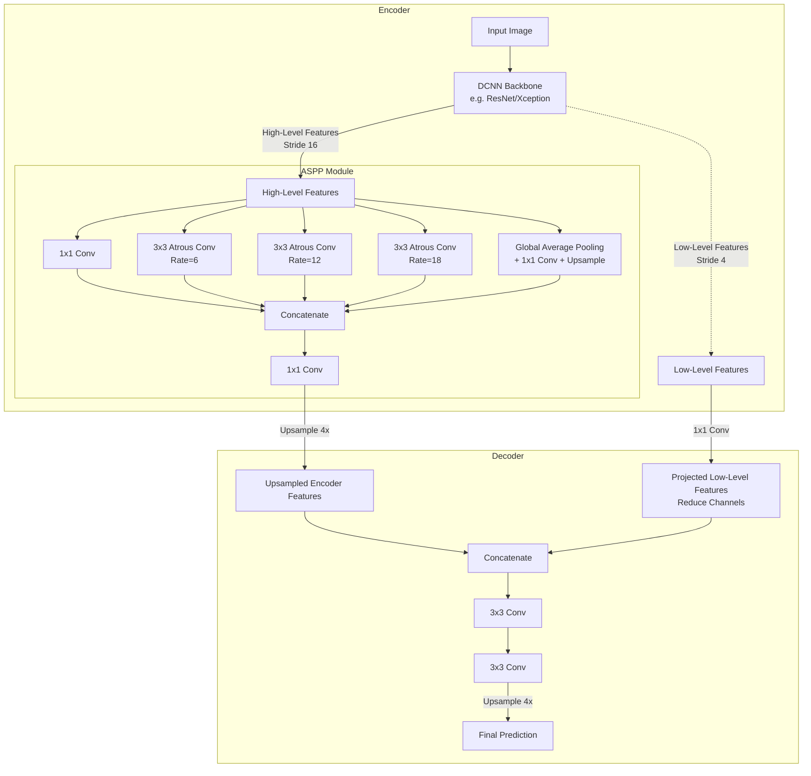

# DeepLabV3+

## 1. Overview

DeepLabV3+ is a state-of-the-art semantic segmentation architecture developed by Google (Chen et al., 2018). It represents the culmination of the DeepLab series, expertly combining the two most successful paradigms in semantic segmentation: Spatial Pyramid Pooling (to capture multi-scale context) and an Encoder-Decoder structure (to recover sharp object boundaries).

At its core, DeepLabV3+ uses **atrous (dilated) convolutions** to control the resolution of feature maps without adding extra parameters, enabling the network to "see" a wider context. It has remained a highly popular baseline and production model for tasks requiring precise pixel-level classification, such as autonomous driving and medical imaging.

## 2. Historical Context

Before DeepLab, segmentation models like FCNs struggled with two main issues:
1. **Resolution Loss:** Repeated max-pooling and striding in classification backbones decimated the spatial resolution (e.g., down to $1/32$ of the original image), destroying fine boundaries.
2. **Lack of Multi-Scale Context:** Objects in images appear at varying scales. Standard convolutions have a fixed receptive field and struggle to segment both a massive train occupying the whole image and a tiny person in the background.

The DeepLab series evolved to solve these:
- **DeepLabV1 & V2:** Introduced atrous convolutions to prevent excessive resolution loss, and Atrous Spatial Pyramid Pooling (ASPP) to capture multi-scale context. Used Conditional Random Fields (CRFs) for post-processing boundaries.
- **DeepLabV3:** Improved the ASPP module by adding image-level features (Global Average Pooling). Dropped the CRF post-processing.
- **DeepLabV3+:** The final iteration. It realized that while DeepLabV3 captured great context, its boundaries were still slightly blurry because it lacked a decoder. V3+ added a simple but highly effective U-Net style decoder to recover sharp boundaries, and swapped the backbone to a modified Xception model using depthwise separable convolutions for speed.

## 3. Problem It Solves

1. **Multi-Scale Objects:** The ASPP module applies convolutions with different dilation rates in parallel, capturing both local details and global scene context simultaneously.
2. **Sharp Boundaries:** The addition of the Decoder module cleanly merges the rich semantic context from the deep layers with the sharp spatial edges from the shallow layers.
3. **Computational Efficiency:** By utilizing Depthwise Separable Convolutions in both the backbone (Xception) and the ASPP module, DeepLabV3+ significantly reduces the parameter count and computational cost.

## 4. Architecture Diagram

## 5. Layer-by-Layer Explanation

### 1. Atrous (Dilated) Convolutions
Instead of pooling (which destroys resolution), DeepLab modifies the backbone by replacing some strides with atrous convolutions. An atrous convolution with rate $r$ introduces $r-1$ zeros between consecutive filter values. This expands the receptive field of the filter without increasing the number of parameters or the computation cost.
- Standard backbones downsample by a factor of 32 (Output Stride = 32). DeepLab alters the stride in the final blocks and applies atrous convolutions to maintain an Output Stride of 16 (or 8 for higher accuracy).

### 2. Atrous Spatial Pyramid Pooling (ASPP)
The output of the backbone is passed into the ASPP module, which consists of 5 parallel branches:
1. A standard $1 \times 1$ convolution.
2. A $3 \times 3$ atrous convolution with rate=6.
3. A $3 \times 3$ atrous convolution with rate=12.
4. A $3 \times 3$ atrous convolution with rate=18.
5. Image-level features (Global Average Pooling followed by a $1 \times 1$ conv and upsampling).

These branches are concatenated and passed through a final $1 \times 1$ convolution. This creates a dense feature map that has looked at the image at 5 different scales.

### 3. The Decoder
The output of the ASPP (which has an Output Stride of 16) is upsampled by a factor of 4 using bilinear interpolation.
- Simultaneously, "low-level" features are extracted from early in the backbone (where the Output Stride is 4, e.g., `Conv2` in ResNet).
- These low-level features contain sharp edges but have too many channels, so a $1 \times 1$ convolution reduces their channels (usually to 48) to prevent them from overpowering the rich ASPP features.
- The upsampled ASPP features and the projected low-level features are concatenated.
- Two $3 \times 3$ convolutions refine the merged features, and a final $4\times$ bilinear upsampling yields the full-resolution prediction.

## 6. Tensor Flow Walkthrough

Assume Input: $512 \times 512 \times 3$, Output Stride (OS) = 16.

**Encoder Phase:**
1. **Backbone:** Processes input to $(B, C_{high}, 32, 32)$ (because $512 / 16 = 32$).
   - We also grab low-level features at OS=4: $(B, C_{low}, 128, 128)$.
2. **ASPP:** The $(B, C_{high}, 32, 32)$ map is passed through the 5 parallel branches. Let's say each branch outputs 256 channels.
   - Concat: $(B, 256 \times 5, 32, 32) = (B, 1280, 32, 32)$
   - Final ASPP $1 \times 1$ Conv: $(B, 256, 32, 32)$

**Decoder Phase:**
3. **Upsample Encoder:** Bilinear upsample the ASPP output by $4\times \rightarrow (B, 256, 128, 128)$.
4. **Project Low-Level:** Apply $1 \times 1$ conv to low-level features to get 48 channels $\rightarrow (B, 48, 128, 128)$.
5. **Concatenate:** $[(B, 256, 128, 128), (B, 48, 128, 128)] \rightarrow (B, 304, 128, 128)$.
6. **Refine:** Two $3 \times 3$ convs $\rightarrow (B, 256, 128, 128)$.
7. **Final Classify & Upsample:** $1 \times 1$ conv to $N$ classes $\rightarrow (B, N, 128, 128)$. Bilinear upsample by $4\times \rightarrow (B, N, 512, 512)$.

## 7. Mathematical Foundations

**Atrous Convolution (1D example):**
For a 1D input signal $x$ and a filter $w$ of length $K$, the standard convolution is:
$$y[i] = \sum_{k=1}^K x[i + k] w[k]$$
An atrous convolution with rate $r$ is:
$$y[i] = \sum_{k=1}^K x[i + r \cdot k] w[k]$$
When $r=1$, this is a standard convolution. When $r>1$, it samples the input with a stride of $r$, effectively enlarging the filter's field of view without increasing the number of weights $K$.

**Depthwise Separable Convolution:**
Standard convolution cost: $D_K \cdot D_K \cdot M \cdot N \cdot D_F \cdot D_F$ (where $D_K$ is kernel size, $M$ input channels, $N$ output channels, $D_F$ spatial size).
Separable convolution splits this into two steps:
1. **Depthwise:** Apply a single $3 \times 3$ filter to each input channel separately.
2. **Pointwise:** Apply a $1 \times 1$ convolution across channels to mix them.
Cost drops drastically, making architectures like Xception highly efficient. DeepLabV3+ heavily relies on this in its ASPP and Decoder modules.

## 8. Complexity Analysis

- **Parameters:** Varies by backbone. With MobileNetV2, it can be extremely light (<10M parameters). With ResNet-101, it is large (~60M).
- **Compute:** Atrous convolutions keep spatial dimensions large (OS=16), making the network compute-heavy (high FLOPs) compared to standard classification networks, but Depthwise Separable Convolutions help offset this.
- **Memory:** High memory footprint due to maintaining large activation maps throughout the backbone.

## 9. Advantages

- **State-of-the-art Accuracy:** Achieved the highest scores on PASCAL VOC and Cityscapes upon release.
- **Flexible Backbone:** Can be paired with heavy backbones (Xception, ResNet) for server-side accuracy, or light backbones (MobileNet) for real-time edge devices.
- **Context + Detail:** The perfect marriage of ASPP for global scene understanding and a Decoder for sharp pixel-perfect edges.

## 10. Limitations

- **Gridding Artifacts:** If atrous rates are not chosen carefully, the network can produce "checkerboard" or "gridding" artifacts in its predictions.
- **Compute Constraints:** Running OS=8 (for maximum accuracy) requires massive VRAM, making it difficult to train with large batch sizes.

## 11. Real World Applications

- **Autonomous Driving:** Semantic segmentation of streets, lane markers, pedestrians, and vehicles (Cityscapes dataset).
- **Medical Imaging:** Used for precise tumor and organ segmentation in MRIs and CT scans.
- **Portrait Mode / Virtual Backgrounds:** Real-time separation of humans from backgrounds on mobile devices (using MobileNet-DeepLabV3+).

## 12. Common Interview Questions

**Q: What is the main difference between U-Net and DeepLabV3+?**
U-Net relies entirely on a deep sequence of standard downsampling and upsampling steps connected by skip connections. It struggles with multi-scale objects because it lacks a dedicated multi-scale module. DeepLabV3+ explicitly handles multi-scale objects using ASPP in the bottleneck, and only uses a very shallow (one-step) decoder to refine boundaries, whereas U-Net uses a symmetric multi-step decoder.

**Q: Why do we need the $1 \times 1$ convolution to reduce the channels of the low-level features in the Decoder?**
The low-level features coming from the early backbone layers typically have a high number of channels (e.g., 256 or 512), but they contain very simple, non-semantic information (like raw edges). The ASPP output contains rich semantic information but only 256 channels. If they were concatenated without reduction, the network would be overwhelmed by the sheer volume of low-level data and ignore the semantic data. Reducing the low-level channels to 48 ensures the semantic features dominate the final prediction.

**Q: What is an Output Stride (OS)?**
Output Stride is the ratio of the input image spatial resolution to the final output resolution of the encoder backbone. Standard ResNet has OS=32. DeepLab modifies ResNet using atrous convolutions to achieve OS=16 (or OS=8), meaning the feature map entering the ASPP is much larger and retains more spatial detail.

## 13. Related Papers

- **Encoder-Decoder with Atrous Separable Convolution for Semantic Image Segmentation (Chen et al., 2018)** — The DeepLabV3+ paper.
- **Rethinking Atrous Convolution for Semantic Image Segmentation (Chen et al., 2017)** — DeepLabV3 (introduced modern ASPP).
- **Xception: Deep Learning with Depthwise Separable Convolutions (Chollet, 2017)** — The modified backbone used in the V3+ paper.

## 14. Related Problems
- Implementing Atrous Spatial Pyramid Pooling (ASPP) in PyTorch.
- Building a Depthwise Separable Convolution block.
