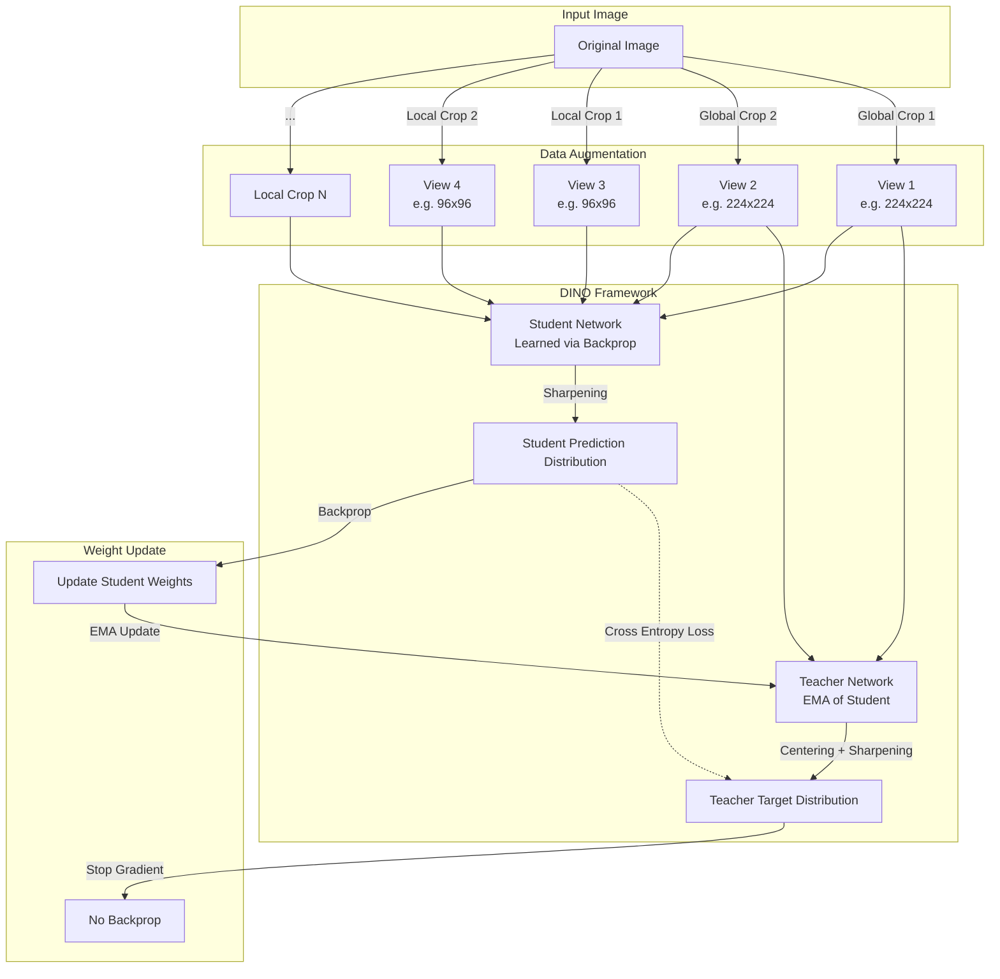

# DINO (Self-Distillation with No Labels)

## 1. Overview

DINO (Self-DIstillation with NO labels) was introduced by Mathilde Caron and the FAIR (Facebook AI Research, now Meta AI) team in 2021. It is a self-supervised learning framework specifically designed to train Vision Transformers (ViTs) without any labeled data.

What makes DINO revolutionary is not just its ability to achieve competitive performance without labels, but the *emergent properties* it unlocked. When a ViT is trained using DINO, the self-attention maps in the final layer automatically learn to segment objects perfectly, without ever being explicitly taught what an object is. The model develops an implicit understanding of scene layout and object boundaries simply by learning to match different views of the same image.

## 2. Historical Context

Prior to DINO, self-supervised learning in computer vision was dominated by contrastive learning methods (like SimCLR and MoCo). These methods trained networks (usually ResNets) to push representations of different images (negative pairs) apart while pulling augmented views of the same image (positive pairs) together. Contrastive learning requires large batch sizes or memory banks to supply enough negative examples.

Simultaneously, the Vision Transformer (ViT) was introduced, requiring massive amounts of labeled data (like JFT-300M) to train effectively from scratch because it lacks the inductive biases of CNNs.

DINO merged self-supervised learning with ViTs, using a non-contrastive approach called self-distillation (similar to BYOL). By doing so, it proved that ViTs are not just data-hungry alternatives to CNNs; when trained self-supervised, they learn explicit, interpretable representations of the world that CNNs completely fail to capture.

## 3. Problem It Solves

1. **The Need for Labels:** Training robust ViTs historically required millions of cleanly labeled images. DINO trains them on entirely unlabeled datasets.
2. **Negative Pair Dependency:** Contrastive learning requires negative samples to prevent "collapse" (the network predicting a constant vector for all inputs). DINO avoids collapse without negative pairs using centering and sharpening.
3. **Implicit Segmentation:** Standard classification networks struggle to localize objects accurately. DINO's attention maps naturally isolate foreground objects from backgrounds.

## 4. Architecture Diagram

DINO uses a Teacher-Student framework. Both networks have the exact same architecture (e.g., a ViT-Base), but the Teacher's weights are an exponentially moving average (EMA) of the Student's weights.

## 5. Layer-by-Layer Explanation

### 1. Multi-Crop Augmentation
Given an input image, DINO creates multiple views:
- **2 Global Views:** Large crops (e.g., $224 \times 224$) that contain most of the image.
- **Multiple Local Views:** Small crops (e.g., $96 \times 96$) that contain only parts of the image.

### 2. The Teacher-Student Setup
- The **Teacher** network only processes the *Global Views*.
- The **Student** network processes *All Views* (Global and Local).
- The goal is to train the Student to match the Teacher's output. By forcing the Student to predict the Teacher's global output using only a local crop, the network learns part-to-whole relationships (e.g., a crop of a dog's ear should output the same representation as a crop of the whole dog).

### 3. Preventing Collapse
If the Student is just learning to match the Teacher, what stops them from both outputting a constant vector of all zeros for every image (a collapsed state)? DINO uses two tricks applied to the Teacher's output:
- **Centering:** Prevents one dimension from dominating. The Teacher's output is adjusted by subtracting the moving average of previous outputs.
- **Sharpening (Temperature scaling):** The softmax temperature of the Teacher is lowered, forcing its output distribution to become "peaky" (close to a one-hot vector). This forces the Student to make confident, distinct predictions for different images.

### 4. The Stop-Gradient
The Cross-Entropy loss is computed between the Student's prediction and the Teacher's target. Crucially, backpropagation is *only* applied to the Student. The Teacher's weights are updated slowly using an Exponential Moving Average (EMA) of the Student's weights.

## 6. Tensor Flow Walkthrough

Assume a ViT-Base backbone. The projection head outputs a vector of size $K$ (e.g., 65536).

1. **Pass Global View 1 through Teacher:**
   - Teacher output $t \in \mathbb{R}^K$.
   - Apply Centering: $t' = t - c$ (where $c$ is the EMA center).
   - Apply Sharpening (Softmax with low temperature $\tau_t$): $P_t = \text{Softmax}(t' / \tau_t)$.
   - Output $P_t$ is the target distribution.

2. **Pass Local View 1 through Student:**
   - Student output $s \in \mathbb{R}^K$.
   - Apply Softmax (with temperature $\tau_s$): $P_s = \text{Softmax}(s / \tau_s)$.

3. **Loss Computation:**
   - Compute Cross-Entropy: $L = - P_t \log(P_s)$.
   - Sum this loss over all pairs of (Global Teacher, Local Student).

4. **Updates:**
   - $\theta_s \leftarrow \theta_s - \eta \nabla_{\theta_s} L$ (Standard AdamW update).
   - $\theta_t \leftarrow \lambda \theta_t + (1 - \lambda) \theta_s$ (EMA update, where $\lambda$ slowly increases to 1).
   - $c \leftarrow m c + (1 - m) t$ (Center EMA update).

## 7. Mathematical Foundations

The loss function optimized by DINO is a simple Cross-Entropy loss, just like in supervised learning, but the "labels" are generated dynamically by the Teacher:
$$H(P_t, P_s) = - P_t(x_{global}) \log P_s(x_{local})$$

**Why does it work?**
Theoretical analysis suggests that centering acts as an implicit regularizer pushing the batch towards a uniform distribution (preventing the network from predicting the exact same output for all images). Sharpening acts as an entropy minimizer, forcing the network to group similar images into the same "implicit class" (the dimensions of the $K$-sized output vector act as pseudo-classes).

Because the network must output the same pseudo-class for a global crop and a local crop, it is forced to identify the *salient objects* present in both. For a ViT, the most efficient way to route this information to the `[CLS]` token is by attending heavily to the object pixels, leading to the emergent segmentation maps.

## 8. Complexity Analysis

- **Parameters:** A DINO setup requires $2\times$ the parameters of the base model in memory simultaneously (Teacher + Student).
- **Compute:** Multi-crop requires running the Student network many times per image (e.g., 2 global crops + 8 local crops = 10 forward passes per image). This makes DINO heavily compute-bound compared to standard supervised training.
- **Memory:** Gradients only need to be computed for the Student. The Teacher only requires a forward pass and memory to store its EMA weights.

## 9. Advantages

- **Emergent Segmentation:** The self-attention maps of the `[CLS]` token automatically act as high-quality semantic segmentation masks without any pixel-level annotations.
- **Excellent k-NN Classifiers:** The features learned by DINO are linearly separable. Simply running a k-Nearest Neighbors (k-NN) classifier on DINO features achieves near state-of-the-art performance on ImageNet without any fine-tuning.
- **No Negative Samples:** Avoids the memory banks and massive batch sizes required by contrastive methods like SimCLR.

## 10. Limitations

- **Compute Intensive:** The multi-crop strategy drastically increases training time.
- **Sensitive Hyperparameters:** Balancing the Teacher temperature, the EMA momentum, and the center update rate requires precise tuning; otherwise, the network quickly collapses.
- **Object-Centric Bias:** Because DINO relies heavily on crops, it works best on datasets with clearly defined central objects (like ImageNet). It struggles slightly on complex, cluttered scenes (like driving datasets) where random crops might contain completely disjoint semantic concepts.

## 11. Real World Applications

- **Foundation Models for Vision:** DINO (and its successor DINOv2) are widely used as the default feature extractors for downstream vision tasks when labeled data is scarce.
- **Unsupervised Object Discovery:** Used in robotics and medical imaging to identify novel objects or anomalies without training a supervised detector.
- **Image Retrieval:** The features are incredibly robust to occlusion and scale, making them perfect for reverse-image search engines.

## 12. Common Interview Questions

**Q: How does DINO avoid collapse without using negative pairs?**
DINO avoids collapse using a combination of **centering** and **sharpening** on the Teacher's outputs. Centering subtracts the average activation, preventing any single dimension (pseudo-class) from dominating the predictions across the batch. Sharpening forces the Teacher to output a peaked (low-entropy) distribution. Together, they force the network to utilize the entire representation space evenly while making confident predictions.

**Q: Why are the Teacher's weights updated via an Exponential Moving Average (EMA) rather than backpropagation?**
If the Teacher were updated via backpropagation to minimize the same loss as the Student, both networks would immediately converge to outputting a constant zero vector (collapse), as that perfectly minimizes the loss ($H(0,0) = 0$). By stopping the gradient and updating the Teacher slowly (EMA), the Teacher acts as a stable, slightly-lagged ensemble of the Student, providing consistent targets.

**Q: Why do ViTs exhibit emergent segmentation in DINO, but CNNs do not?**
CNNs route information locally; their receptive fields grow, but spatial information is permanently blurred by pooling. ViTs use global self-attention at every layer. To solve the DINO objective (matching local and global crops), the ViT's `[CLS]` token must aggregate information from the specific patches that define the object. The attention weights naturally highlight exactly which patches those are.

## 13. Related Papers

- **Emerging Properties in Self-Supervised Vision Transformers (Caron et al., 2021)** — The original DINO paper.
- **Bootstrap Your Own Latent (BYOL) (Grill et al., 2020)** — Introduced the Teacher/Student EMA non-contrastive framework.
- **DINOv2: Learning Robust Visual Features without Supervision (Oquab et al., 2023)** — Scaled DINO to massive datasets and models, becoming a true vision foundation model.

## 14. Related Problems
- Implementing Exponential Moving Average (EMA) model updates in PyTorch.
- Extracting and visualizing self-attention maps from a Vision Transformer.
