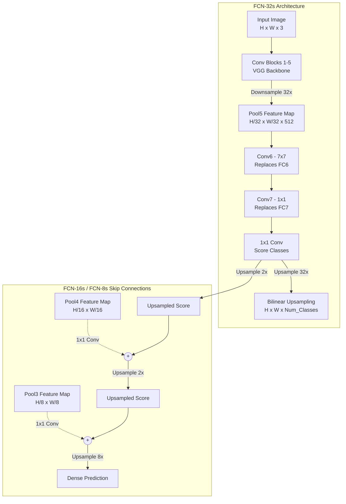

# Fully Convolutional Networks (FCN)

## 1. Overview

Fully Convolutional Networks (FCNs) were introduced by Long, Shelhamer, and Darrell in their landmark 2015 paper, "Fully Convolutional Networks for Semantic Segmentation." This architecture revolutionized computer vision by demonstrating how standard classification networks (like AlexNet, VGG, or ResNet) could be transformed to produce dense, pixel-wise predictions.

Prior to FCNs, image segmentation was largely handled by patching—extracting thousands of small patches from an image, passing each patch through a CNN independently to classify its central pixel, and stitching the results together. This was incredibly slow and ignored global context. FCNs solved this by discarding fully connected layers, allowing the network to process an entire image of arbitrary size in a single forward pass and output a spatial heatmap of predictions.

## 2. Historical Context

In the early 2010s, deep CNNs were dominating image classification (e.g., "Is this an image of a cat?"). These networks consisted of convolutional feature extractors followed by massive Fully Connected (FC) layers.

The FC layers required fixed-size inputs. If VGG16 was trained on $224 \times 224$ images, it could *only* accept $224 \times 224$ images because the flattened feature map had to exactly match the weights of the first FC layer. Furthermore, the FC layers destroyed all spatial information—they output a 1D vector of class probabilities.

To perform semantic segmentation (e.g., "Which exact pixels belong to the cat?"), the field needed a way to retain spatial dimensions. Long et al. realized that fully connected layers are mathematically equivalent to $1 \times 1$ (or sometimes larger) convolutions that cover the entire input feature map. By "convolutionalizing" these layers, the network could output spatial maps instead of 1D vectors.

## 3. Problem It Solves

1. **Fixed Input Sizes:** By removing FC layers, an FCN can process an input image of any resolution.
2. **Loss of Spatial Information:** FC layers destroy the 2D layout of features. FCNs preserve it, allowing the network to output a spatial grid of class probabilities.
3. **Computational Inefficiency:** Patch-based segmentation ran the same convolutions over overlapping regions millions of times. FCNs compute the convolutions across the entire image once, drastically increasing speed.

## 4. Architecture Diagram

The FCN architecture takes a standard classification network, replaces the FC layers with convolutions, and then uses transposed convolutions to upsample the coarse predictions back to the original image resolution.

## 5. Layer-by-Layer Explanation

### 1. Convolutionalization
Take a network like VGG16. The final pooling layer outputs a $7 \times 7 \times 512$ feature map. The next layer is usually an FC layer with 4096 neurons.
- To "convolutionalize" this, we replace the FC layer with a $7 \times 7$ convolution with 4096 filters.
- If we pass a larger image (e.g., $384 \times 384$), the pooling layer outputs a $12 \times 12 \times 512$ map. The $7 \times 7$ convolution now slides across this map, producing a $6 \times 6 \times 4096$ spatial output.
- We have successfully turned a classification vector into a spatial heatmap!

### 2. The 1x1 Scoring Layer
The final layers of the FCN use $1 \times 1$ convolutions to reduce the channel dimension (e.g., 4096) down to the number of segmentation classes (e.g., 21 for PASCAL VOC). 
- The result is a coarse, low-resolution heatmap where each spatial cell contains a probability distribution over the classes.

### 3. Upsampling (Transposed Convolution)
Because the VGG backbone downsamples the image by a factor of 32 (via five $2 \times 2$ max pooling layers), the resulting heatmap is 32 times smaller than the original image. 
- FCN uses a transposed convolution (sometimes initialized as bilinear interpolation) with a stride of 32 to blow this heatmap back up to the original image size. This is called **FCN-32s**.

### 4. Skip Architecture (FCN-16s and FCN-8s)
Upsampling a tiny feature map by $32\times$ results in incredibly blobby, inaccurate segmentation boundaries. To fix this, the authors introduced skip connections (a precursor to U-Net).
- **FCN-16s:** The network takes the output of the Pool4 layer (which is only downsampled $16\times$), runs a $1 \times 1$ conv to get class scores, and adds it to the $2\times$-upsampled scores from Pool5. The combined result is then upsampled $16\times$.
- **FCN-8s:** The network goes one step further, combining predictions from Pool3, Pool4, and Pool5. This fuses deep, coarse, semantic information with shallow, fine, spatial information, resulting in much sharper segmentation masks.

## 6. Tensor Flow Walkthrough

Assume an input image of $512 \times 512 \times 3$ and 21 classes.

**FCN-32s Flow:**
1. **Input:** $(B, 3, 512, 512)$
2. **VGG Backbone (Pool1 to Pool5):** Each pool layer halves the spatial dimensions.
   - Pool5 Output: $(B, 512, 16, 16)$  *(since $512 / 2^5 = 16$)*
3. **Convolutionalized FC6 ($7 \times 7$ conv, pad=3):**
   - Output: $(B, 4096, 16, 16)$
4. **Convolutionalized FC7 ($1 \times 1$ conv):**
   - Output: $(B, 4096, 16, 16)$
5. **Score Layer ($1 \times 1$ conv to 21 classes):**
   - Output: $(B, 21, 16, 16)$
6. **Upsample 32x (Transposed Conv, stride=32):**
   - Final Output: $(B, 21, 512, 512)$

## 7. Mathematical Foundations

**Convolutionalizing Fully Connected Layers:**
In a standard FC layer, the output $y_j$ is computed as:
$$y_j = \sum_{i} W_{ji} x_i + b_j$$
Where $x$ is the flattened input tensor. 

If the input tensor has spatial dimensions $h \times w \times c$, and the FC weights are reshaped into a convolutional filter of size $h \times w \times c$, sliding this filter over the input tensor performs the exact same mathematical operation. The beauty is that if the input tensor is larger than $h \times w$, the convolutional filter just computes the FC operation at multiple spatial locations, producing a 2D output map.

**Transposed Convolutions:**
While standard convolutions compute a many-to-one mapping (reducing spatial size), transposed convolutions compute a one-to-many mapping (increasing spatial size). A transposed convolution with stride $S$ places a scaled copy of the convolutional kernel at intervals of $S$ pixels in the output space, summing overlapping regions. FCNs often initialize these kernels to act as bilinear interpolators, then allow the network to learn to adjust them.

## 8. Complexity Analysis

- **Parameters:** Roughly identical to the backbone classification network (e.g., VGG16 has ~134M parameters).
- **Compute:** Highly dependent on input resolution. Because the network processes the entire image convolutionally, compute scales linearly with the number of pixels ($O(H \times W)$).
- **Memory:** Requires significant GPU VRAM for high-resolution images because the intermediate activation maps across the entire image must be stored for backpropagation.

## 9. Advantages

- **Arbitrary Image Sizes:** Can run inference on any image size without cropping or warping.
- **Efficiency:** Orders of magnitude faster than patch-based segmentation.
- **End-to-End:** Can be trained end-to-end for pixel-wise loss (usually cross-entropy per pixel).

## 10. Limitations

- **Coarse Boundaries:** Even with FCN-8s skip connections, the segmentation boundaries are often blurry compared to modern architectures.
- **Global Context Deficit:** Standard convolutions only have a local receptive field. FCNs struggle to incorporate global scene context (e.g., knowing that a "boat" pixel is unlikely to be found in the middle of a "desert" region). This limitation led to the development of architectures with dilated convolutions and spatial pyramid pooling (like DeepLab).

## 11. Real World Applications

- **Foundational Baseline:** FCN was the first fully convolutional architecture for dense prediction. It is the grandfather of almost all modern segmentation and object detection backbones.
- **Medical Imaging:** Served as the direct inspiration for U-Net.
- **Satellite Imagery:** Used for land-cover classification over massive, arbitrarily sized satellite tiles.

## 12. Common Interview Questions

**Q: What is the mathematical difference between a Fully Connected layer and a $1 \times 1$ Convolution?**
There is no fundamental mathematical difference; a $1 \times 1$ convolution is simply a fully connected layer applied independently to every spatial location (pixel) of a feature map. They both compute a linear combination of the channels. The difference is purely in the software implementation and how they handle spatial dimensions.

**Q: Why was the FCN-32s output so blurry, and how did FCN-8s fix it?**
FCN-32s takes a feature map that has been downsampled by a factor of 32. At this resolution, a single "pixel" in the feature map corresponds to a massive $32 \times 32$ block in the original image. Upsampling it directly produces a heavily pixelated/blurry output. FCN-8s fused this deep semantic information with higher-resolution spatial information from earlier layers (Pool3 and Pool4), allowing the network to refine the rough boundaries.

## 13. Related Papers

- **Fully Convolutional Networks for Semantic Segmentation (Long et al., 2015)**
- **U-Net: Convolutional Networks for Biomedical Image Segmentation (Ronneberger et al., 2015)** — Greatly expanded on the skip connection concept.
- **DeepLab: Semantic Image Segmentation with Deep Convolutional Nets... (Chen et al., 2014/2017)** — Addressed FCN's blurry boundaries using atrous (dilated) convolutions and Conditional Random Fields.

## 14. Related Problems
- Converting a pre-trained VGG16 classification model into an FCN in PyTorch.
- Implementing Bilinear Interpolation as a Transposed Convolution.
