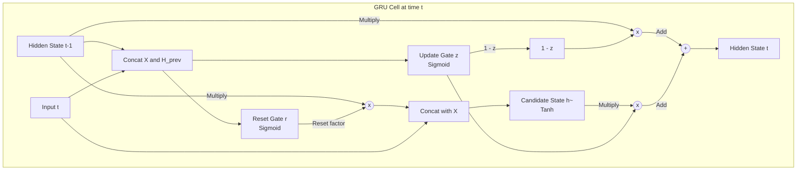

# Gated Recurrent Unit (GRU)

## 1. Overview

The Gated Recurrent Unit (GRU) is a gating mechanism in recurrent neural networks, introduced in 2014 by Kyunghyun Cho et al. It was designed to solve the vanishing gradient problem of standard RNNs, much like the Long Short-Term Memory (LSTM) unit, but with a simplified architecture that requires fewer parameters and less computational overhead.

While LSTMs use three gates (input, output, and forget) and maintain a separate cell state, GRUs merge the cell state and hidden state into a single vector and rely on only two gates: an Update gate and a Reset gate. Because of this simplicity, GRUs often train faster and perform comparably to LSTMs on many tasks, making them a highly popular choice for sequential modeling before the dominance of Transformers.

## 2. Historical Context

By 2014, the NLP community was rapidly adopting neural architectures for tasks like Machine Translation (Seq2Seq). While LSTMs were theoretically powerful and immune to vanishing gradients, they were slow to train and parameter-heavy. 

When Cho et al. were developing their RNN Encoder-Decoder architecture for statistical machine translation, they realized they needed the gradient-preserving properties of LSTMs but wanted something more streamlined. They stripped the LSTM down to its bare essentials, removing the separate memory cell and combining gates to create the GRU. 

Empirical evaluations by Chung et al. (2014) later showed that there was no clear winner between LSTM and GRU across various tasks, cementing the GRU as a standard, lightweight alternative to the LSTM.

## 3. Problem It Solves

1. **Vanishing Gradients:** Like LSTMs, GRUs use additive updates to their hidden state, allowing gradients to flow backwards unimpeded over long sequences.
2. **Computational Overhead:** LSTMs require 4 large matrix multiplications per step. GRUs reduce this to 3, cutting down parameter count by ~25% and speeding up training and inference.
3. **Redundant Memory State:** In many tasks, maintaining a separate internal cell state ($C_t$) that differs from the exposed hidden state ($h_t$) is unnecessary. The GRU merges them, directly exposing its entire memory to the rest of the network.

## 4. Architecture Diagram

## 5. Layer-by-Layer Explanation

The GRU simplifies the LSTM by merging the hidden state and cell state into a single state vector, $h_t$. It controls the flow of information using two gates:

### 1. Update Gate ($z_t$)
The update gate acts as a combination of the LSTM's forget and input gates. It decides **how much of the past information (previous hidden state) needs to be passed along to the future.**
- If $z_t$ is close to 1, the model copies the previous hidden state entirely and ignores new information.
- If $z_t$ is close to 0, the model forgets the past and focuses entirely on the new candidate state.

### 2. Reset Gate ($r_t$)
The reset gate decides **how much of the past information to forget before computing the new candidate state.** 
- If $r_t$ is close to 0, the model acts as if it is reading the first symbol of a sequence, completely dropping the past when computing the new features.

### 3. Candidate Hidden State ($\tilde{h}_t$)
This is the new information proposed for the current time step. It looks at the current input $x_t$ and the *reset* version of the previous hidden state ($r_t \odot h_{t-1}$). 

### 4. Final Hidden State ($h_t$)
The final step is a linear interpolation between the previous hidden state $h_{t-1}$ and the new candidate state $\tilde{h}_t$, controlled by the update gate $z_t$.

## 6. Tensor Flow Walkthrough

Let the sequence length be $T$, batch size be $B$, input feature dimension be $D_x$, and the GRU hidden dimension be $D_h$.

For a single time step $t$:
- Input $x_t \in \mathbb{R}^{B \times D_x}$
- Previous hidden state $h_{t-1} \in \mathbb{R}^{B \times D_h}$

**Concatenation for Gates:**
- $[x_t, h_{t-1}] \in \mathbb{R}^{B \times (D_x + D_h)}$

**Linear Projections for Gates:**
- $W_{zr} \in \mathbb{R}^{(D_x + D_h) \times 2D_h}$
- Compute $[z_{raw}, r_{raw}] = [x_t, h_{t-1}] W_{zr} + b_{zr} \in \mathbb{R}^{B \times 2D_h}$
- Apply sigmoid: $z_t = \sigma(z_{raw})$ and $r_t = \sigma(r_{raw})$

**Candidate State:**
- The reset gate modulates the previous hidden state: $r_t \odot h_{t-1}$
- Concatenate with input: $[x_t, r_t \odot h_{t-1}]$
- Linear projection: $\tilde{h}_{raw} = [x_t, r_t \odot h_{t-1}] W_h + b_h \in \mathbb{R}^{B \times D_h}$
- Apply tanh: $\tilde{h}_t = \tanh(\tilde{h}_{raw})$

**Final State Update:**
- Interpolate: $h_t = (1 - z_t) \odot h_{t-1} + z_t \odot \tilde{h}_t \in \mathbb{R}^{B \times D_h}$

*(Note: The exact formulation varies slightly between implementations, such as PyTorch vs. the original paper, regarding whether the reset gate is applied before or after the matrix multiplication. The logic remains the same.)*

## 7. Mathematical Foundations

The explicit equations for a GRU cell at time $t$ are:

$$z_t = \sigma(W_z \cdot [h_{t-1}, x_t] + b_z)$$
$$r_t = \sigma(W_r \cdot [h_{t-1}, x_t] + b_r)$$
$$\tilde{h}_t = \tanh(W_h \cdot [r_t \odot h_{t-1}, x_t] + b_h)$$
$$h_t = (1 - z_t) \odot h_{t-1} + z_t \odot \tilde{h}_t$$

**Preventing Vanishing Gradients:**
Just like the LSTM, the GRU relies on the additive update in the final step ($h_t = (1 - z_t) \odot h_{t-1} + \dots$). If the network learns to set the update gate $z_t$ close to 0, $h_t$ is roughly equal to $h_{t-1}$. This creates a linear highway where the gradient can travel backwards through time indefinitely without vanishing, because the derivative $\frac{\partial h_t}{\partial h_{t-1}}$ is close to 1.

## 8. Complexity Analysis

- **Parameters:** A GRU requires $3 \times ((D_x + D_h) \times D_h + D_h)$ parameters. This is exactly 75% of the parameters required by an LSTM of the same hidden size.
- **Compute:** The GRU requires 3 matrix multiplications per step compared to the LSTM's 4, leading to proportionately faster training and inference. Like all RNNs, computation is still $O(T)$ and fundamentally sequential.
- **Memory:** $O(T)$ memory is required to store intermediate hidden states for backpropagation through time.

## 9. Advantages

- **Efficiency:** Faster to train and requires less memory than an LSTM due to fewer gates and matrix operations.
- **Comparable Performance:** On many tasks, GRUs perform indistinguishably from LSTMs.
- **Simpler Architecture:** Merging the cell and hidden states makes the architecture more intuitive and easier to implement from scratch.

## 10. Limitations

- **Bounded Capacity:** Because it doesn't have a separate memory cell, the GRU might struggle slightly more than an LSTM on tasks that require maintaining a hidden state over extremely long sequences while simultaneously outputting heavily filtered data.
- **Sequential Bottleneck:** Like the LSTM, it cannot parallelize operations across the time dimension, rendering it slow on modern hardware compared to Transformers.

## 11. Real World Applications

- **Polyphonic Music Modeling:** One of the original tasks evaluated by Chung et al., where GRUs achieved state-of-the-art results.
- **Speech Signal Modeling:** Often used in resource-constrained environments (like mobile devices) where the speed and parameter reduction of a GRU over an LSTM is critical.
- **Language Modeling & Translation:** Frequently used as the encoder/decoder in early Seq2Seq systems before the dominance of attention mechanisms.

## 12. Common Interview Questions

**Q: In what specific scenarios might an LSTM outperform a GRU?**
While they perform similarly on average, LSTMs tend to have a slight edge on datasets with very long sequences or tasks that require complex counting. The LSTM's separate memory cell and explicit output gate allow it to maintain an internal state and choose *not* to expose it to the network, whereas the GRU exposes its entire memory state to the network at every step.

**Q: How does the GRU simulate the LSTM's forget gate?**
The GRU doesn't have a standalone forget gate. Instead, the Update Gate ($z_t$) performs a dual role. The operation $(1 - z_t) \odot h_{t-1}$ acts as the forget mechanism. If $z_t$ is 1, the network completely forgets the past. If $z_t$ is 0, it perfectly remembers the past.

**Q: Why do we use $(1 - z_t)$ for the past state and $z_t$ for the new candidate state?**
This ensures that the final state $h_t$ is a convex combination (linear interpolation) of the old state and the new candidate. The elements of the hidden state are guaranteed to remain bounded, and the network is forced to explicitly choose a balance between old information and new information.

## 13. Related Papers

- **Learning Phrase Representations using RNN Encoder-Decoder for Statistical Machine Translation (Cho et al., 2014)** — Introduced the GRU.
- **Empirical Evaluation of Gated Recurrent Neural Networks on Sequence Modeling (Chung et al., 2014)** — The paper that famously compared LSTMs and GRUs, showing their comparable performance.

## 14. Related Problems
- Implementing a GRU cell from scratch in PyTorch.
- Analyzing the gradient flow of the Update Gate.
