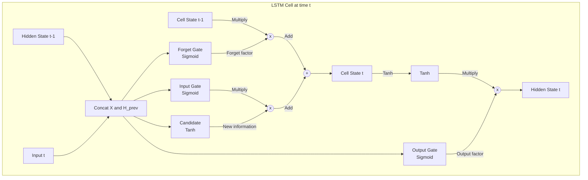

# Long Short-Term Memory (LSTM)

## 1. Overview

Long Short-Term Memory (LSTM) networks are a specialized architecture of Recurrent Neural Networks (RNNs) introduced by Hochreiter and Schmidhuber in 1997. They were designed explicitly to solve the fundamental problem plaguing standard RNNs: the inability to learn long-range dependencies due to the vanishing gradient problem.

For nearly two decades, LSTMs were the undisputed kings of sequence modeling. From Google Translate to Siri's speech recognition to early text generation, LSTMs powered the first wave of deep learning breakthroughs in natural language processing (NLP) and time-series forecasting. While largely superseded by Transformers for massive-scale NLP, LSTMs remain highly relevant for smaller-scale time-series prediction, control systems, and resource-constrained environments.

## 2. Historical Context

In the 1990s, standard RNNs were known to be theoretically capable of retaining past information to inform future predictions. However, in practice, they failed spectacularly on sequences longer than 5-10 steps. 

When training an RNN with backpropagation through time (BPTT), the gradient is multiplied by the recurrent weight matrix at every time step. If the eigenvalues of this matrix are less than 1, the gradients shrink exponentially (vanishing gradients). If they are greater than 1, the gradients grow exponentially (exploding gradients).

Hochreiter and Schmidhuber's breakthrough was realizing that the network needed a mechanism to explicitly *remember* and *forget* information over long intervals without being forced to push it through a saturating nonlinearity at every step.

## 3. Problem It Solves

1. **Vanishing Gradients:** Standard RNNs struggle to carry gradient signals across long sequences. LSTMs introduce a "cell state" pathway that allows gradients to flow unimpeded.
2. **Long-Term Dependencies:** The network can learn to store information for hundreds of time steps and retrieve it exactly when needed.
3. **Information Routing:** The LSTM can dynamically decide what new information to store, what old information to throw away, and what parts of its memory to output at the current time step.

## 4. Architecture Diagram Data

The core of an LSTM is its memory cell, controlled by three gates: Forget, Input, and Output.

## 5. Layer-by-Layer Explanation

An LSTM unit maintains two states:
- **Cell State ($C_t$):** The internal memory of the LSTM. It acts as an information highway running straight down the entire chain, with only minor linear interactions. This is the key to preventing vanishing gradients.
- **Hidden State ($H_t$):** The output of the LSTM cell at the current step, which is also passed to the next step (just like in a standard RNN). It contains the filtered version of the cell state.

The flow of information is regulated by three "gates" (neural network layers with sigmoid activations that output values between 0 and 1):

1. **Forget Gate:** Looks at $H_{t-1}$ and $X_t$, and outputs a number between 0 and 1 for each number in the cell state $C_{t-1}$. A 1 represents "completely keep this" while a 0 represents "completely get rid of this."
2. **Input Gate & Candidate:** The Input Gate decides *which* values we'll update. Simultaneously, a `tanh` layer creates a vector of new candidate values ($\tilde{C}_t$) that could be added to the state.
3. **State Update:** The old cell state $C_{t-1}$ is multiplied by the forget gate, and the scaled new candidates are added. This computes the new cell state $C_t$.
4. **Output Gate:** Decides what parts of the new cell state to output. The cell state is passed through a `tanh` (to push values between -1 and 1) and multiplied by the output gate to produce the final hidden state $H_t$.

## 6. Tensor Flow Walkthrough

Let the sequence length be $T$, batch size be $B$, input feature dimension be $D_x$, and the LSTM hidden dimension be $D_h$.

For a single time step $t$:
- Input $X_t \in \mathbb{R}^{B \times D_x}$
- Previous hidden state $H_{t-1} \in \mathbb{R}^{B \times D_h}$
- Previous cell state $C_{t-1} \in \mathbb{R}^{B \times D_h}$

**Concatenation:**
- $[H_{t-1}, X_t] \in \mathbb{R}^{B \times (D_h + D_x)}$

**Linear Projections (usually computed as one large matrix multiply for efficiency):**
- Matrix $W \in \mathbb{R}^{(D_h + D_x) \times 4D_h}$
- Out $= [H_{t-1}, X_t] W + b \in \mathbb{R}^{B \times 4D_h}$
- Split `Out` into four equal chunks of size $B \times D_h$: $f_{raw}, i_{raw}, o_{raw}, \tilde{C}_{raw}$

**Gate Activations:**
- $f_t = \sigma(f_{raw})$ (Forget gate)
- $i_t = \sigma(i_{raw})$ (Input gate)
- $o_t = \sigma(o_{raw})$ (Output gate)
- $\tilde{C}_t = \tanh(\tilde{C}_{raw})$ (Candidate cell state)

**State Updates (element-wise operations):**
- $C_t = f_t \odot C_{t-1} + i_t \odot \tilde{C}_t \in \mathbb{R}^{B \times D_h}$
- $H_t = o_t \odot \tanh(C_t) \in \mathbb{R}^{B \times D_h}$

## 7. Mathematical Foundations

The explicit equations for an LSTM cell at time $t$ are:

$$f_t = \sigma(W_f \cdot [h_{t-1}, x_t] + b_f)$$
$$i_t = \sigma(W_i \cdot [h_{t-1}, x_t] + b_i)$$
$$\tilde{C}_t = \tanh(W_c \cdot [h_{t-1}, x_t] + b_c)$$
$$C_t = f_t \odot C_{t-1} + i_t \odot \tilde{C}_t$$
$$o_t = \sigma(W_o \cdot [h_{t-1}, x_t] + b_o)$$
$$h_t = o_t \odot \tanh(C_t)$$

**Why this solves the vanishing gradient:**
Look at the derivative of the cell state with respect to the previous cell state:
$$\frac{\partial C_t}{\partial C_{t-1}} = f_t + \dots$$
Because of the additive update rule ($C_t = f_t \odot C_{t-1} + \dots$), the gradient can flow perfectly backward through the cell state if the forget gate $f_t$ is close to 1. There is no repeated multiplication by a weight matrix $W$ as there is in standard RNNs, bypassing the root cause of vanishing gradients.

## 8. Complexity Analysis

- **Parameters:** For an input size $D_x$ and hidden size $D_h$, the number of parameters is $4 \times ((D_x + D_h) \times D_h + D_h)$. This is roughly 4 times larger than a standard RNN of the same size.
- **Compute:** $O(T \cdot B \cdot (D_x + D_h) \cdot D_h)$. The computation is fundamentally **sequential**. Time step $t$ cannot be computed until time step $t-1$ finishes. This makes LSTMs very slow to train on modern parallel hardware (GPUs/TPUs) compared to Transformers.
- **Memory:** During backpropagation through time (BPTT), all intermediate states across the sequence must be stored in memory, resulting in $O(T)$ memory consumption.

## 9. Advantages

- **Long-Term Memory:** Capable of learning dependencies across hundreds of time steps.
- **Robust Gradient Flow:** Practically immune to the vanishing gradient problem compared to standard RNNs.
- **Variable Length Inputs:** Like all RNNs, inherently handles sequences of arbitrary length without padding (in non-batched settings).

## 10. Limitations

- **Sequential Bottleneck:** Cannot be parallelized across the time dimension during training. This was the primary reason the field migrated to Transformers.
- **Bounded Capacity:** The entire history of the sequence must be compressed into a fixed-size vector ($H_t$). For very long documents, this compression becomes lossy.
- **Exploding Gradients:** While LSTMs fix vanishing gradients, they can still suffer from exploding gradients, often requiring gradient clipping in practice.

## 11. Real World Applications

- **Time-Series Forecasting:** Predicting stock prices, weather forecasting, and anomaly detection in sensor data.
- **Speech Recognition:** For years, LSTMs were the core of acoustic models (often using Bi-directional LSTMs or CNN-LSTM hybrids).
- **Control Systems:** Reinforcement learning agents often use LSTMs to maintain memory of past observations in partially observable environments (POMDPs).

## 12. Common Interview Questions

**Q: What is the difference between an LSTM and a GRU?**
A Gated Recurrent Unit (GRU) is a simplified version of an LSTM. It merges the cell state and hidden state into one, and combines the forget and input gates into a single "update gate." GRUs have fewer parameters (~25% less) and compute faster, often achieving similar performance to LSTMs on many tasks, though LSTMs sometimes edge them out on very complex, long-range datasets.

**Q: Why does the LSTM use `tanh` for the candidate state and `sigmoid` for the gates?**
`Sigmoid` squashes values strictly between 0 and 1, making it perfect for gates (where 0 means "flow blocked" and 1 means "flow allowed"). `Tanh` squashes values between -1 and 1 and is zero-centered. This allows the network to add or subtract from the cell state, and the zero-centered nature helps with optimization stability.

**Q: How does the forget gate prevent vanishing gradients?**
Unlike a standard RNN which repeatedly multiplies gradients by the weight matrix $W$ at every step, the LSTM's cell state gradient flows backwards primarily through the addition operation $C_t = f_t \odot C_{t-1} + \dots$. If the forget gate $f_t$ learns to be 1, the gradient is passed backwards perfectly with no decay.

## 13. Related Papers

- **Long Short-Term Memory (Hochreiter & Schmidhuber, 1997)** — The original paper.
- **Learning Phrase Representations using RNN Encoder-Decoder for Statistical Machine Translation (Cho et al., 2014)** — Introduced the GRU.
- **Attention Is All You Need (Vaswani et al., 2017)** — The paper that largely obsoleted LSTMs for NLP tasks.

## 14. Related Problems
- Constructing an LSTM cell from scratch in NumPy/PyTorch.
- Implementing Backpropagation Through Time (BPTT).
