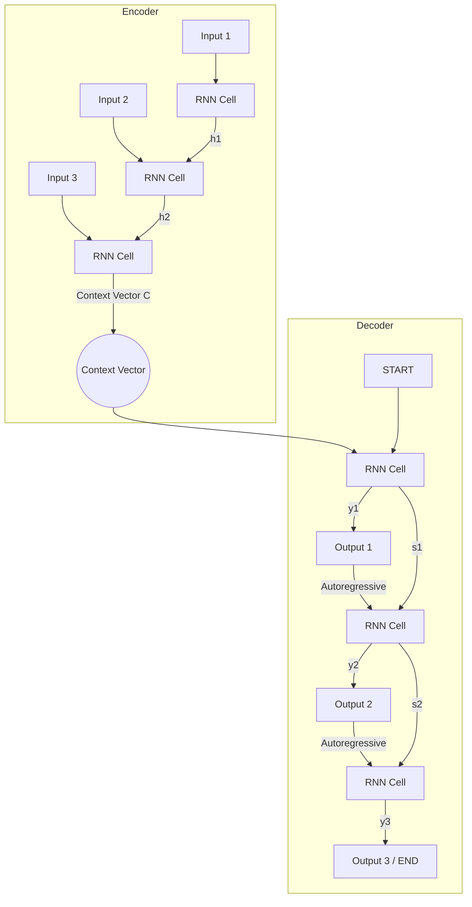

# Sequence to Sequence (Seq2Seq)

## 1. Overview

The Sequence-to-Sequence (Seq2Seq) architecture, introduced by Sutskever et al. (Google) and Cho et al. (MILA) in 2014, fundamentally solved the problem of mapping an input sequence to an output sequence where the lengths of the two sequences are different. 

Prior to Seq2Seq, neural networks required the input and output to have the same dimensionality or a fixed-length mapping. Seq2Seq bypassed this limitation by using an **Encoder-Decoder** structure: one Recurrent Neural Network (RNN) reads the input sequence and compresses it into a single fixed-length vector (the context vector), and a second RNN uses that vector to generate the output sequence one token at a time.

This architecture catalyzed the deep learning revolution in Natural Language Processing, directly enabling modern neural machine translation, summarization, and conversational AI.

## 2. Historical Context

Before 2014, Statistical Machine Translation (SMT) systems (like early Google Translate) were incredibly complex pipelines. They required separate models for phrase alignment, language modeling, and reordering, heavily relying on hand-crafted linguistic rules.

Applying standard neural networks to translation was difficult because the input (e.g., a 5-word English sentence) and the output (e.g., a 7-word French sentence) had arbitrary and differing lengths. In 2014, two independent papers proposed the same elegant solution:
- **Sutskever et al. (Sequence to Sequence Learning with Neural Networks):** Used multi-layer LSTMs.
- **Cho et al. (Learning Phrase Representations using RNN Encoder-Decoder...):** Introduced the GRU and the Encoder-Decoder concept.

By 2016, Google Translate completely replaced its legacy SMT system with GNMT (Google Neural Machine Translation), a massive Seq2Seq model.

## 3. Problem It Solves

1. **Variable-Length Inputs and Outputs:** Seq2Seq removes the constraint that inputs and outputs must align one-to-one or share a fixed length.
2. **End-to-End Training:** Instead of a complex pipeline of specialized linguistic modules, a single neural network is trained end-to-end to maximize the probability of the target sequence given the source sequence.
3. **Information Bottlenecking:** By forcing the entire input sequence through a single context vector, the model is forced to learn a dense, semantic representation of the input's meaning.

## 4. Architecture Diagram

## 5. Layer-by-Layer Explanation

### 1. The Encoder
The Encoder processes the input sequence (e.g., $x_1, x_2, \dots, x_T$) one token at a time. At each step $t$, it updates its hidden state $h_t$ using the current input $x_t$ and the previous hidden state $h_{t-1}$.
- When the sequence ends (often signaled by an `<EOS>` token), the final hidden state $h_T$ becomes the **Context Vector** ($C$). This single vector is expected to contain the semantic meaning of the entire input sequence.

### 2. The Context Vector
The Context Vector $C$ is the bridge between the Encoder and Decoder. It acts as the initial hidden state $s_0$ for the Decoder.

### 3. The Decoder
The Decoder generates the output sequence ($y_1, y_2, \dots, y_{T'}$) autoregressively.
- It begins with a `<START>` token and the Context Vector.
- It produces a hidden state $s_t$, which is passed through a linear layer and a softmax function to predict a probability distribution over the target vocabulary.
- The highest probability token is selected (or sampled) as $y_t$.
- In the next step, $y_t$ is fed back into the Decoder as the input. This process repeats until the Decoder outputs an `<EOS>` (End of Sequence) token.

## 6. Tensor Flow Walkthrough

Assume a batch size of $B$, embedding dimension of $E$, hidden dimension of $H$, and vocabulary size of $V$.

**Encoder Forward Pass:**
- Input Sequence: $(B, T_{src})$
- Embeddings: $(B, T_{src}, E)$
- Process via RNN/LSTM/GRU. We only care about the final hidden state.
- Output Context Vector $C$: $(B, H)$

**Decoder Forward Pass (Step 1):**
- Input: `<START>` token embeddings $\rightarrow (B, 1, E)$
- Initial hidden state: Context Vector $C \rightarrow (B, H)$
- RNN Output step 1: $(B, 1, H)$
- Linear Projection to Vocab: $(B, 1, H) \times W_{vocab} \rightarrow (B, 1, V)$
- Softmax over $V$ gives probabilities. We take the argmax to get the predicted word ID.

**Decoder Forward Pass (Step 2):**
- Input: Embeddings of predicted word from Step 1 $\rightarrow (B, 1, E)$
- Previous hidden state: RNN Output step 1 $\rightarrow (B, H)$
- Process and repeat until `<EOS>` is predicted.

## 7. Mathematical Foundations

The goal of the Seq2Seq model is to maximize the conditional probability of the target sequence $Y$ given the source sequence $X$:
$$P(y_1, \dots, y_{T'} | x_1, \dots, x_T)$$

The Encoder computes the context vector $c$:
$$h_t = f(x_t, h_{t-1})$$
$$c = h_T$$

The Decoder computes the probability of the next word given the context vector and all previously generated words:
$$P(y_1, \dots, y_{T'} | X) = \prod_{t=1}^{T'} P(y_t | c, y_1, \dots, y_{t-1})$$

The Decoder's hidden state $s_t$ is updated as:
$$s_t = g(y_{t-1}, s_{t-1}, c)$$

And the probability distribution is computed via softmax:
$$P(y_t | y_{t-1}, s_t, c) = \text{Softmax}(W \cdot s_t + b)$$

## 8. Training Process (Teacher Forcing)

During inference, the Decoder is truly autoregressive: it feeds its own generated output back in as the next input. 
However, during training, this makes the model unstable. If the model makes a mistake at step 1, step 2 receives garbage input, causing a cascading failure that makes learning nearly impossible early on.

To solve this, we use **Teacher Forcing**: during training, instead of feeding the model's *prediction* back as the next input, we feed the *actual ground truth* target token. This allows the model to learn efficiently and prevents cascading errors.

## 9. Complexity Analysis

- **Parameters:** Varies based on RNN size, but generally $O(H^2 + H \cdot E + H \cdot V)$.
- **Compute:** $O(T_{src} \cdot H^2)$ for encoding + $O(T_{tgt} \cdot H^2)$ for decoding. Sequential computation prevents parallelization across time steps.
- **The Information Bottleneck:** The standard Seq2Seq model forces the *entire* input sequence to be compressed into a single, fixed-size vector $c$. As $T_{src}$ increases (e.g., a 50-word sentence), the vector fails to capture all nuances, causing performance to drop drastically on long sequences.

## 10. Advantages

- **Flexibility:** Can map any sequence length to any sequence length.
- **End-to-End:** Replaced massive pipelines of specialized systems with a single differentiable network.
- **Foundation for Modern NLP:** Introduced the Encoder-Decoder paradigm that is still used today in models like T5 and BART.

## 11. Limitations

- **The Information Bottleneck:** Compressing long sentences into a fixed-size vector loses information. (This was solved by **Attention**).
- **Sequential Computation:** RNNs cannot be parallelized over time, making training slow on GPUs. (This was solved by the **Transformer**).
- **Vanishing Gradients:** Standard RNNs struggle with long sequences. LSTMs and GRUs mitigate this, but don't perfectly solve it.

## 12. Real World Applications

- **Machine Translation:** Translating English to French, mapping characters to characters or words to words.
- **Text Summarization:** Mapping a long article to a short paragraph.
- **Conversational Agents:** Mapping a user's query sequence to a system's response sequence (early chatbots).
- **Speech Recognition:** Mapping a sequence of audio frames to a sequence of text characters.

## 13. Common Interview Questions

**Q: What was the critical limitation of the original Seq2Seq model, and how was it fixed?**
The critical limitation was the "Information Bottleneck" — forcing the entire input sequence to be compressed into a single fixed-size context vector. It performed poorly on long sentences. This was fixed by Bahdanau et al. by introducing the **Attention Mechanism**, which allows the Decoder to "look back" at the entire sequence of Encoder hidden states ($h_1, h_2, \dots, h_T$) and dynamically compute a unique context vector for *each* decoding step.

**Q: Why was reversing the input sequence a common trick in early Seq2Seq models?**
Sutskever et al. found that feeding the input sequence to the Encoder in reverse order (e.g., "C B A" instead of "A B C") significantly improved performance. By reversing the input, the beginning of the source sentence (which is usually aligned with the beginning of the target sentence) is processed last by the Encoder. This means the start of the sentence is "fresh" in the context vector, making it much easier for the Decoder to get started generating the translation.

## 14. Related Papers
- **Sequence to Sequence Learning with Neural Networks (Sutskever et al., 2014)**
- **Learning Phrase Representations using RNN Encoder-Decoder for Statistical Machine Translation (Cho et al., 2014)**
- **Neural Machine Translation by Jointly Learning to Align and Translate (Bahdanau et al., 2014)** — Introduced Attention.
