# Swin Transformer: Hierarchical Vision Transformer using Shifted Windows

## 1. Overview

The Swin Transformer (Shifted Window Transformer) was introduced by Microsoft Research Asia in 2021. It solved the two fundamental limitations of the original Vision Transformer (ViT) when applied to dense computer vision tasks like object detection and semantic segmentation: lack of hierarchical feature maps and the quadratic computational complexity of self-attention with respect to image resolution.

Swin reinstates the hierarchical structure of traditional CNNs (like ResNet or Feature Pyramid Networks) while retaining the powerful self-attention mechanism of Transformers. It achieves linear computational complexity by computing attention locally within non-overlapping windows, and uses a "shifted window" approach to allow information to leak across window boundaries. Swin quickly became a dominant backbone for dense vision tasks, dethroning both standard CNNs and ViTs on benchmarks like COCO object detection and ADE20K segmentation.

## 2. Historical Context

The original Vision Transformer (ViT) proved that an image could be treated as a sequence of 16x16 patches and processed by a standard NLP Transformer. However, ViT had major flaws for general-purpose vision:
1. **Single Scale:** ViT maintains a single, low-resolution feature map (e.g., $16 \times 16$ spatial resolution) throughout the entire network. Dense prediction tasks (like segmentation) require high-resolution feature maps at early layers and low-resolution semantic maps at deep layers.
2. **Quadratic Cost:** Self-attention scales quadratically with sequence length. If you want high resolution (e.g., $4 \times 4$ patches instead of $16 \times 16$), the sequence becomes $16 \times$ longer, making attention $256 \times$ more expensive.

Swin addressed these by borrowing the best inductive biases of CNNs (hierarchical downsampling and local processing) and integrating them into the Transformer framework.

## 3. Problem It Solves

1. **Hierarchical Features:** Like a CNN, Swin starts with a high-resolution feature map and progressively downsamples it, merging patches to create larger receptive fields and smaller spatial dimensions. This naturally builds a feature pyramid.
2. **Computational Efficiency:** By restricting self-attention to small, local windows (e.g., $7 \times 7$ patches), the computational cost becomes linear with respect to image size, not quadratic.
3. **Cross-Window Communication:** Local attention alone isolates windows. The "shifted window" mechanism allows windows to overlap in subsequent layers, ensuring global context is eventually captured.

## 4. Architecture Diagram

```mermaid
graph TD
    subgraph Swin Architecture
        In[Input Image<br>H x W x 3] --> PE[Patch Partition<br>4x4 patches]
        
        PE --> L1_1[Linear Embedding<br>C channels]
        
        subgraph Stage 1
            L1_1 --> S1_W[Swin Transformer Block<br>W-MSA]
            S1_W --> S1_SW[Swin Transformer Block<br>SW-MSA]
        end
        
        subgraph Stage 2
            S1_SW --> PM1[Patch Merging<br>2x2 merging]
            PM1 --> S2_W[Swin Transformer Block<br>W-MSA]
            S2_W --> S2_SW[Swin Transformer Block<br>SW-MSA]
        end
        
        subgraph Stage 3
            S2_SW --> PM2[Patch Merging<br>2x2 merging]
            PM2 --> S3_W[Swin Transformer Blocks<br>W-MSA / SW-MSA x 3]
        end
        
        subgraph Stage 4
            S3_W --> PM3[Patch Merging<br>2x2 merging]
            PM3 --> S4_W[Swin Transformer Blocks<br>W-MSA / SW-MSA]
        end
        
        S4_W --> Out[Output Feature Maps<br>for Classification/Detection]
    end
```

## 5. Layer-by-Layer Explanation

### 1. Patch Partition & Linear Embedding
The image is split into small non-overlapping patches (e.g., $4 \times 4$ pixels). Each patch is flattened and linearly projected into a vector of dimension $C$. This creates a high-resolution sequence of tokens.

### 2. Patch Merging (Hierarchical Downsampling)
Between stages, the network applies "Patch Merging". It takes $2 \times 2$ groups of adjacent patches and concatenates them along the channel dimension (increasing channels by $4\times$). A linear layer then reduces the channels to $2C$. 
- Result: Spatial resolution is halved ($H/2, W/2$), and channel dimension is doubled ($2C$). This perfectly mirrors the spatial pooling in ResNet.

### 3. Swin Transformer Block (W-MSA)
Instead of global self-attention (which is quadratic), the feature map is divided into non-overlapping windows of size $M \times M$ (typically $7 \times 7$). Standard multi-head self-attention (MSA) is computed *only* within each window.
- Since $M$ is fixed (e.g., 7), the attention cost per window is constant. The total cost across the image scales linearly with the number of windows (i.e., linearly with the image size).

### 4. Shifted Window Block (SW-MSA)
Because W-MSA never communicates across window boundaries, a subsequent block shifts the window partitioning by $(M/2, M/2)$ pixels.
- The new windows now straddle the boundaries of the previous windows. Computing attention in these shifted windows allows information to bleed across the original boundaries, enabling long-range connections over multiple layers.

## 6. Tensor Flow Walkthrough

Assume an input image of $224 \times 224 \times 3$, initial patch size of $4 \times 4$, window size $M=7$, and base channel $C=96$.

**Stage 1:**
- **Input:** $224 \times 224 \times 3$
- **Patch Partition:** $(224/4) \times (224/4) = 56 \times 56$ patches.
- **Linear Embedding:** $(56 \times 56, 96)$ or reshaped to $(56, 56, 96)$.
- **W-MSA / SW-MSA:** The $56 \times 56$ grid is divided into $8 \times 8$ windows of size $7 \times 7$. Attention is performed inside each $7 \times 7$ window. Output shape remains $(56, 56, 96)$.

**Stage 2:**
- **Patch Merging:** $2 \times 2$ spatial elements are merged. Spatial dim becomes $28 \times 28$. Channels become $96 \times 2 = 192$.
- **Output shape:** $(28, 28, 192)$.

**Stage 3:**
- **Patch Merging:** Spatial dim becomes $14 \times 14$. Channels become $384$.
- **Output shape:** $(14, 14, 384)$.

**Stage 4:**
- **Patch Merging:** Spatial dim becomes $7 \times 7$. Channels become $768$.
- **Output shape:** $(7, 7, 768)$.

*Notice how this exactly mimics the hierarchical feature maps of ResNet50 (which produces spatial maps of 56, 28, 14, and 7).*

## 7. Mathematical Foundations

**Complexity of Global MSA (ViT):**
For an image with $h \times w$ patches, global MSA requires:
$$O(h w C^2 + (hw)^2 C)$$
The $(hw)^2$ term is the quadratic bottleneck.

**Complexity of Window MSA (Swin):**
By computing attention in windows of size $M \times M$, the complexity becomes:
$$O(h w C^2 + M^2 hw C)$$
Because $M$ is fixed (e.g., 7), $M^2$ is a constant. The complexity is now **linear** with respect to $hw$ (the number of patches).

**Cyclic Shift for Efficient SW-MSA:**
When the windows are shifted by $(M/2, M/2)$, some windows fall off the edge of the image. Naively, this creates varying window sizes. Swin uses a brilliant engineering trick: **cyclic shift** (rolling the image tensor) combined with a **masking mechanism** to ensure pixels shifted from the left edge don't attend to pixels on the right edge. This allows batched computation of equal-sized windows.

**Relative Position Bias:**
Instead of absolute positional embeddings (like ViT), Swin adds a relative position bias $B$ directly to the attention scores during softmax:
$$Attention(Q, K, V) = \text{Softmax}\left(\frac{QK^T}{\sqrt{d}} + B\right) V$$
This drastically improves translation invariance (a key property of CNNs).

## 8. Complexity Analysis

- **Parameters:** Swin-B (base) has 88M parameters, highly comparable to ViT-B.
- **Compute:** Swin-B requires 15.4G FLOPs for a $224 \times 224$ image, slightly less than ViT-B due to the linear attention scaling.
- **Memory:** Memory usage scales linearly with resolution, making it entirely feasible to process high-resolution images (e.g., $1024 \times 1024$) which would OOM (Out of Memory) a standard ViT.

## 9. Advantages

- **Universal Backbone:** Can be plugged directly into existing detection architectures (Mask R-CNN, RetinaNet) and segmentation architectures (UperNet) because it produces a hierarchical feature pyramid.
- **Linear Scaling:** Can process high-resolution imagery efficiently.
- **Strong Inductive Biases:** By re-introducing locality (windowed attention) and translation invariance (relative position bias), it learns faster and requires less data than standard ViTs.

## 10. Limitations

- **Engineering Complexity:** Implementing the cyclic shift and masked attention efficiently is significantly more complex than a standard ViT or ResNet.
- **Fixed Window Size:** The window size $M$ is a fixed hyperparameter. If objects are much larger than the window size, the network relies entirely on the patch merging layers and deeper stages to capture global context.

## 11. Real World Applications

- **Object Detection & Segmentation:** Swin replaced ResNet as the default backbone for high-performance dense prediction tasks. It achieved state-of-the-art on COCO object detection upon release.
- **Medical Image Segmentation:** Used as the backbone for Swin-UNet, replacing convolutional encoders in U-Net architectures for highly accurate medical scans.
- **Video Processing:** Video Swin Transformer extends the shifted windows into the temporal dimension (3D shifted windows) for action recognition.

## 12. Common Interview Questions

**Q: Why couldn't we use the original ViT for object detection?**
Object detection requires detecting small objects, which necessitates high-resolution feature maps (e.g., a $4 \times 4$ patch size). ViT's self-attention scales quadratically, making high-resolution processing computationally intractable. Furthermore, ViT only produces a single low-resolution feature map, whereas modern detection heads (like FPN) require a pyramid of multi-scale features.

**Q: Explain how the "Shifted Window" mechanism works.**
In layer $L$, the image is divided into a grid of non-overlapping windows. Self-attention is computed only within these windows. In layer $L+1$, the window grid is shifted by half a window width and height. This means the new windows overlap the boundaries of the previous windows, allowing information to propagate globally across the image as the network deepens.

**Q: How does Swin handle windows that go off the edge of the image during the shift?**
Swin uses a "cyclic shift" (like `torch.roll`), wrapping the top-left pixels to the bottom-right. To prevent pixels that are now physically adjacent in the tensor (but actually from opposite sides of the image) from attending to each other, a masking matrix is applied to the attention scores to set their similarity to $-\infty$.

## 13. Related Papers

- **Swin Transformer (Liu et al., 2021)**
- **Vision Transformer (Dosovitskiy et al., 2020)** — The predecessor.
- **Swin Transformer V2 (Liu et al., 2022)** — Scales Swin up to 3 billion parameters and higher resolutions by modifying the normalization layers and positional embeddings.

## 14. Related Problems
- Constructing a cyclic shift mask in PyTorch.
- Implementing Relative Positional Bias in attention matrices.
