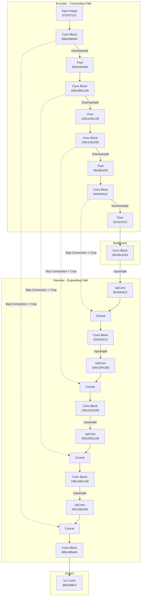

# U-Net

## 1. Overview

U-Net is a seminal convolutional neural network architecture originally developed by Ronneberger, Fischer, and Brox in 2015 for biomedical image segmentation. It gets its name from its distinctive U-shaped architecture, which consists of a contracting path (encoder) to capture context and a symmetric expanding path (decoder) that enables precise localization.

While it was designed to segment cells in microscopy images with very little training data, U-Net's elegant solution to the problem of spatial resolution loss made it universally applicable. Today, U-Net (and its modern variants incorporating attention) serves as the structural backbone of nearly all state-of-the-art image generation systems, most notably **Diffusion Models** (like Stable Diffusion, DALL-E 2, and Midjourney).

## 2. Historical Context

Before U-Net, the standard approach for semantic segmentation (classifying every pixel in an image) involved using a standard CNN (like AlexNet or VGG) and replacing the fully connected layers with convolutions. The problem was that CNNs naturally reduce the spatial dimensions of an image as they extract deep, semantic features (e.g., a $224 \times 224$ image becomes a $7 \times 7$ feature map).

To produce a full-resolution segmentation mask, early models like Fully Convolutional Networks (FCNs) tried to upsample the tiny $7 \times 7$ feature map back to $224 \times 224$. However, because the spatial information was permanently lost during the downsampling process, the resulting segmentation boundaries were incredibly coarse and blurry. 

U-Net solved this elegantly by introducing **skip connections** that route high-resolution features from the encoder directly to the decoder.

## 3. Problem It Solves

1. **The Semantic-Spatial Trade-off:** Deep neural networks need to reduce spatial dimensions (via pooling or strided convolutions) to increase their receptive field and extract high-level "semantic" meaning. But segmentation and generation tasks require high "spatial" resolution at the output.
2. **Blurry Boundaries:** Upsampling deep features alone produces blurry outputs because the exact coordinate locations of edges were lost during pooling.
3. **Data Efficiency:** U-Net was designed to train effectively on very small datasets (originally just 30 images) by relying heavily on data augmentation (elastic deformations).

## 4. Architecture Diagram

The architecture consists of a contracting path (left side) and an expanding path (right side).

*(Note: The original paper used unpadded convolutions, which is why the spatial dimensions shrink at every step and cropping is required. Modern U-Nets use padded convolutions so $H$ and $W$ remain perfectly aligned.)*

## 5. Layer-by-Layer Explanation

### 1. Contracting Path (Encoder)
The left side of the U acts as a standard feature extractor. It consists of repeated applications of two $3 \times 3$ convolutions, each followed by a ReLU activation. After each block, a $2 \times 2$ max pooling operation with stride 2 is applied for downsampling. 
- With every downsampling step, the spatial dimensions are halved, and the number of feature channels is doubled. This extracts deep, abstract semantic features.

### 2. Bottleneck
The bottom of the U connects the encoder and decoder. It consists of two $3 \times 3$ convolutions without any pooling. This is where the model has the maximum number of channels and the minimum spatial resolution. In a Diffusion model, this bottleneck often contains attention layers.

### 3. Expanding Path (Decoder)
The right side of the U mirrors the encoder. It begins with an upsampling operation (typically a $2 \times 2$ transposed convolution or bilinear upsampling) that halves the number of feature channels and doubles the spatial dimensions.
- **The Skip Connection:** The upsampled feature map is then **concatenated** along the channel axis with the corresponding feature map from the encoder path. This is the magic of U-Net: it provides the decoder with the exact, high-resolution spatial details that were lost during max pooling.
- After concatenation, two $3 \times 3$ convolutions are applied to merge the semantic information from the decoder with the spatial information from the encoder.

### 4. Output Layer
At the final layer, a $1 \times 1$ convolution is used to map the multi-channel feature map to the desired number of output classes (e.g., 2 channels for foreground/background segmentation, or 3 channels for RGB image generation).

## 6. Tensor Flow Walkthrough

Assuming a modern U-Net with padded convolutions (so spatial dimensions don't shrink during convolutions):

Let the input be an image $X \in \mathbb{R}^{B \times 1 \times 256 \times 256}$ (Batch, Channels, Height, Width).

1. **Encoder Block 1:**
   - Input: $(B, 1, 256, 256)$
   - $3 \times 3$ Conv $\rightarrow$ $(B, 64, 256, 256)$
   - Output (Save for Skip 1): $(B, 64, 256, 256)$
   - MaxPool: $(B, 64, 128, 128)$
2. **Encoder Block 2:**
   - Input: $(B, 64, 128, 128)$
   - $3 \times 3$ Conv $\rightarrow$ $(B, 128, 128, 128)$
   - Output (Save for Skip 2): $(B, 128, 128, 128)$
   - MaxPool: $(B, 128, 64, 64)$
3. **Bottleneck:**
   - Input: $(B, 128, 64, 64)$
   - $3 \times 3$ Conv $\rightarrow$ $(B, 256, 64, 64)$
4. **Decoder Block 1:**
   - Input: $(B, 256, 64, 64)$
   - Upsample: $(B, 128, 128, 128)$
   - Concat with Skip 2: $(B, 128+128, 128, 128) = (B, 256, 128, 128)$
   - $3 \times 3$ Conv $\rightarrow$ $(B, 128, 128, 128)$
5. **Decoder Block 2:**
   - Input: $(B, 128, 128, 128)$
   - Upsample: $(B, 64, 256, 256)$
   - Concat with Skip 1: $(B, 64+64, 256, 256) = (B, 128, 256, 256)$
   - $3 \times 3$ Conv $\rightarrow$ $(B, 64, 256, 256)$
6. **Output:**
   - $1 \times 1$ Conv $\rightarrow (B, \text{NumClasses}, 256, 256)$

## 7. Mathematical Foundations

The core mathematical innovation of U-Net is the skip connection via concatenation.

Let $E_i$ be the feature map output by the $i$-th encoder block.
Let $D_i$ be the feature map entering the $i$-th decoder block (after upsampling).

In a network without skip connections (like a standard autoencoder), the decoder block function $F$ simply processes $D_i$:
$$Output_i = F(D_i)$$

In U-Net, the skip connection concatenates $E_i$ and $D_i$ along the channel dimension $C$:
$$Output_i = F([D_i, E_i])$$

This allows the convolutional filters in $F$ to act as a learned gating mechanism. The network learns how to combine the deep, low-resolution "what is this?" features in $D_i$ with the shallow, high-resolution "where is this?" features in $E_i$.

## 8. Complexity Analysis

- **Parameters:** A standard U-Net is relatively lightweight (e.g., ~30M parameters), though modern variants used in Diffusion Models can scale to billions of parameters.
- **Compute:** U-Net is computationally heavy compared to classification networks because the decoder operates at high spatial resolutions. Convolutions on $256 \times 256$ feature maps are expensive.
- **Memory:** Training a U-Net requires significant VRAM because the high-resolution feature maps from the encoder ($E_1, E_2, \dots$) must be kept in memory during the forward pass so they can be concatenated during the backward pass of the decoder.

## 9. Advantages

- **Spatially Precise:** Skip connections preserve pixel-perfect spatial information, making it ideal for segmentation and generation.
- **Data Efficient:** Generalizes very well from small datasets when paired with data augmentation.
- **Symmetric Information Flow:** The symmetric structure ensures that the capacity of the model to decode information is matched by its capacity to encode it.

## 10. Limitations

- **High Memory Footprint:** The need to store large intermediate activations for skip connections makes large batch sizes difficult.
- **Local Receptive Field:** Standard convolutions only look at local patches. U-Net struggles to capture global context across the entire image (e.g., if a segmentation decision on the far left of the image depends on a feature on the far right). This is why modern implementations often insert Self-Attention layers in the bottleneck.
- **Grid Artifacts:** Depending on the upsampling method used (e.g., transposed convolutions with stride), U-Nets can produce checkerboard artifacts in generated images.

## 11. Real World Applications

- **Medical Imaging:** MRI tumor segmentation, cell tracking, retina blood vessel extraction.
- **Autonomous Driving:** Real-time semantic segmentation of roads, pedestrians, and vehicles.
- **Generative AI (Diffusion Models):** The U-Net is the standard architecture used to predict and remove noise in Stable Diffusion. The network takes a noisy image as input and outputs a predicted noise tensor of the exact same dimensions. The U-Net's ability to process semantic prompts (injected via cross-attention in the bottleneck) while maintaining spatial structure is what makes text-to-image generation possible.

## 12. Common Interview Questions

**Q: Why does U-Net use concatenation instead of addition for skip connections (like ResNet)?**
Addition requires the two tensors to have the exact same number of channels, and it fundamentally mixes the representations together. Concatenation keeps the representations separate, providing the next convolutional layer with *both* the raw spatial features from the encoder and the abstract semantic features from the decoder. The network can then learn its own weights to decide how to combine them.

**Q: Why do early U-Net papers mention cropping the skip connections?**
In the original 2015 paper, convolutions were unpadded (valid padding). Every $3 \times 3$ convolution shrank the spatial dimensions by 2 pixels. By the time the features were upsampled in the decoder, they were physically smaller than the corresponding encoder feature maps. Cropping was necessary to align them before concatenation. Modern implementations use padding to maintain identical dimensions.

**Q: Where are attention mechanisms usually added in a U-Net, and why?**
Attention is typically added in the bottleneck and the lower resolution layers of the decoder. This is because attention is $O(N^2)$ with respect to spatial resolution. Applying attention at the $256 \times 256$ input resolution is computationally intractable, but applying it at the $32 \times 32$ bottleneck provides global context where it is cheapest to compute.

## 13. Related Papers

- **U-Net: Convolutional Networks for Biomedical Image Segmentation (2015)**
- **Stable Diffusion (High-Resolution Image Synthesis with Latent Diffusion Models):** Uses a heavily modified U-Net with cross-attention.
- **V-Net:** A 3D extension of U-Net for volumetric medical data.

## 14. Related Problems
- Constructing a U-Net architecture in PyTorch.
- Implementing Bilinear Upsampling vs Transposed Convolutions.
